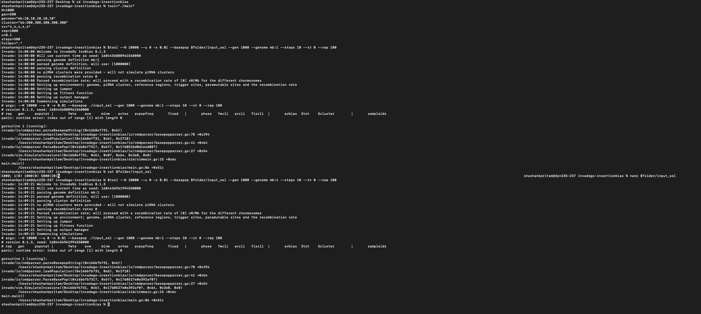
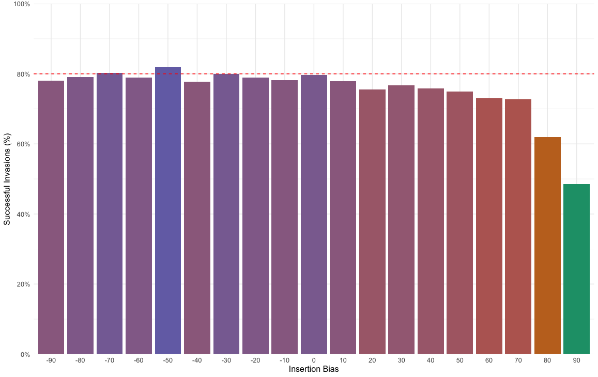
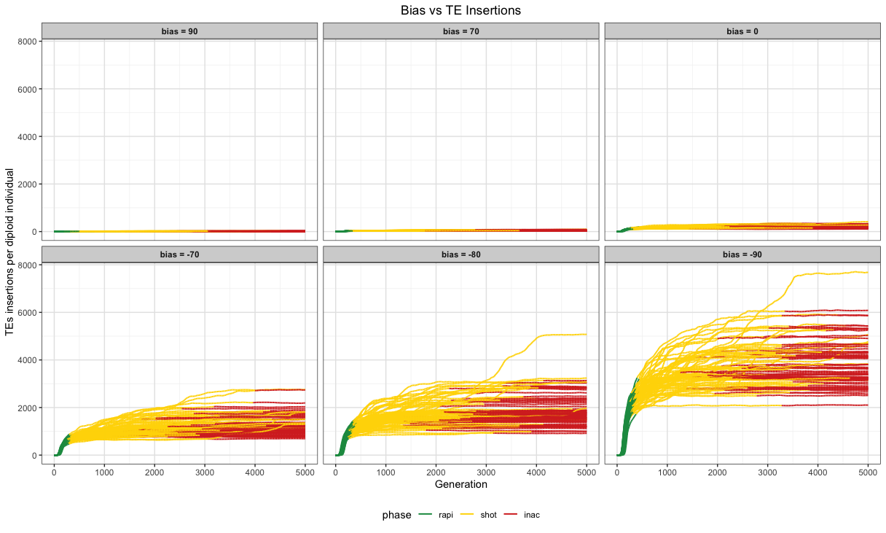
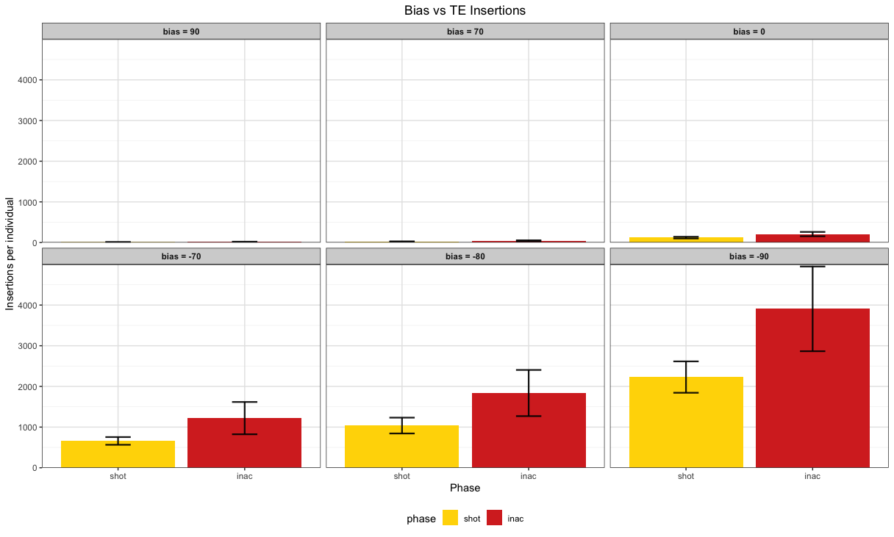
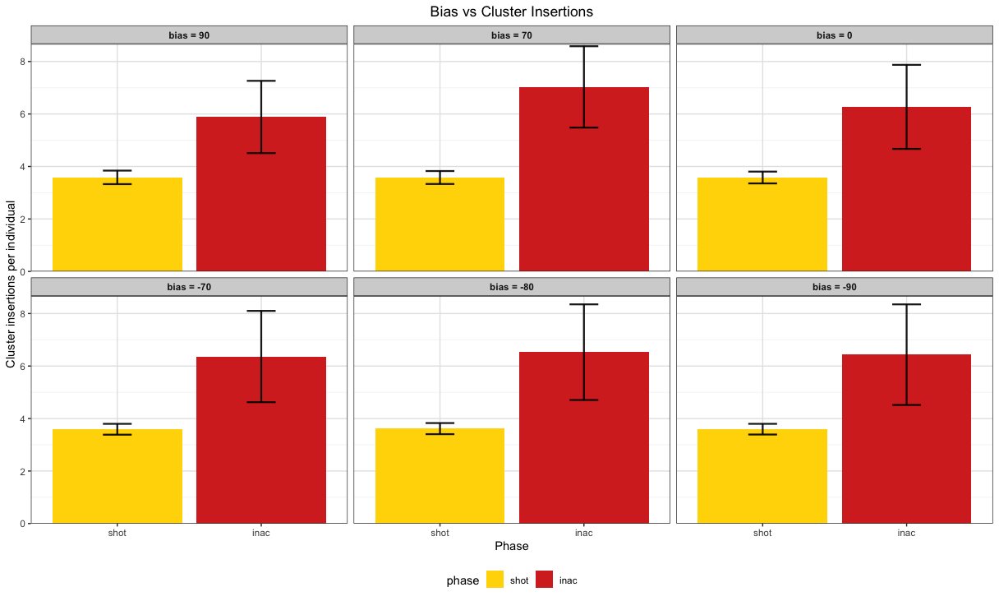

# Insertion Bias

**Motivation**: 
P-element has strong insertion bias into piRNA clusters; why would TE be so stupid? Maybe it is an advantage because it reduces the burden of TEs; while at the same time not limiting the chances of a TE of invading a new population (Probability of Establishment).

- [ ] Selection - WIP (Need sample file input and corresponding command).

[Error Log](error_log_sel.md)

- [ ] Fig1:

a. overview of simulations; 
****
a. intuitive understand of insertion bias; 

a. insertion bias has major influence

---

- [ ] Fig2: first question, does the insertion bias lower the chances of establishment of a TE? Only when it is strong above 60-70
Documentation: [GitHub](https://github.com/shashankpritam/Insertion-Bias-TE/blob/main/Validation_5_bias.md)

Result:

---

- [ ] Fig3: properties of TE invasions with insertion bias; length of phases, number of cluster insertions; which ones to show?

Result:

---

