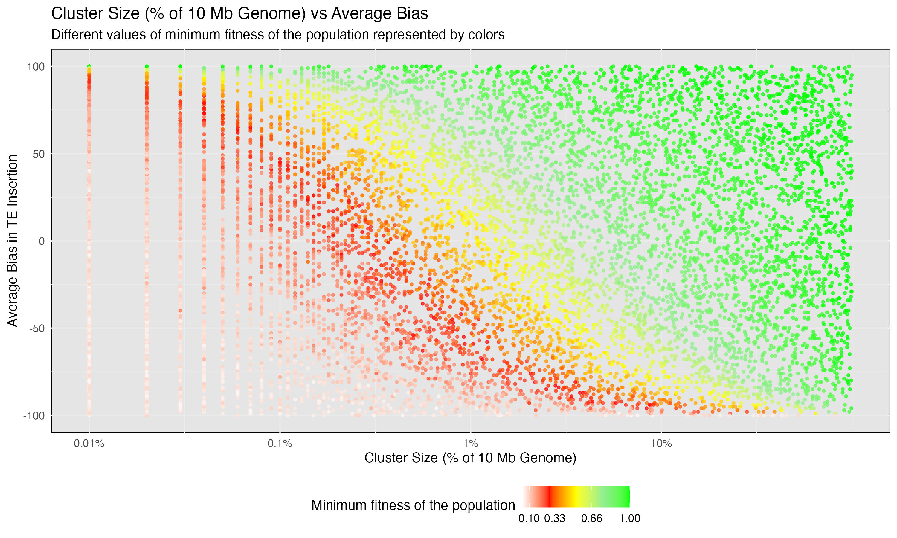

# Minimum Fitness

Shashank Pritam

- [<span class="toc-section-number">1</span>
  Introduction](#introduction)
  - [<span class="toc-section-number">1.1</span> Initial
    conditions](#initial-conditions)
- [<span class="toc-section-number">2</span> Materials &
  Methods](#materials-methods)
  - [<span class="toc-section-number">2.1</span> Commands for the
    simulation](#commands-for-the-simulation)
  - [<span class="toc-section-number">2.2</span> Parameters
    ](#parameters)
- [<span class="toc-section-number">3</span> Visualization in
  R](#visualization-in-r)
- [<span class="toc-section-number">4</span> Plotting](#plotting)
- [<span class="toc-section-number">5</span> Explaination of the Color
  Scheme in the Plot](#explaination-of-the-color-scheme-in-the-plot)
  - [<span class="toc-section-number">5.1</span> Minimum fitness of the
    population during the invasion - Continuous Variable - `min_w`
    ](#minimum-fitness-of-the-population-during-the-invasion---continuous-variable---min_w)
  - [<span class="toc-section-number">5.2</span> Population status -
    Categorical Variables -
    `popstat`](#population-status---categorical-variables---popstat)
- [<span class="toc-section-number">6</span> Conclusion](#conclusion)

## Introduction

What is the impact of insertion bias on the minimum fitness of a
population during the invasion of transposable elements (TEs)?

### Initial conditions

## Materials & Methods

version: invadego0.1.3

### Commands for the simulation

The simulations were generated using the code from:

- [sim_storm.py](./sim_storm.py)

### Parameters

Simulations were ran with the following parameters:

- Number of simulations: 10000
- Number of threads: 4
- Output directory: \*/invadego/13thSep23at104054PM
- Invade path: \*/invadego/main
- Number of replications (–rep): 1
- Mutation rate (–u): 0.2
- Number of steps (–steps): 5000
- Population size (–N): 1000
- Number of generations (–gen): 5000
- Negative effect of a TE insertion (–x): 0.01
- Genome (–genome) mb:10,10,10,10,10
- Recombination Rate (–rr): 4,4,4,4,4
- Negative effect of a cluster insertions (-no-x-cluins, i.e, x=0)
- Silent mode: True


<details>
<summary>Random Clusters were Generated using this snippet</summary>

``` python
def get_rand_clusters(): 
    lower_limit = 0  # Lower bound
    upper_limit = math.log10(1e+7)  # Upper bound
    r = math.floor(10**random.uniform(lower_limit, upper_limit))
    return f"{r},{r},{r},{r},{r}"
```

</details>

## Visualization in R

<details>

<summary>Setting the environment</summary>

``` r
### Setting the environment
library(tidyverse)
library(ggplot2)
theme_set(theme_bw())
```

</details>

<details>
<summary>Data loading and parsing</summary>

``` r
### Data loading and parsing
column_names <- c("rep", "gen", "popstat", "spacer_1", "fwte", "avw", "min_w", "avtes", "avpopfreq", "fixed", "spacer_2", "phase", "fwcli", "avcli", "fixcli", "spacer_3", "avbias", "3tot", "3cluster", "spacer_4", "sampleid")

df <- read_delim('./13thSep23at104054PM/combined.txt', delim='\t', col_names = column_names, show_col_types = FALSE)


numeric_columns <- c("rep", "gen", "fwte", "avw", "min_w", "avtes", "avpopfreq", "fixed", "fwcli", "avcli", "fixcli", "avbias", "sampleid")
df[numeric_columns] <- lapply(df[numeric_columns], as.numeric)

#### Convert sampleid to % of the genome (given that genome size is 10,000 kb)
df$sampleid_percent = (df$sampleid / 10000) * 100

#### Data Preparation and Plotting
df_gen_not0 <- df %>% filter(gen != 0)
df_gen_0 <- df %>% filter(gen == 0)


#### Join and fill NaN
df_final <- left_join(df_gen_not0, df_gen_0, by = "rep", suffix = c("", "_from_gen0"))
columns_to_fill <- c("popstat", "avbias", "sampleid", "min_w")
for (col in columns_to_fill) {
    df_final[[col]] <- ifelse(is.na(df_final[[col]]), df_final[[paste(col, "_from_gen0", sep = "")]], df_final[[col]])
}

#### Keep only the necessary columns
df_final <- select(df_final, rep, popstat, avbias, sampleid, min_w)

#### Calculate sampleid_percent
df_final$sampleid_percent <- (df_final$sampleid / 10000000) * 100

### Filter out fail-0 and fail-w
df_filtered = df_final %>% filter(!popstat %in% c("fail-0", "fail-w"))
```

</details>

### Plotting

<details>
<summary>Plotting</summary>

``` r
### Custom color breaks and colors for fitness
breaks = c(0.01, 0.1, 0.33, 0.66, 1)
colors = c("darkred", "red", "yellow", "lightgreen", "green")


### Create a ggplot with the filtered data
g_avbias_cluster_size <- ggplot(df_filtered, aes(x = sampleid_percent, y = avbias, color = min_w)) +
  geom_point(alpha = 0.7, size = 0.8)

### Adding back fail-0 and fail-w with specific colors
g_avbias_cluster_size <- g_avbias_cluster_size +
  geom_point(data = df_final %>% filter(popstat == "fail-0"), aes(x = sampleid_percent, y = avbias), color = "darkgreen", alpha = 0.7, size = 0.8) +
  geom_point(data = df_final %>% filter(popstat == "fail-w"), aes(x = sampleid_percent, y = avbias), color = "darkgrey", alpha = 0.3, size = 0.75)

### Complete the ggplot
g_avbias_cluster_size <- g_avbias_cluster_size +
  ylab("Average Bias in TE Insertion") +
  xlab("Cluster Size (% of 10 Mb Genome)") +
  labs(
    title = "Cluster Size (% of 10 Mb Genome) vs Average Bias",
    subtitle = "Different values of minimum fitness of the population represented by colors",
    x = "Cluster Size (% of 10 Mb Genome)",
    y = "Average Bias in TE Insertion"
  ) +
  scale_color_gradientn(
    name = "Minimum fitness of the population",
    breaks = breaks,
    colors = colors
  ) +
  scale_x_log10(
    breaks = c(0.001, 0.01, 0.1, 1, 10),
    labels = c("0.001%", "0.01%", "0.1%", "1%", "10%")
  ) +  
  theme_minimal() +
  theme(
    legend.position = "bottom", 
    panel.background = element_rect(fill = "grey90")
  )

### Display the plot
g_avbias_cluster_size

```

</details>


<details>
<summary>Save the plot</summary>

``` r
### Save the plot
ggsave(filename = "../../../images/minimum_fitness.jpg", plot = g_avbias_cluster_size, width = 10, height = 6)
```
</details>

 


## Explaination of the Color Scheme in the Plot

The color scheme used in the plot serves to represent different
categories and values effectively:

### Minimum fitness of the population during the invasion - Continuous Variable - `min_w`

For `min_w`, we have used a gradient of colors as follows:

- **Dark Red (0.01)**: Represents $min\_w < 0.01$
- **Red (0.1)**: Represents $min\_w < 0.1$
- **Yellow (0.33)**: Represents $min\_w < 0.33$
- **Green (1)**: Represents $min\_w = 11$

These colors visually guide the viewer through varying levels of fitness
from lowest to highest.

### Population status - Categorical Variables - `popstat`

Points where the `popstat` is either “fail-0” or “fail-w”. These are
represented by:

- **Dark Green (`fail-0`)**: Indicates no TEs are left in the
  population.
- **Dark Grey (`fail-w`)**: Indicates that population fitness is too
  low.

## Conclusion

In the above diagram, we have a fixed transposition rate of 0.2.
Previously, it has been shown by Kofler\[2020\] that piRNA Clusters Need
a Minimum Size to Control Transposable Element Invasions, and with small
sized population, piRNA clusters may need to make up as much as 3% of
the genome, given there is a high rate of transposition alongside with
recessive TE insertions. Here, we observe that the compensation for
lower cluster size comes through increased insertion bias. The
population fitness increases with cluster size and average bias;
negative bias results in extinction even with a large cluster size.

------------------------------------------------------------------------

<cite><a href="https://doi.org/10.1093/gbe/evaa064">Robert Kofler,
“piRNA Clusters Need a Minimum Size to Control Transposable Element
Invasions,” Genome Biology and Evolution, Volume 12, Issue 5, May 2020,
Pages 736–749</a></cite>
