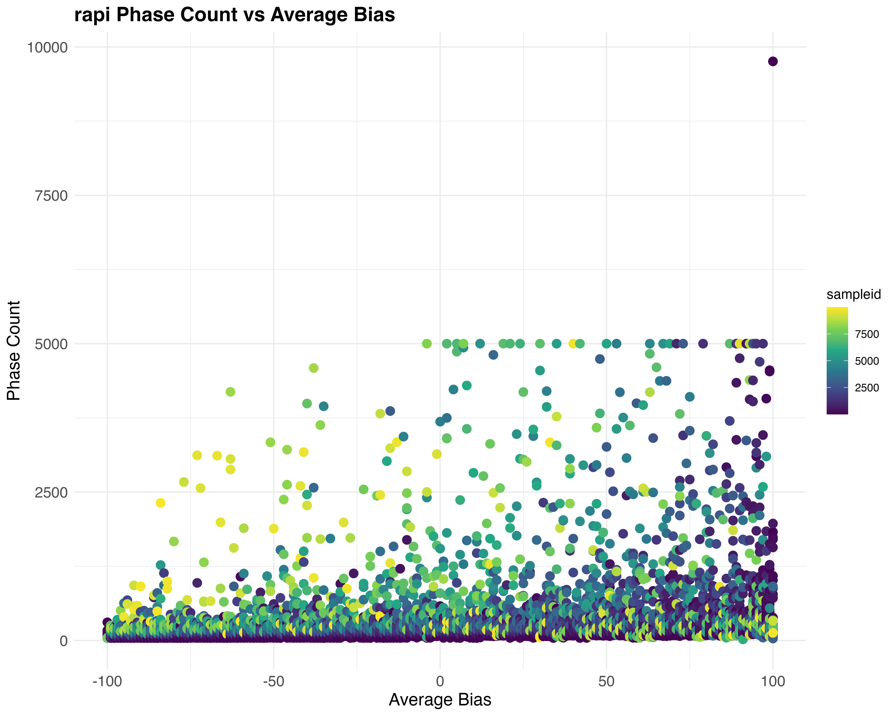

# Phase Length
Shashank Pritam

- [<span class="toc-section-number">1</span>
  Introduction](#introduction)
- [<span class="toc-section-number">2</span> Materials &
  Methods](#materials-methods)
  - [<span class="toc-section-number">2.1</span> Commands for the
    simulation](#commands-for-the-simulation)
  - [<span class="toc-section-number">2.2</span>
    Parameters](#parameters)
- [<span class="toc-section-number">3</span> Visualization in
  R](#visualization-in-r)
  - [<span class="toc-section-number">3.1</span> Set the environment by
    loading modules](#set-the-environment-by-loading-modules)
  - [<span class="toc-section-number">3.2</span> Load Data and Plot
    Result](#load-data-and-plot-result)
- [<span class="toc-section-number">4</span> Result: Phase Counts vs
  Average Bias](#result-phase-counts-vs-average-bias)
  - [<span class="toc-section-number">4.1</span> Rapid Phase Count vs
    Average Bias](#rapid-phase-count-vs-average-bias)
  - [<span class="toc-section-number">4.2</span> Shotgun Phase Count vs
    Average Bias](#shotgun-phase-count-vs-average-bias)
  - [<span class="toc-section-number">4.3</span> Inactive Phase Count vs
    Average Bias](#inactive-phase-count-vs-average-bias)
- [<span class="toc-section-number">5</span> Result: Phase Counts vs
  piRNA Cluster Size](#result-phase-counts-vs-pirna-cluster-size)
  - [<span class="toc-section-number">5.1</span> Rapid Phase Count vs
    piRNA Cluster Size](#rapid-phase-count-vs-pirna-cluster-size)
  - [<span class="toc-section-number">5.2</span> Shotgun Phase Count vs
    Sampleid](#shotgun-phase-count-vs-sampleid)
  - [<span class="toc-section-number">5.3</span> Inactive Phase Count vs
    piRNA Cluster Size](#inactive-phase-count-vs-pirna-cluster-size)

## Introduction

In this simulation we explore the question - How does various phases of
invasion change with bias?

## Materials & Methods

version: invadego0.1.3

### Commands for the simulation

The simulations were generated using the code from:

- [sim_storm.py](./Simulation-Results_Files/Slurm-Jobs/sim_storm.py)

### Parameters

Simulations were ran with the following parameters:

- Number of simulations: 10000
- Number of threads: 4
- Number of replications (–rep): 1
- Transposition rate (–u): 0.2
- Number of steps (–steps): 1
- Population size (–N): 1000
- Number of generations (–gen): 5000
- Negative effect of a TE insertion (–x): 0.01
- Genome (–genome) mb:10,10,10,10,10
- Recombination Rate (–rr): 4,4,4,4,4
- Negative effect of a cluster insertions (-no-x-cluins, i.e, x=0)
- Silent mode: False

Random Clusters were Generated using this snippet:

<details>
<summary>Code</summary>

``` python
def get_rand_clusters(): 
    lower_limit = 0  # Lower bound
    upper_limit = math.log10(1e+7)  # Upper bound
    r = math.floor(10**random.uniform(lower_limit, upper_limit))
    return f"{r},{r},{r},{r},{r}"
```

</details>

## Visualization in R

### Set the environment by loading modules

<details>
<summary>Code</summary>

``` r
library(tidyverse)
library(ggplot2)
theme_set(theme_bw())
```

</details>

### Load Data and Plot Result

<details>
<summary>Code</summary>

``` r
# Set the path of the combined file
combined_file_path <- "Simulation-Results_Files/simulation_storm/phaselen/20thNov23at091514PM/combined.txt"

# Define column names and numeric columns
column_names <- c("rep", "gen", "popstat", "spacer_1", "fwte", "avw", "min_w", "avtes", "avpopfreq", "fixed", "spacer_2", "phase", "fwcli", "avcli", "fixcli", "spacer_3", "avbias", "3tot", "3cluster", "spacer_4", "sampleid")
numeric_columns <- c("rep", "gen", "fwte", "avw", "min_w", "avtes", "avpopfreq", "fixed", "fwcli", "avcli", "fixcli", "avbias", "sampleid")

# Read the combined data
all_data <- read_delim(combined_file_path, delim = '\t', col_names = column_names, show_col_types = FALSE) %>%
            mutate(sampleid_percent = (sampleid / 10000) * 100)

# Convert columns to numeric where necessary
all_data[numeric_columns] <- lapply(all_data[numeric_columns], as.numeric)

# Count phases for each combination of avbias and sampleid
phase_counts <- all_data %>%
                group_by(avbias, sampleid, phase) %>%
                summarize(phase_count = n(), .groups = 'drop')

# Function to create plots
# Function to create plots
create_plot <- function(data, phase_name, x_label, y_label) {
    ggplot(data %>% filter(phase == phase_name), aes(x = avbias, y = phase_count)) +
    geom_point(aes(color = sampleid), size = 3) +
    scale_color_viridis_c() +
    labs(title = paste(phase_name, "Phase Count vs", x_label), x = x_label, y = y_label) +
    theme_minimal() +
    theme(plot.title = element_text(size = 16, face = "bold"),
          axis.title = element_text(size = 14),
          axis.text = element_text(size = 12))
}

# Create and save plots
plot_rapi_avbias <- create_plot(phase_counts, "rapi", "Average Bias", "Phase Count")
plot_shot_avbias <- create_plot(phase_counts, "shot", "Average Bias", "Phase Count")
plot_inac_avbias <- create_plot(phase_counts, "inac", "Average Bias", "Phase Count")

plot_rapi_sampleid <- create_plot(phase_counts, "rapi", "piRNA Cluster Size", "Phase Count")
plot_shot_sampleid <- create_plot(phase_counts, "shot", "piRNA Cluster Size", "Phase Count")
plot_inac_sampleid <- create_plot(phase_counts, "inac", "piRNA Cluster Size", "Phase Count")

# Define images path
images_path <- "images"

# Save the plots
ggsave(filename = file.path(images_path, "phase_count_rapi_avbias.jpg"), plot = plot_rapi_avbias, width = 10, height = 8, dpi = 600)
ggsave(filename = file.path(images_path, "phase_count_shot_avbias.jpg"), plot = plot_shot_avbias, width = 10, height = 8, dpi = 600)
ggsave(filename = file.path(images_path, "phase_count_inac_avbias.jpg"), plot = plot_inac_avbias, width = 10, height = 8, dpi = 600)

ggsave(filename = file.path(images_path, "phase_count_rapi_sampleid.jpg"), plot = plot_rapi_sampleid, width = 10, height = 8, dpi = 600)
ggsave(filename = file.path(images_path, "phase_count_shot_sampleid.jpg"), plot = plot_shot_sampleid, width = 10, height = 8, dpi = 600)
ggsave(filename = file.path(images_path, "phase_count_inac_sampleid.jpg"), plot = plot_inac_sampleid, width = 10, height = 8, dpi = 600)
```

</details>

## Result: Phase Counts vs Average Bias

### Rapid Phase Count vs Average Bias



### Shotgun Phase Count vs Average Bias


### Inactive Phase Count vs Average Bias


## Result: Phase Counts vs piRNA Cluster Size

### Rapid Phase Count vs piRNA Cluster Size


### Shotgun Phase Count vs Sampleid


### Inactive Phase Count vs piRNA Cluster Size


