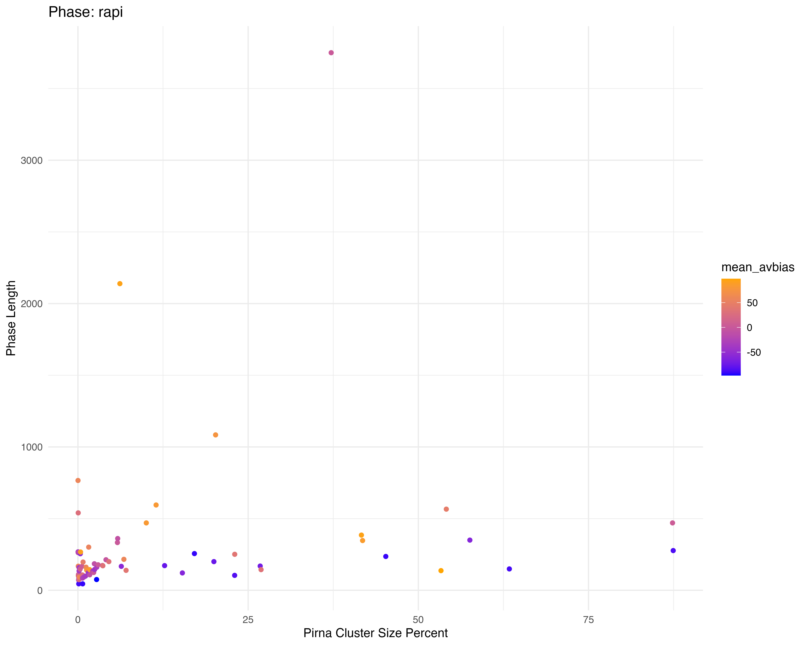
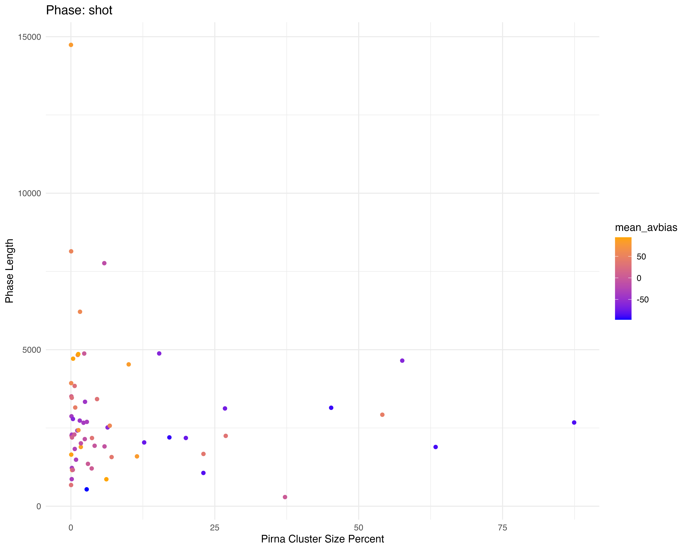
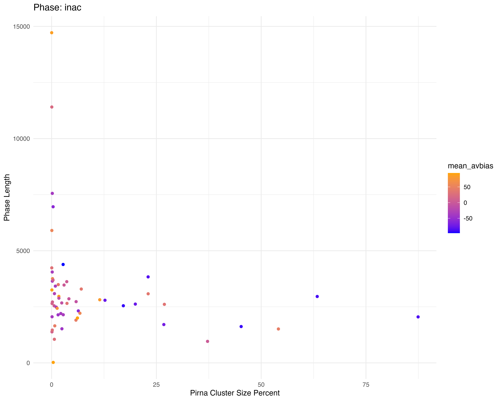

# Phase Length
Shashank Pritam

- [<span class="toc-section-number">1</span>
  Introduction](#introduction)
- [<span class="toc-section-number">2</span> Materials &
  Methods](#materials-methods)
  - [<span class="toc-section-number">2.1</span> Commands for the
    simulation](#commands-for-the-simulation)
  - [<span class="toc-section-number">2.2</span>
    Parameters](#parameters)
- [<span class="toc-section-number">3</span> Visualization in
  R](#visualization-in-r)
  - [<span class="toc-section-number">3.1</span> Set the environment by
    loading modules](#set-the-environment-by-loading-modules)
  - [<span class="toc-section-number">3.2</span> Load Data](#load-data)
- [<span class="toc-section-number">4</span> Results: Phase Length
  Plots](#results-phase-length-plots)
  - [<span class="toc-section-number">4.1</span> Rapi Phase
    Length](#rapi-phase-length)
  - [<span class="toc-section-number">4.2</span> Shot Phase
    Length](#shot-phase-length)
  - [<span class="toc-section-number">4.3</span> Inac Phase
    Length](#inac-phase-length)

## Introduction

In this simulation we explore the question - How does various phases of
invasion change with bias?

## Materials & Methods

version: invadego0.1.3

### Commands for the simulation

The simulations were generated using the code from:

- [sim_storm.py](./Simulation-Results_Files/Slurm-Jobs/sim_storm.py)

### Parameters

Simulations were ran with the following parameters:

- Number of simulations: 10000
- Number of threads: 4
- Number of replications (–rep): 1
- Transposition rate (–u): 0.2
- Number of steps (–steps): 1
- Population size (–N): 1000
- Number of generations (–gen): 5000
- Negative effect of a TE insertion (–x): 0.01
- Genome (–genome) mb:10,10,10,10,10
- Recombination Rate (–rr): 4,4,4,4,4
- Negative effect of a cluster insertions (-no-x-cluins, i.e, x=0)
- Silent mode: False

Random Clusters were Generated using this snippet:

<details>
<summary>Code</summary>

``` python
def get_rand_clusters(): 
    lower_limit = 0  # Lower bound
    upper_limit = math.log10(1e+7)  # Upper bound
    r = math.floor(10**random.uniform(lower_limit, upper_limit))
    return f"{r},{r},{r},{r},{r}"
```

</details>

## Visualization in R

### Set the environment by loading modules

<details>
<summary>Code</summary>

``` r
library(tidyverse)
library(ggplot2)
theme_set(theme_bw())
```

</details>

### Load Data

<details>
<summary>Code</summary>

``` r
# Define column names and numeric columns
column_names <- c("rep", "gen", "popstat", "spacer_1", "fwte", "avw", "min_w", "avtes", "avpopfreq", "fixed", "spacer_2", "phase", "fwcli", "avcli", "fixcli", "spacer_3", "avbias", "3tot", "3cluster", "spacer_4", "sampleid")
numeric_columns <- c("rep", "gen", "fwte", "avw", "min_w", "avtes", "avpopfreq", "fixed", "fwcli", "avcli", "fixcli", "avbias", "sampleid")

# Set the folder path where your txt files are stored
folder_path <- "Simulation-Results_Files/simulation_storm/phaselen/20thNov23at091514PM"
images_path <- "images"

# Read all files into one data frame
all_data <- map_df(0:99, ~read_delim(file.path(folder_path, paste0(.x, ".txt")), 
                                     delim = '\t', 
                                     col_names = column_names, 
                                     show_col_types = FALSE))

# Convert columns to numeric where necessary
all_data[numeric_columns] <- lapply(all_data[numeric_columns], as.numeric)

# Process data for each phase and calculate sampleid_percent
process_data <- function(data, phase_name) {
    data %>% 
        filter(phase == phase_name) %>%
        mutate(sampleid_percent = (sampleid / 10000) * 100) %>%
        filter(sampleid_percent != 0) %>%
        group_by(sampleid, sampleid_percent) %>%
        summarize(phase_length = n(), 
                  mean_avbias = mean(avbias, na.rm = TRUE), .groups = 'keep') 
}

print(process_data(all_data, "rapi"))
```

</details>

    # A tibble: 71 × 4
    # Groups:   sampleid, sampleid_percent [71]
       sampleid sampleid_percent phase_length mean_avbias
          <dbl>            <dbl>        <int>       <dbl>
     1        1             0.01          766        57.9
     2        2             0.02          268       -39.3
     3        3             0.03          263       -18.6
     4        4             0.04          540        29.4
     5        5             0.05          168        57.0
     6        6             0.06          102        90  
     7        8             0.08          110        13  
     8       10             0.1            72       -37  
     9       11             0.11           98        13  
    10       12             0.12           45       -89  
    # ℹ 61 more rows

<details>
<summary>Code</summary>

``` r
# Plot for each phase
plot_rapi <- ggplot(process_data(all_data, "rapi"), aes(x = sampleid_percent, y = phase_length, color = mean_avbias)) +
             geom_point() +
             scale_color_gradient(low = "blue", high = "orange") +
             labs(title = "Phase: rapi", x = "Pirna Cluster Size Percent", y = "Phase Length") +
             theme_minimal()

plot_shot <- ggplot(process_data(all_data, "shot"), aes(x = sampleid_percent, y = phase_length, color = mean_avbias)) +
             geom_point() +
             scale_color_gradient(low = "blue", high = "orange") +
             labs(title = "Phase: shot", x = "Pirna Cluster Size Percent", y = "Phase Length") +
             theme_minimal()

plot_inac <- ggplot(process_data(all_data, "inac"), aes(x = sampleid_percent, y = phase_length, color = mean_avbias)) +
             geom_point() +
             scale_color_gradient(low = "blue", high = "orange") +
             labs(title = "Phase: inac", x = "Pirna Cluster Size Percent", y = "Phase Length") +
             theme_minimal()

# Save the plots
ggsave(filename = file.path(images_path, "phase_length_rapi.jpg"), plot = plot_rapi, width = 10, height = 8, dpi = 600)
ggsave(filename = file.path(images_path, "phase_length_shot.jpg"), plot = plot_shot, width = 10, height = 8, dpi = 600)
ggsave(filename = file.path(images_path, "phase_length_inac.jpg"), plot = plot_inac, width = 10, height = 8, dpi = 600)
```

</details>

## Results: Phase Length Plots

### Rapi Phase Length



### Shot Phase Length



### Inac Phase Length


