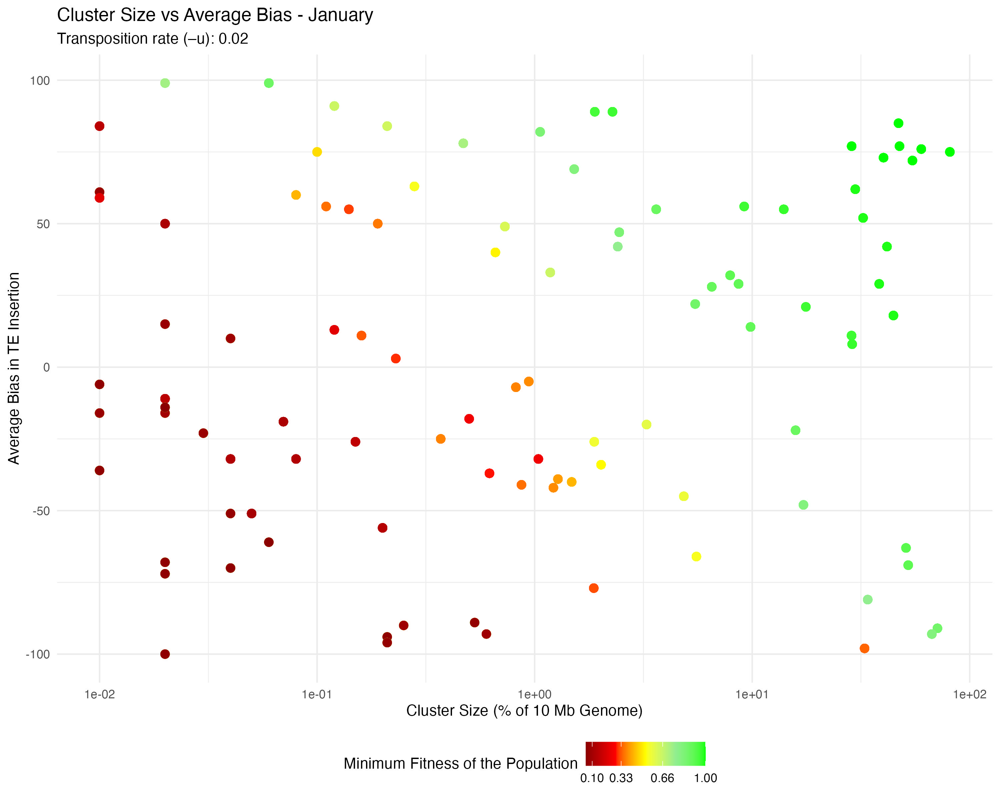
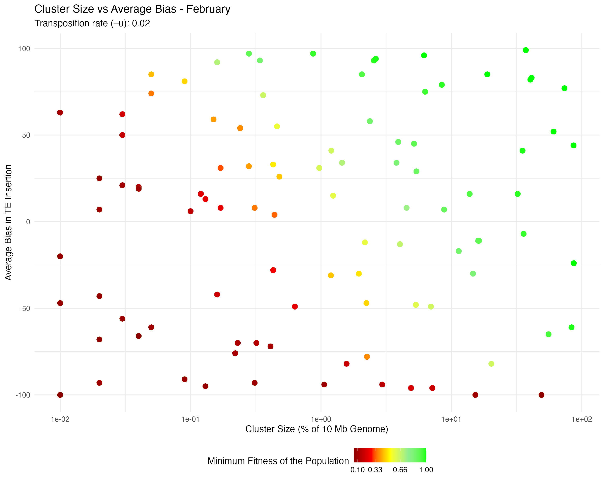
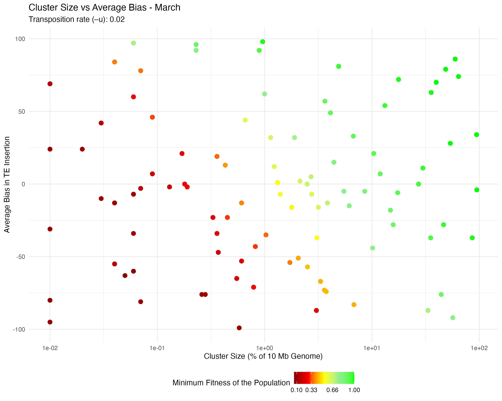
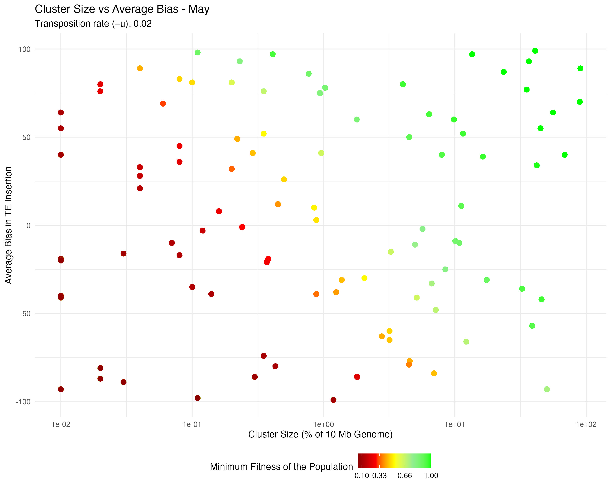
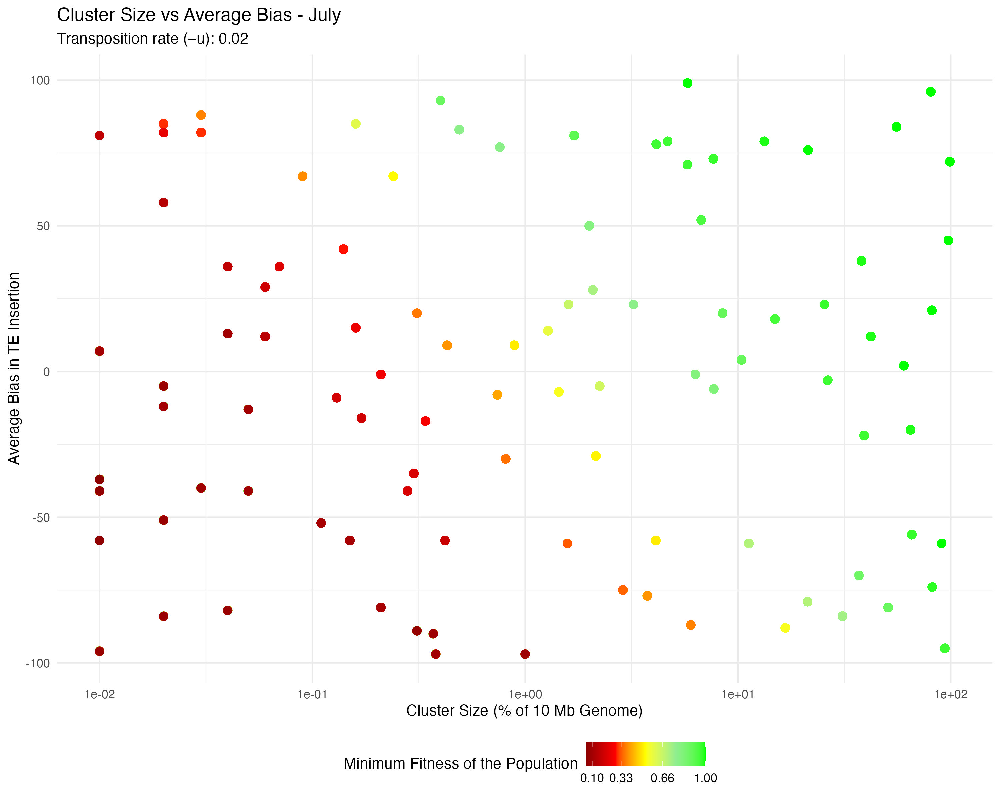
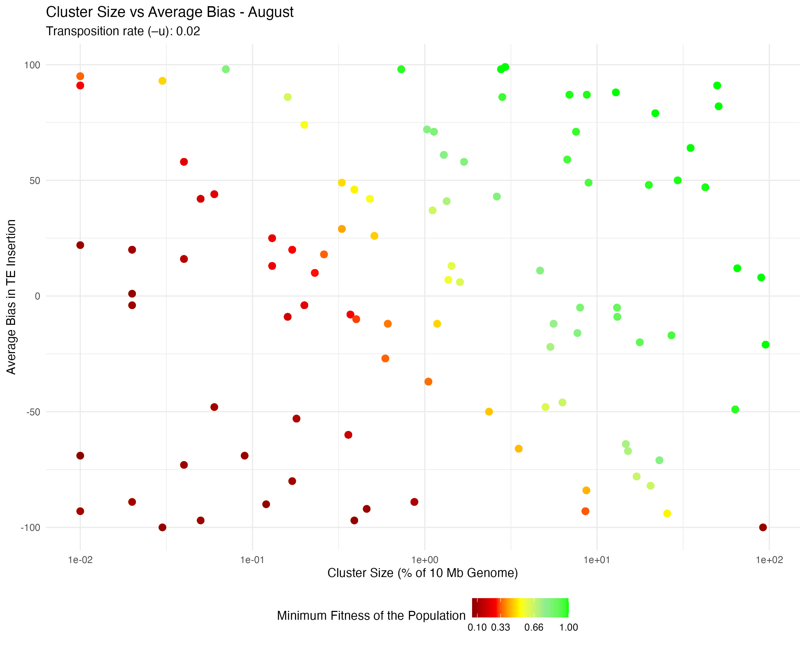
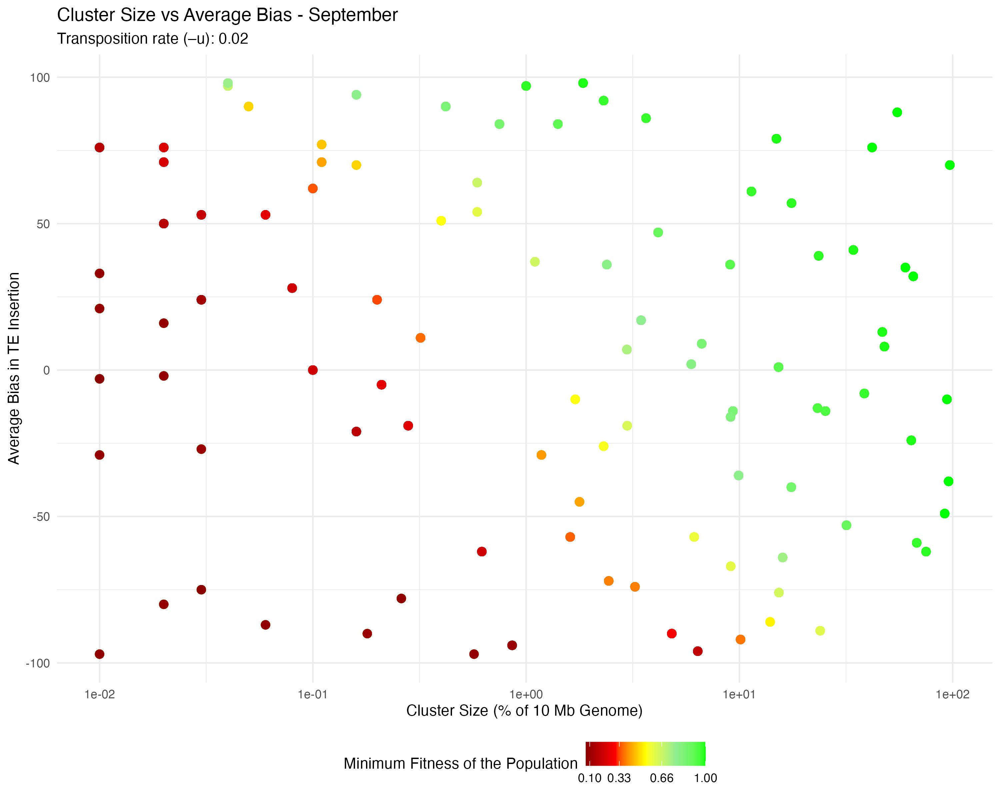
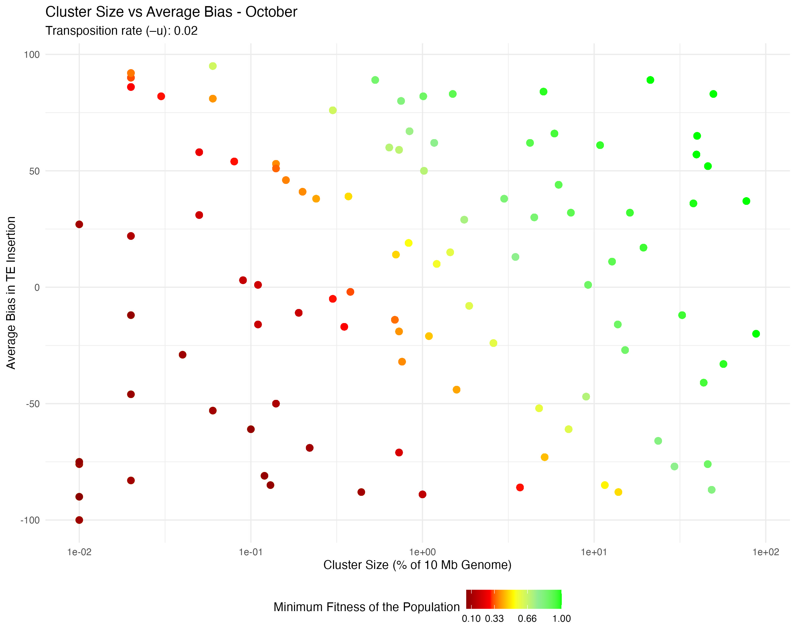
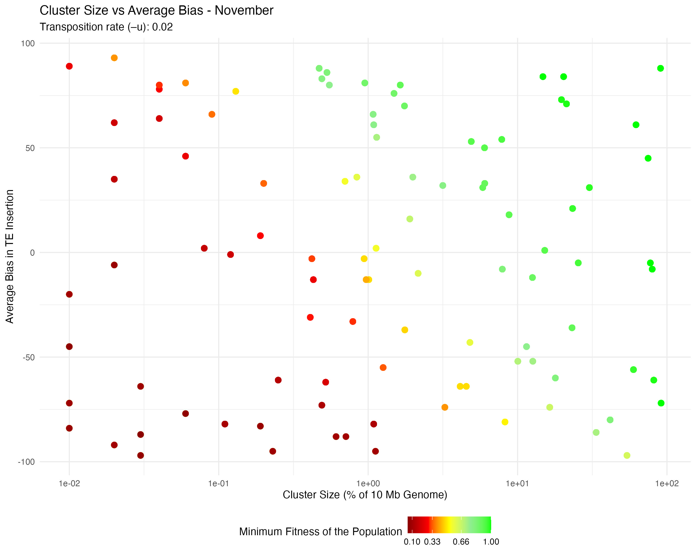
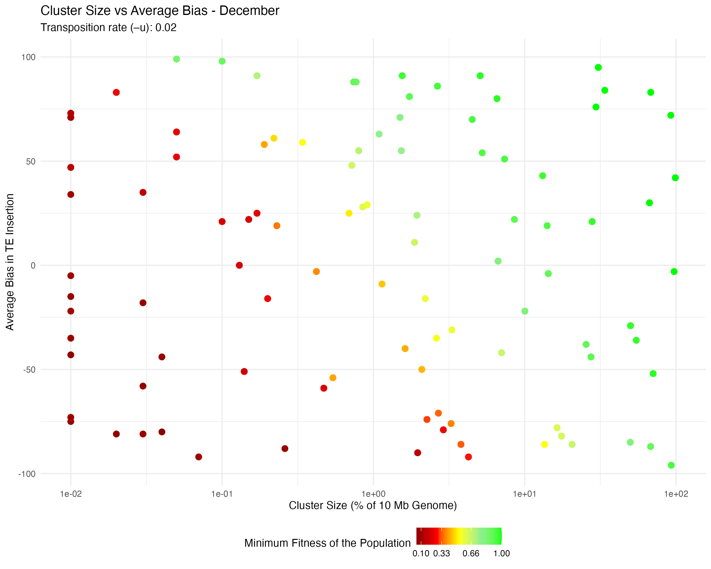

# Population_Size
Shashank Pritam

- [<span class="toc-section-number">1</span>
  Introduction](#introduction)
- [<span class="toc-section-number">2</span> Materials &
  Methods](#materials-methods)
  - [<span class="toc-section-number">2.1</span> Commands for the
    simulation](#commands-for-the-simulation)
  - [<span class="toc-section-number">2.2</span>
    Parameters](#parameters)
- [<span class="toc-section-number">3</span> Visualization in
  R](#visualization-in-r)
  - [<span class="toc-section-number">3.1</span> Setting the
    environment](#setting-the-environment)

## Introduction

In this simulation we explore the question - How does a species adapt to
Transposable Element (TE) invasion across dynamic population sizes due
to annual cycles and geographical variations?

## Materials & Methods

version: invadego0.1.3

### Commands for the simulation

The simulations were generated using the code from:

- [sim_storm.py](./Simulation-Results_Files/simulation_storm/minfit/sim_storm.py)

### Parameters

Simulations were ran with the following parameters:

- Number of simulations: 10000
- Number of threads: 4
- Number of replications (–rep): 1
- Transposition rate (–u): 0.2
- Number of steps (–steps): 5000
- Population size (–N): Variable
- Number of generations (–gen): 5000
- Negative effect of a TE insertion (–x): 0.01
- Genome (–genome) mb:10,10,10,10,10
- Recombination Rate (–rr): 4,4,4,4,4
- Negative effect of a cluster insertions (-no-x-cluins, i.e, x=0)
- Silent mode: True

Random Clusters were Generated using this snippet:

<details>
<summary>Code</summary>

``` python
def get_rand_clusters(): 
    lower_limit = 0  # Lower bound
    upper_limit = math.log10(1e+7)  # Upper bound
    r = math.floor(10**random.uniform(lower_limit, upper_limit))
    return f"{r},{r},{r},{r},{r}"
```

</details>

## Visualization in R

### Setting the environment

<details>
<summary>Code</summary>

``` r
library(tidyverse)
library(ggplot2)
library(readr)
theme_set(theme_bw())
```

</details>
<details>
<summary>Code</summary>

``` r
#| output: false
simulation_folder_path <- "/Users/shashankpritam/github/Insertion-Bias-TE/Simulation-Results_Files/simulation_storm/popvar/10thDec2023at072107PM/"

month_folders <- c("January", "February", "March", "April", "May", "June", "July", "August", "September", "October", "November", "December")

all_data <- tibble() 

column_names <- c("rep", "gen", "popstat", "spacer_1", "fwte", "avw", "min_w", "avtes", "avpopfreq", "fixed", "spacer_2", "phase", "fwcli", "avcli", "fixcli", "spacer_3", "avbias", "3tot", "3cluster", "spacer_4", "sampleid")

numeric_columns <- c("rep", "gen", "fwte", "avw", "min_w", "avtes", "avpopfreq", "fixed", "fwcli", "avcli", "fixcli", "avbias", "sampleid")

for (month in month_folders) {
  file_path <- paste0(simulation_folder_path, month, "/combined.txt")
  
  if (file.exists(file_path)) {
    month_data <- read.table(file_path, header = TRUE, sep = "\t")
    month_data$Month <- month
    
    # Ensure all required columns are present
    for (col in column_names) {
      if (!col %in% colnames(month_data)) {
        month_data[[col]] <- NA
      }
    }
    
    # Ensure numeric columns are numeric
    for (col in numeric_columns) {
      if (col %in% colnames(month_data)) {
        month_data[[col]] <- as.numeric(month_data[[col]])
      }
    }
    
    # Optionally, reorder columns to match 'column_names'
    month_data <- month_data[, c(column_names, "Month")]
    
    all_data <- bind_rows(all_data, month_data)
  }
}

# Create the sampleid_percent column and add it to numeric_columns
all_data <- all_data %>%
            mutate(sampleid_percent = (sampleid / 10000) * 100)

numeric_columns <- c(numeric_columns, "sampleid_percent")

# Convert columns to numeric where necessary
all_data[numeric_columns] <- lapply(all_data[numeric_columns], as.numeric)

# Count phases for each combination of avbias and sampleid
phase_counts <- all_data %>%
                group_by(avbias, sampleid_percent, phase) %>%
                summarize(phase_count = n(), .groups = 'drop')
```

</details>
<details>
<summary>Code</summary>

``` r
load_month_data <- function(folder_path, month) {
  # Define column names
  column_names <- c("rep", "gen", "popstat", "spacer_1", "fwte", "avw", "min_w", "avtes", "avpopfreq", "fixed", "spacer_2", "phase", "fwcli", "avcli", "fixcli", "spacer_3", "avbias", "3tot", "3cluster", "spacer_4", "sampleid")
  
  # Construct the file path
  file_path <- paste0(folder_path, month, "/combined.txt")

  # Read the data
  df <- read_delim(file_path, delim = '\t', col_names = column_names, show_col_types = FALSE)

  # Convert necessary columns to numeric
  numeric_columns <- c("rep", "gen", "fwte", "avw", "min_w", "avtes", "avpopfreq", "fixed", "fwcli", "avcli", "fixcli", "avbias", "sampleid")
  df[numeric_columns] <- lapply(df[numeric_columns], as.numeric)

  # Create the sampleid_percent column
  df <- df %>%
        mutate(sampleid_percent = (sampleid / 10000) * 100)

  return(df)
}
```

</details>
<details>
<summary>Code</summary>

``` r
plot_data <- function(df, month, u_value) {

  ggplot(df, aes(x = sampleid_percent, y = avbias, color = min_w)) +
    geom_point(alpha = 0.7, size = 0.8) +
    ylab("Average Bias in TE Insertion") +
    xlab("Cluster Size (% of 10 Mb Genome)") +
    labs(
      title = paste("Cluster Size vs Average Bias -", month),
      subtitle = paste("Transposition rate (–u):", u_value)
    ) +
    theme_minimal() +
    scale_color_gradientn(
      name = "Minimum Fitness of the Population",
      breaks = c(0.01, 0.1, 0.33, 0.66, 1),
      colors = c("darkred", "red", "yellow", "lightgreen", "green")
    ) +
    scale_x_log10() +
    theme(legend.position = "bottom")
}
```

</details>
<details>
<summary>Code</summary>

``` r
u_value <- 0.02

for (month in month_folders) {
  df <- load_month_data(simulation_folder_path, month)
  plot <- plot_data(df, month, u_value)
  
  # Save the plot
  ggsave(paste0("images/pop_var_", month, ".jpg"), plot, width = 10, height = 8)
}
```

</details>

    Warning: Removed 11 rows containing missing values (`geom_point()`).

    Warning: Removed 7 rows containing missing values (`geom_point()`).

    Warning: Removed 6 rows containing missing values (`geom_point()`).

    Warning: Removed 7 rows containing missing values (`geom_point()`).
    Removed 7 rows containing missing values (`geom_point()`).

    Warning: Removed 9 rows containing missing values (`geom_point()`).

    Warning: Removed 7 rows containing missing values (`geom_point()`).

    Warning: Removed 6 rows containing missing values (`geom_point()`).

    Warning: Removed 3 rows containing missing values (`geom_point()`).

    Warning: Removed 2 rows containing missing values (`geom_point()`).

    Warning: Removed 3 rows containing missing values (`geom_point()`).

    Warning: Removed 7 rows containing missing values (`geom_point()`).

<html>
<body>
<h2>
Population Variation Plots
</h2>














</body>
</html>
