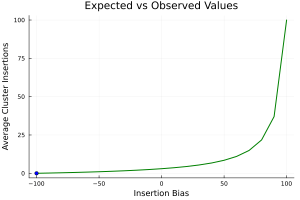

# Invadego: Insertion-Bias Module

This repository contains the results and data associated with the validation and simulation processes of Invadego's Insertion-Bias module.

**Invadego Version:** 0.1.3

## Directory Structure

1. [Validation_1_invasion.md](./Validation_1_invasion.md)
2. [Validation_2_drift.md](./Validation_2_drift.md)
3. [Validation_3_clusters.md](./Validation_3_clusters.md)
4. [Validation_4_recombination.md](./Validation_4_recombination.md)
5. [Validation_5_insertion-bias.md](./Validation_5_bias.md)
6. [Validation_6_Selection.md](./Validation_6_Selection.md)
7. [Validation_7_Insertion.md](./Validation_7_Insertion_Bias.md)
8. [Simulation-Results_Files](./Simulation-Results_Files)

    a. [Slurm-Jobs](./Simulation-Results_Files/Slurm-Jobs)
   
    b. [validation_1](./Simulation-Results_Files/validation_1)
   
    c. [validation_2](./Simulation-Results_Files/validation_2)
   
    d. [validation_3](./Simulation-Results_Files/validation_3)
   
    e. [validation_4](./Simulation-Results_Files/validation_4)
   
    f. [validation_5.1](./Simulation-Results_Files/validation_5.1)
   
    g. [validation_5.2](./Simulation-Results_Files/validation_5.2)
   
    h. [validation_6](./Simulation-Results_Files/validation_6)
   
    i. [validation_7](./Simulation-Results_Files/validation_7.1)

10. [archives](./archives)
11. [.gitattributes](./.gitattributes)
12. [.gitignore](./.gitignore)
13. [README.md](./README.md)

Feel free to explore the repository for more details on the validation and simulation results.

