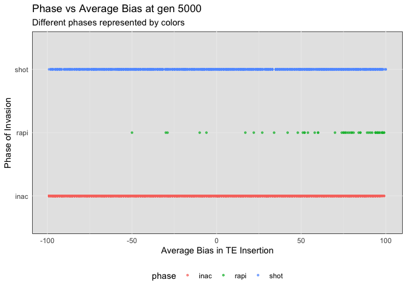
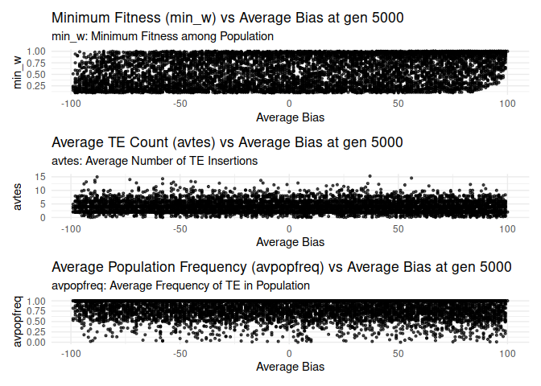
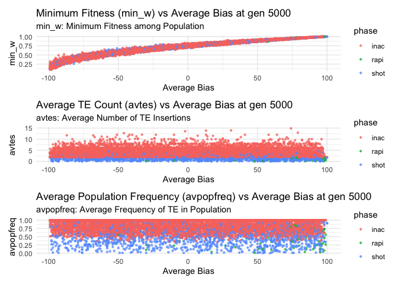
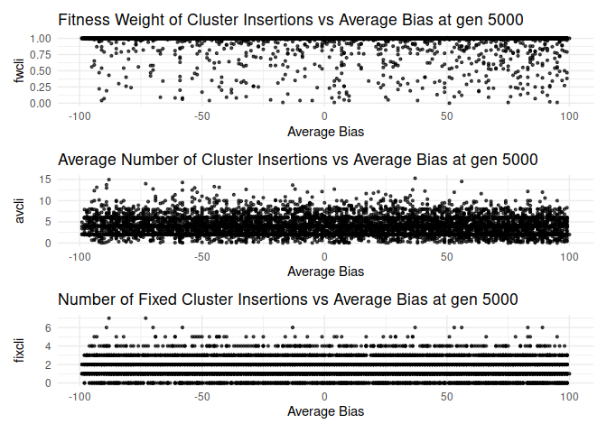
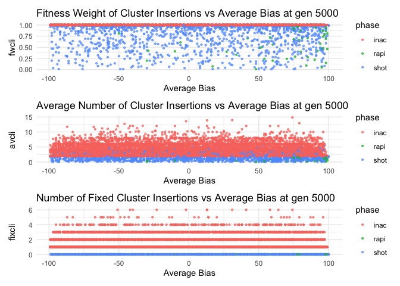

# Simulation Storm
Shashank Pritam

- [Simulation Storm](#simulation-storm)
  - [Introduction](#introduction)
    - [Initial conditions:](#initial-conditions)
      - [Simulation 1](#simulation-1)
  - [Materials \& Methods](#materials--methods)
    - [Commands for the simulation:](#commands-for-the-simulation)
    - [Visualization in R](#visualization-in-r)
      - [Setting the environment](#setting-the-environment)
      - [Data loading and parsing](#data-loading-and-parsing)
      - [Visualization:](#visualization)
    - [Plot 1: Phase vs Average Bias at gen 5000](#plot-1-phase-vs-average-bias-at-gen-5000)
    - [Plot 2: min\_w, avtes and avpopfreq vs avbias](#plot-2-min_w-avtes-and-avpopfreq-vs-avbias)
    - [Plot 3: Plot for min\_w, avtes and avpopfreq vs avbias with phase as a factor](#plot-3-plot-for-min_w-avtes-and-avpopfreq-vs-avbias-with-phase-as-a-factor)
    - [Plot 4: min\_w, avtes, avpopfreq vs Average Bias at gen 5000](#plot-4-min_w-avtes-avpopfreq-vs-average-bias-at-gen-5000)
    - [Plot 5: min\_w, avtes, avpopfreq vs Average Bias at gen 5000 with phase as a factor](#plot-5-min_w-avtes-avpopfreq-vs-average-bias-at-gen-5000-with-phase-as-a-factor)

## Introduction

With this simulation we wanted to understand the role of insertion bias
on minimum fitness during a TEs invasion.


### Initial conditions:

#### Simulation 1


|       | Parameter                          | Description & Value                                               |
|-------|------------------------------------|-------------------------------------------------------------------|
|   1   | Number of simulations              | 10,000                                                            |
|   2   | Number of threads                  | 4                                                                 |
|   3   | Output directory                   | 11thAug23at083124PM                                               |
|   4   | Invade path                        | ./main                                                            |
|   5   | Number of replications (`--rep`)   | 1                                                                 |
|   6   | Mutation rate (`--u`)              | 0.1                                                               |
|   7   | Number of steps (`--steps`)        | 5000                                                              |
|   8   | Population size (`--N`)            | 1000                                                              |
|   9   | Number of generations (`--gen`)    | 5000                                                              |
|  10   | Silent mode                        | False                                                             |
|  11   | Chromosome configuration           | 5 chromosomes of size 10 Mb with 300kb cluster each               |
|  12   | Recombination rate (`--rr`)        | 4cM/Mb for each chromosome (`4,4,4,4`)                            |
|  13   | Negative effect (`--x`)            | 0.01                                                              |
|  14   | Cluster insertions (`--no-x-cluins`)| Switch; no negative effect for cluster insertions (x=0)          |


## Materials & Methods

version: invadego0.1.3

### Commands for the simulation:

The simulations were generated using the code from:

- [sim_storm.py](./Simulation-Results_Files/simulation_storm/sim_storm.py)

<details>
<summary>Code</summary>

``` python
# Imports
import argparse
import random
import time
import math
import os
import subprocess

# Path where the main is currently in my system
invade_path = os.path.join("./main")

# Parser info
parser = argparse.ArgumentParser(description="""           
Description
-----------
     ___ _   ___     ___    ____  _____ ____  ___  
    |_ _| \ | \ \   / / \  |  _ \| ____/ ___|/ _ \ 
     | ||  \| |\ \ / / _ \ | | | |  _|| |  _| | | |
     | || |\  | \ V / ___ \| |_| | |__| |_| | |_| |
    |___|_| \_|  \_/_/   \_\____/|_____\____|\___/ 

    Simulation Storm""",
    formatter_class=argparse.RawDescriptionHelpFormatter,
    epilog="""
Prerequisites
-------------
    python version 3+

Authors
-------
    Robert Kofler
    Filip Wierzbicki
    Almorò Scarpa
    Shashank Pritam
""")


# Get current time
def current_milli_time():
    return round(time.time() * 1000)

# Generate random bias in range of (-100, 100)
def get_rand_bias():
    return random.randint(-100, 100)


# The default directory is dynamic and depends on the time this scipt is invoked
def get_default_output_directory():
    current_time = time.strftime("%dth%b%yat%I%M%S%p", time.gmtime())
    default_output_directory = os.path.join(current_time)

    if not os.path.exists(default_output_directory):
        os.makedirs(default_output_directory)

    return default_output_directory


# Parser arguments
parser = argparse.ArgumentParser()

parser.add_argument("--number", type=int, dest="count", default=100, help="the number of simulations")
parser.add_argument("--threads", type=int, dest="threads", default=4, help="the threads of simulations")
parser.add_argument("--output", type=str, dest="output", default=get_default_output_directory(), help="the output directory for simulations")
parser.add_argument("--invade", type=str, dest="invade", default=invade_path, help="the invade.go")
parser.add_argument("--rep", type=int, dest="rep", default=1, help="the number of replications")
parser.add_argument("--u", type=float, dest="u", default=0.2, help="the mutation rate")
parser.add_argument("--steps", type=int, dest="steps", default=5000, help="the number of steps")
parser.add_argument("--N", type=int, dest="N", default=1000, help="population size")
parser.add_argument("--gen", type=int, dest="gen", default=5000, help="number of generations")
parser.add_argument("--silent", action="store_true", dest="silent", default=False, help="be quiet; default=False")

args = parser.parse_args()


# The basic command line input for invadego which will have some parameters appended later on
def get_basis(invade):
    return f'{invade} -no-x-cluins --N {args.N} --gen {args.gen} --genome mb:10,10,10,10,10 --x 0.01 --rr 4,4,4,4,4 --rep {args.rep} --u {args.u} --steps {args.steps} --silent'


# Removing irrelavant lines from putput files
def get_filter():
    return """|grep -v "^Invade"|grep -v "^#" """

# Getting random cluter insertions values in the range of (3% to 97%)
def get_rand_clusters():
    r = 300
    #r = random.randint(300, 9700)
    #r = math.floor(10**random.uniform(3.69899,5.69899))
    return f"{r},{r},{r},{r},{r}"


# TE invasion that is stopped by cluster insertions and neg selection against TEs
def run_cluster_negsel(invade, count, output):
    """
    TE invasion that is stopped by cluster insertions and neg selection against TEs
    """
    commandlist = []
    for i in range(count):
        x = get_rand_clusters()
        tr = current_milli_time() + i
        sampleid_value = x.split(',')[0]
        command_basis = get_basis(invade)
        command = f'{command_basis} --basepop "100({get_rand_bias()})" --cluster kb:{x} --replicate-offset {i} --seed {tr} '
        command += f'--sampleid {sampleid_value} {get_filter()} > {os.path.join(output, str(i))}.txt'
        commandlist.append(command)
    return commandlist


# Construct the command list
commandlist = run_cluster_negsel(args.invade, args.count, args.output)

# Submit Jobs
def submit_job_max_len(commandlist, max_processes):
    sleep_time = 10.0
    processes = list()
    for command in commandlist:
        if not args.silent:
            print(f'Running process. \nSubmitting {command}')
        processes.append(subprocess.Popen(command, shell=True, stdout=None))
        while len(processes) >= max_processes:
            time.sleep(sleep_time)
            processes = [proc for proc in processes if proc.poll() is None]
    while len(processes) > 0:
        time.sleep(sleep_time)
        processes = [proc for proc in processes if proc.poll() is None]


print(f"""Running Simulations with the following parameters:
Number of simulations: {args.count}
Number of threads: {args.threads}
Output directory: {args.output}
Invade path: {args.invade}
Number of replications (--rep): {args.rep}
Mutation rate (--u): {args.u}
Number of steps (--steps): {args.steps}
Population size (--N): {args.N}
Number of generations (--gen): {args.gen}
Silent mode: {args.silent}
""")


# This is the "main"
submit_job_max_len(commandlist, max_processes=args.threads)


# Cat 🐈 all the files together:
with open(f"{args.output}/combined.txt", "w") as outfile:
    for i in range(args.count):
        filename = f"{args.output}/{i}.txt"
        subprocess.run(["cat", filename], stdout=outfile)
        
# Sign of completion of the job.
print("Done")
```

</details>

### Visualization in R

#### Setting the environment

<details>
<summary>Code</summary>

``` r
library(tidyverse)
```

</details>

    ── Attaching core tidyverse packages ──────────────────────── tidyverse 2.0.0 ──
    ✔ dplyr     1.1.2     ✔ readr     2.1.4
    ✔ forcats   1.0.0     ✔ stringr   1.5.0
    ✔ ggplot2   3.4.2     ✔ tibble    3.2.1
    ✔ lubridate 1.9.2     ✔ tidyr     1.3.0
    ✔ purrr     1.0.1     
    ── Conflicts ────────────────────────────────────────── tidyverse_conflicts() ──
    ✖ dplyr::filter() masks stats::filter()
    ✖ dplyr::lag()    masks stats::lag()
    ℹ Use the conflicted package (<http://conflicted.r-lib.org/>) to force all conflicts to become errors

<details>
<summary>Code</summary>

``` r
library(RColorBrewer)
library(ggplot2)
library(patchwork)
library(dplyr)
theme_set(theme_bw())
```

</details>

#### Data loading and parsing

<details>
<summary>Code</summary>

``` r
# Define and load DataFrame with column names
column_names <- c("rep", "gen", "popstat", "spacer_1", "fwte", "avw", "min_w", "avtes", "avpopfreq", "fixed", "spacer_2", "phase", "fwcli", "avcli", "fixcli", "spacer_3", "avbias", "3tot", "3cluster", "spacer_4", "sampleid")
df <- read_delim('/Users/shashankpritam/github/Insertion-Bias-TE/Simulation-Results_Files/simulation_storm/11thAug23at083124PM/combined.txt', delim='\t', col_names = column_names)
```

</details>

    Rows: 20000 Columns: 22
    ── Column specification ────────────────────────────────────────────────────────
    Delimiter: "\t"
    chr  (8): popstat, spacer_1, spacer_2, phase, spacer_3, 3tot, 3cluster, spac...
    dbl (13): rep, gen, fwte, avw, min_w, avtes, avpopfreq, fixed, fwcli, avcli,...
    lgl  (1): X22

    ℹ Use `spec()` to retrieve the full column specification for this data.
    ℹ Specify the column types or set `show_col_types = FALSE` to quiet this message.

<details>
<summary>Code</summary>

``` r
# Convert specific columns to numeric
numeric_columns <- c("rep", "gen", "fwte", "avw", "min_w", "avtes", "avpopfreq", "fixed", "fwcli", "avcli", "fixcli", "avbias", "sampleid")
df[numeric_columns] <- lapply(df[numeric_columns], as.numeric)
```

</details>

#### Visualization:

<details>
<summary>Code</summary>

``` r
# Define color gradient functions
color.gradient <- function(x, colors=c("#D7191C","#FDAE61","#A6D96A","#1A9641"), colsteps=100) { colorRampPalette(colors) (colsteps) [ findInterval(x, seq(min(df$min_w),1.0, length.out=colsteps)) ] }

# Assign colors based on the 'min_w' column
df$col <- color.gradient(df$min_w)
df[df$popstat == "fail-0",]$col <- "grey"
df$col <- as.factor(df$col)

# Create and plot the ggplot object
# Subset the data for gen 5000
df_gen_5000 <- df[df$gen == 5000,]
```

</details>

### Plot 1: Phase vs Average Bias at gen 5000

Here we are plotting the phase of the simulation or experiment against
the average bias in TE insertion at generation 5000. The different
phases are color-coded.

<details>
<summary>Code</summary>

``` r
g_avbias_phase <- ggplot(df_gen_5000, aes(x = avbias, y = phase, color = phase)) +
  geom_point(alpha = 0.7, size = 0.8) +
  ylab("Phase of Invasion") +
  xlab("Average Bias in TE Insertion") +
  labs(title = "Phase vs Average Bias at gen 5000",
       subtitle = "Different phases represented by colors") +
  theme_minimal() +
  theme(legend.position = "bottom", panel.background = element_rect(fill="grey90"))

# Display the plot
plot(g_avbias_phase)
```

</details>



### Plot 2: min_w, avtes and avpopfreq vs avbias

Here we are plotting the parameters min_w, avtes and avpopfreq against
the average bias in TE insertion at generation 5000. The different
phases are color-coded.

<details>
<summary>Code</summary>

``` r
# Plot for min_w vs avbias
plot_min_w <- ggplot(df_gen_5000, aes(x = avbias, y = min_w)) +
  geom_point(alpha = 0.7, size = 0.8) +
  ylab("min_w") +
  xlab("Average Bias") +
  labs(title = "Minimum Fitness (min_w) vs Average Bias at gen 5000",
       subtitle = "min_w: Minimum Fitness among Population") +
  theme_minimal()

# Plot for avtes vs avbias
plot_avtes <- ggplot(df_gen_5000, aes(x = avbias, y = avtes)) +
  geom_point(alpha = 0.7, size = 0.8) +
  ylab("avtes") +
  xlab("Average Bias") +
  labs(title = "Average TE Count (avtes) vs Average Bias at gen 5000",
       subtitle = "avtes: Average Number of TE Insertions") +
  theme_minimal()

# Plot for avpopfreq vs avbias
plot_avpopfreq <- ggplot(df_gen_5000, aes(x = avbias, y = avpopfreq)) +
  geom_point(alpha = 0.7, size = 0.8) +
  ylab("avpopfreq") +
  xlab("Average Bias") +
  labs(title = "Average Population Frequency (avpopfreq) vs Average Bias at gen 5000",
       subtitle = "avpopfreq: Average Frequency of TE in Population") +
  theme_minimal()

# Combine the plots
combined_plot <- plot_min_w / plot_avtes / plot_avpopfreq

# Display the combined plot
plot(combined_plot)
```

</details>



### Plot 3: Plot for min_w, avtes and avpopfreq vs avbias with phase as a factor

<details>
<summary>Code</summary>

``` r
# Plot for min_w vs avbias
plot_min_w <- ggplot(df_gen_5000, aes(x = avbias, y = min_w, color = phase)) +
  geom_point(alpha = 0.7, size = 0.8) +
  ylab("min_w") +
  xlab("Average Bias") +
  labs(title = "Minimum Fitness (min_w) vs Average Bias at gen 5000",
       subtitle = "min_w: Minimum Fitness among Population") +
  theme_minimal()

# Plot for avtes vs avbias
plot_avtes <- ggplot(df_gen_5000, aes(x = avbias, y = avtes, color = phase)) +
  geom_point(alpha = 0.7, size = 0.8) +
  ylab("avtes") +
  xlab("Average Bias") +
  labs(title = "Average TE Count (avtes) vs Average Bias at gen 5000",
       subtitle = "avtes: Average Number of TE Insertions") +
  theme_minimal()

# Plot for avpopfreq vs avbias
plot_avpopfreq <- ggplot(df_gen_5000, aes(x = avbias, y = avpopfreq, color = phase)) +
  geom_point(alpha = 0.7, size = 0.8) +
  ylab("avpopfreq") +
  xlab("Average Bias") +
  labs(title = "Average Population Frequency (avpopfreq) vs Average Bias at gen 5000",
       subtitle = "avpopfreq: Average Frequency of TE in Population") +
  theme_minimal()

# Combine the plots
combined_plot <- plot_min_w / plot_avtes / plot_avpopfreq

# Display the combined plot
plot(combined_plot)
```

</details>



### Plot 4: min_w, avtes, avpopfreq vs Average Bias at gen 5000

Here we are plotting different attributes of the population related to
TEs against the average bias in TE insertion at generation 5000. Three
separate plots are combined into one for a concise visualization.

<details>
<summary>Code</summary>

``` r
# Subset the data for gen 5000
df_gen_5000 <- df[df$gen == 5000,]

# Plot for fwcli vs avbias
plot_fwcli <- ggplot(df_gen_5000, aes(x = avbias, y = fwcli)) +
  geom_point(alpha = 0.7, size = 0.8) +
  ylab("fwcli") +
  xlab("Average Bias") +
  labs(title = "Fitness Weight of Cluster Insertions vs Average Bias at gen 5000") +
  theme_minimal()

# Plot for avcli vs avbias
plot_avcli <- ggplot(df_gen_5000, aes(x = avbias, y = avcli)) +
  geom_point(alpha = 0.7, size = 0.8) +
  ylab("avcli") +
  xlab("Average Bias") +
  labs(title = "Average Number of Cluster Insertions vs Average Bias at gen 5000") +
  theme_minimal()

# Plot for fixcli vs avbias
plot_fixcli <- ggplot(df_gen_5000, aes(x = avbias, y = fixcli)) +
  geom_point(alpha = 0.7, size = 0.8) +
  ylab("fixcli") +
  xlab("Average Bias") +
  labs(title = "Number of Fixed Cluster Insertions vs Average Bias at gen 5000") +
  theme_minimal()

# Combine the plots
combined_plot_2 <- plot_fwcli / plot_avcli / plot_fixcli

# Display the combined plot
plot(combined_plot_2)
```

</details>



### Plot 5: min_w, avtes, avpopfreq vs Average Bias at gen 5000 with phase as a factor

<details>
<summary>Code</summary>

``` r
# Plot for fwcli vs avbias
plot_fwcli <- ggplot(df_gen_5000, aes(x = avbias, y = fwcli, color = phase)) +
  geom_point(alpha = 0.7, size = 0.8) +
  ylab("fwcli") +
  xlab("Average Bias") +
  labs(title = "Fitness Weight of Cluster Insertions vs Average Bias at gen 5000") +
  theme_minimal()

# Plot for avcli vs avbias
plot_avcli <- ggplot(df_gen_5000, aes(x = avbias, y = avcli, color = phase)) +
  geom_point(alpha = 0.7, size = 0.8) +
  ylab("avcli") +
  xlab("Average Bias") +
  labs(title = "Average Number of Cluster Insertions vs Average Bias at gen 5000") +
  theme_minimal()

# Plot for fixcli vs avbias
plot_fixcli <- ggplot(df_gen_5000, aes(x = avbias, y = fixcli, color = phase)) +
  geom_point(alpha = 0.7, size = 0.8) +
  ylab("fixcli") +
  xlab("Average Bias") +
  labs(title = "Number of Fixed Cluster Insertions vs Average Bias at gen 5000") +
  theme_minimal()

# Combine the plots
combined_plot <- plot_fwcli / plot_avcli / plot_fixcli

# Display the combined plot
plot(combined_plot)
```

</details>


