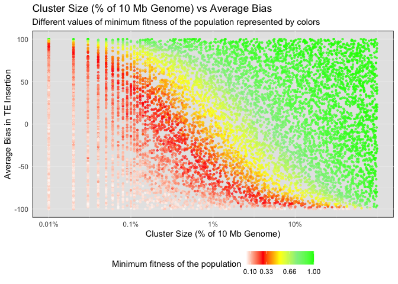

# Minimum Fitness
Shashank Pritam

- [<span class="toc-section-number">0.1</span>
  Introduction](#introduction)
  - [<span class="toc-section-number">0.1.1</span> Initial
    conditions](#initial-conditions)
- [<span class="toc-section-number">0.2</span> Materials &
  Methods](#materials-methods)
  - [<span class="toc-section-number">0.2.1</span> Commands for the
    simulation](#commands-for-the-simulation)
- [<span class="toc-section-number">0.3</span> Visualization in
  R](#visualization-in-r)
- [<span class="toc-section-number">1</span> Plot](#plot)
  - [<span class="toc-section-number">1.1</span>
    Conclusion](#conclusion)

## Introduction

What is the impact of insertion bias on the minimum fitness of a
population during the invasion of transposable elements (TEs)?

### Initial conditions

## Materials & Methods

version: invadego0.1.3

### Commands for the simulation

The simulations were generated using the code from:

- [sim_storm.py](./sim_storm.py)

## Visualization in R

<details>
<summary>Code</summary>

``` r
# Setting the environment
library(tidyverse)
```

</details>

    ── Attaching core tidyverse packages ──────────────────────── tidyverse 2.0.0 ──
    ✔ dplyr     1.1.2     ✔ readr     2.1.4
    ✔ forcats   1.0.0     ✔ stringr   1.5.0
    ✔ ggplot2   3.4.3     ✔ tibble    3.2.1
    ✔ lubridate 1.9.2     ✔ tidyr     1.3.0
    ✔ purrr     1.0.2     
    ── Conflicts ────────────────────────────────────────── tidyverse_conflicts() ──
    ✖ dplyr::filter() masks stats::filter()
    ✖ dplyr::lag()    masks stats::lag()
    ℹ Use the conflicted package (<http://conflicted.r-lib.org/>) to force all conflicts to become errors

<details>
<summary>Code</summary>

``` r
library(ggplot2)
theme_set(theme_bw())

# Data loading and parsing
column_names <- c("rep", "gen", "popstat", "spacer_1", "fwte", "avw", "min_w", "avtes", "avpopfreq", "fixed", "spacer_2", "phase", "fwcli", "avcli", "fixcli", "spacer_3", "avbias", "3tot", "3cluster", "spacer_4", "sampleid")

df <- read_delim('./23thAug23at110646PM/combined.txt', delim='\t', col_names = column_names, show_col_types = FALSE)


numeric_columns <- c("rep", "gen", "fwte", "avw", "min_w", "avtes", "avpopfreq", "fixed", "fwcli", "avcli", "fixcli", "avbias", "sampleid")
df[numeric_columns] <- lapply(df[numeric_columns], as.numeric)

# Convert sampleid to % of the genome (given that genome size is 10,000 kb)
df$sampleid_percent = (df$sampleid / 10000) * 100

# Data Preparation and Plotting
df_gen_not0 <- df %>% filter(gen != 0)
df_gen_0 <- df %>% filter(gen == 0)


# Join and fill NaN
df_final <- left_join(df_gen_not0, df_gen_0, by = "rep", suffix = c("", "_from_gen0"))

# Step 2: Fill missing NaN values in the necessary columns
columns_to_fill <- c("popstat", "avbias", "sampleid", "min_w")
for (col in columns_to_fill) {
    df_final[[col]] <- ifelse(is.na(df_final[[col]]), df_final[[paste(col, "_from_gen0", sep = "")]], df_final[[col]])
}

# Keep only the necessary columns
df_final <- select(df_final, rep, popstat, avbias, sampleid, min_w)

# Calculate sampleid_percent
df_final$sampleid_percent <- (df_final$sampleid / 10000) * 100
```

</details>

# Plot

<details>
<summary>Code</summary>

``` r
# Custom color breaks and colors for fitness
breaks = c(0.01, 0.1, 0.33, 0.66, 1)
colors = c("white", "red", "yellow", "lightgreen", "green")

# Update ggplot
g_avbias_cluster_size <- ggplot(df_final, aes(x = sampleid_percent, y = avbias, color = min_w)) +
  geom_point(alpha = 0.7, size = 0.8) +
  ylab("Average Bias in TE Insertion") +
  xlab("Cluster Size (% of 10 Mb Genome)") +
  labs(
    title = "Cluster Size (% of 10 Mb Genome) vs Average Bias",
    subtitle = "Different values of minimum fitness of the population represented by colors",
    x = "Cluster Size (% of 10 Mb Genome)",
    y = "Average Bias in TE Insertion"
  ) +
  scale_color_gradientn(
    name = "Minimum fitness of the population",
    breaks = breaks,
    colors = colors
  ) +
  scale_x_log10(
    breaks = c(0.001, 0.01, 0.1, 1, 10),
    labels = c("0.001%", "0.01%", "0.1%", "1%", "10%")
  ) +  
  theme_minimal() +
  theme(
    legend.position = "bottom", 
    panel.background = element_rect(fill = "grey90")
  )

g_avbias_cluster_size
```

</details>



<details>
<summary>Code</summary>

``` r
# Save the plot
ggsave(filename = "../../../images/minimum_fitness.jpg", plot = g_avbias_cluster_size, width = 10, height = 6)
```

</details>

## Conclusion

In the above diagram, we have a fixed transposition rate of 0.2.
Previously, it has been shown by Kofler\[2020\] that piRNA Clusters Need
a Minimum Size to Control Transposable Element Invasions, and with small
sized population, piRNA clusters may need to make up as much as 3% of
the genome, given there is a high rate of transposition alongside with
recessive TE insertions. Here, we observe that the compensation for
lower cluster size comes through increased insertion bias. The
population fitness increases with cluster size and average bias;
negative bias results in extinction even with a large cluster size.

------------------------------------------------------------------------

<cite><a href="https://doi.org/10.1093/gbe/evaa064">Robert Kofler,
“piRNA Clusters Need a Minimum Size to Control Transposable Element
Invasions,” Genome Biology and Evolution, Volume 12, Issue 5, May 2020,
Pages 736–749</a></cite>
