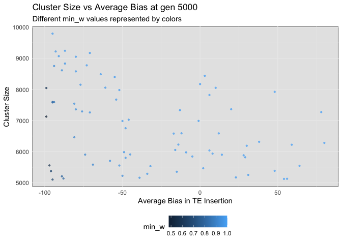
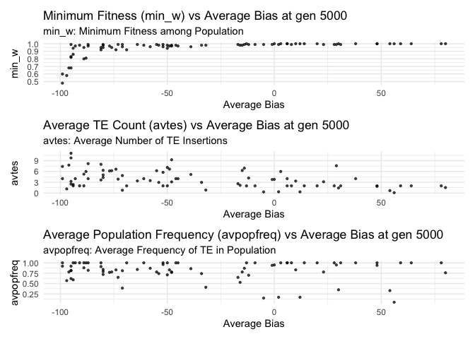
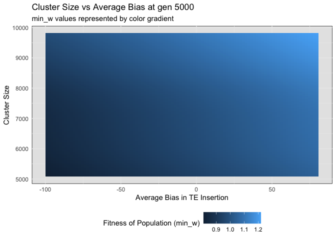

# Minimum Fitness
Shashank Pritam

- [<span class="toc-section-number">1</span>
  Introduction](#introduction)
  - [<span class="toc-section-number">1.1</span> Initial
    conditions:](#initial-conditions)
- [<span class="toc-section-number">2</span> Materials &
  Methods](#materials-methods)
  - [<span class="toc-section-number">2.1</span> Commands for the
    simulation:](#commands-for-the-simulation)
  - [<span class="toc-section-number">2.2</span> Visualization in
    R](#visualization-in-r)
  - [<span class="toc-section-number">2.3</span> Plot 1: Phase vs
    Average Bias at gen 5000](#plot-1-phase-vs-average-bias-at-gen-5000)
  - [<span class="toc-section-number">2.4</span> Plot 3: Plot for min_w,
    avtes and avpopfreq vs avbias with phase as a
    factor](#plot-3-plot-for-min_w-avtes-and-avpopfreq-vs-avbias-with-phase-as-a-factor)
  - [<span class="toc-section-number">2.5</span> Plot 5: min_w, avtes,
    avpopfreq vs Average Bias at gen 5000 with phase as a
    factor](#plot-5-min_w-avtes-avpopfreq-vs-average-bias-at-gen-5000-with-phase-as-a-factor)

## Introduction

With this simulation we wanted to understand the role of insertion bias
on minimum fitness during a TEs invasion.

### Initial conditions:

## Materials & Methods

version: invadego0.1.3

### Commands for the simulation:

The simulations were generated using the code from:

- [sim_storm.py](sim_storm.py)

### Visualization in R

#### Setting the environment

<details>
<summary>Code</summary>

``` r
library(tidyverse)
```

</details>

    ── Attaching core tidyverse packages ──────────────────────── tidyverse 2.0.0 ──
    ✔ dplyr     1.1.2     ✔ readr     2.1.4
    ✔ forcats   1.0.0     ✔ stringr   1.5.0
    ✔ ggplot2   3.4.2     ✔ tibble    3.2.1
    ✔ lubridate 1.9.2     ✔ tidyr     1.3.0
    ✔ purrr     1.0.1     
    ── Conflicts ────────────────────────────────────────── tidyverse_conflicts() ──
    ✖ dplyr::filter() masks stats::filter()
    ✖ dplyr::lag()    masks stats::lag()
    ℹ Use the conflicted package (<http://conflicted.r-lib.org/>) to force all conflicts to become errors

<details>
<summary>Code</summary>

``` r
library(RColorBrewer)
library(ggplot2)
library(patchwork)
library(dplyr)
theme_set(theme_bw())
```

</details>

#### Data loading and parsing

<details>
<summary>Code</summary>

``` r
# Define and load DataFrame with column names
column_names <- c("rep", "gen", "popstat", "spacer_1", "fwte", "avw", "min_w", "avtes", "avpopfreq", "fixed", "spacer_2", "phase", "fwcli", "avcli", "fixcli", "spacer_3", "avbias", "3tot", "3cluster", "spacer_4", "sampleid")
df <- read_delim('/Users/shashankpritam/github/Insertion-Bias-TE/Simulation-Results_Files/simulation_storm/21thAug23at045659PM/combined.txt', delim='\t', col_names = column_names)
```

</details>

    Rows: 296 Columns: 22
    ── Column specification ────────────────────────────────────────────────────────
    Delimiter: "\t"
    chr  (8): popstat, spacer_1, spacer_2, phase, spacer_3, 3tot, 3cluster, spac...
    dbl (13): rep, gen, fwte, avw, min_w, avtes, avpopfreq, fixed, fwcli, avcli,...
    lgl  (1): X22

    ℹ Use `spec()` to retrieve the full column specification for this data.
    ℹ Specify the column types or set `show_col_types = FALSE` to quiet this message.

<details>
<summary>Code</summary>

``` r
# Convert specific columns to numeric
numeric_columns <- c("rep", "gen", "fwte", "avw", "min_w", "avtes", "avpopfreq", "fixed", "fwcli", "avcli", "fixcli", "avbias", "sampleid")
df[numeric_columns] <- lapply(df[numeric_columns], as.numeric)
```

</details>

#### Visualization:

<details>
<summary>Code</summary>

``` r
# Define color gradient functions
color.gradient <- function(x, colors=c("#D7191C","#FDAE61","#A6D96A","#1A9641"), colsteps=100) { colorRampPalette(colors) (colsteps) [ findInterval(x, seq(min(df$min_w),1.0, length.out=colsteps)) ] }

# Assign colors based on the 'min_w' column
df$col <- color.gradient(df$min_w)
df[df$popstat == "fail-0",]$col <- "grey"
df$col <- as.factor(df$col)

# Create and plot the ggplot object
# Subset the data for gen 5000
df_gen_5000 <- df[df$gen == 5000,]
```

</details>

### Plot 1: Phase vs Average Bias at gen 5000

Here we are plotting the phase of the simulation or experiment against
the average bias in TE insertion at generation 5000. The different
phases are color-coded.

<details>
<summary>Code</summary>

``` r
g_avbias_phase <- ggplot(df_gen_5000, aes(x = avbias, y = phase, color = phase)) +
  geom_point(alpha = 0.7, size = 0.8) +
  ylab("Phase of Invasion") +
  xlab("Average Bias in TE Insertion") +
  labs(title = "Phase vs Average Bias at gen 5000",
       subtitle = "Different phases represented by colors") +
  theme_minimal() +
  theme(legend.position = "bottom", panel.background = element_rect(fill="grey90"))

# Display the plot
plot(g_avbias_phase)
```

</details>



### Plot 3: Plot for min_w, avtes and avpopfreq vs avbias with phase as a factor

<details>
<summary>Code</summary>

``` r
# Plot for min_w vs avbias
plot_min_w <- ggplot(df_gen_5000, aes(x = avbias, y = min_w, color = phase)) +
  geom_point(alpha = 0.7, size = 0.8) +
  ylab("min_w") +
  xlab("Average Bias") +
  labs(title = "Minimum Fitness (min_w) vs Average Bias at gen 5000",
       subtitle = "min_w: Minimum Fitness among Population") +
  theme_minimal()

# Plot for avtes vs avbias
plot_avtes <- ggplot(df_gen_5000, aes(x = avbias, y = avtes, color = phase)) +
  geom_point(alpha = 0.7, size = 0.8) +
  ylab("avtes") +
  xlab("Average Bias") +
  labs(title = "Average TE Count (avtes) vs Average Bias at gen 5000",
       subtitle = "avtes: Average Number of TE Insertions") +
  theme_minimal()

# Plot for avpopfreq vs avbias
plot_avpopfreq <- ggplot(df_gen_5000, aes(x = avbias, y = avpopfreq, color = phase)) +
  geom_point(alpha = 0.7, size = 0.8) +
  ylab("avpopfreq") +
  xlab("Average Bias") +
  labs(title = "Average Population Frequency (avpopfreq) vs Average Bias at gen 5000",
       subtitle = "avpopfreq: Average Frequency of TE in Population") +
  theme_minimal()

# Combine the plots
combined_plot <- plot_min_w / plot_avtes / plot_avpopfreq

# Display the combined plot
plot(combined_plot)
```

</details>



### Plot 5: min_w, avtes, avpopfreq vs Average Bias at gen 5000 with phase as a factor

<details>
<summary>Code</summary>

``` r
# Plot for fwcli vs avbias
plot_fwcli <- ggplot(df_gen_5000, aes(x = avbias, y = fwcli, color = phase)) +
  geom_point(alpha = 0.7, size = 0.8) +
  ylab("fwcli") +
  xlab("Average Bias") +
  labs(title = "Fitness Weight of Cluster Insertions vs Average Bias at gen 5000") +
  theme_minimal()

# Plot for avcli vs avbias
plot_avcli <- ggplot(df_gen_5000, aes(x = avbias, y = avcli, color = phase)) +
  geom_point(alpha = 0.7, size = 0.8) +
  ylab("avcli") +
  xlab("Average Bias") +
  labs(title = "Average Number of Cluster Insertions vs Average Bias at gen 5000") +
  theme_minimal()

# Plot for fixcli vs avbias
plot_fixcli <- ggplot(df_gen_5000, aes(x = avbias, y = fixcli, color = phase)) +
  geom_point(alpha = 0.7, size = 0.8) +
  ylab("fixcli") +
  xlab("Average Bias") +
  labs(title = "Number of Fixed Cluster Insertions vs Average Bias at gen 5000") +
  theme_minimal()

# Combine the plots
combined_plot <- plot_fwcli / plot_avcli / plot_fixcli

# Display the combined plot
plot(combined_plot)
```

</details>


