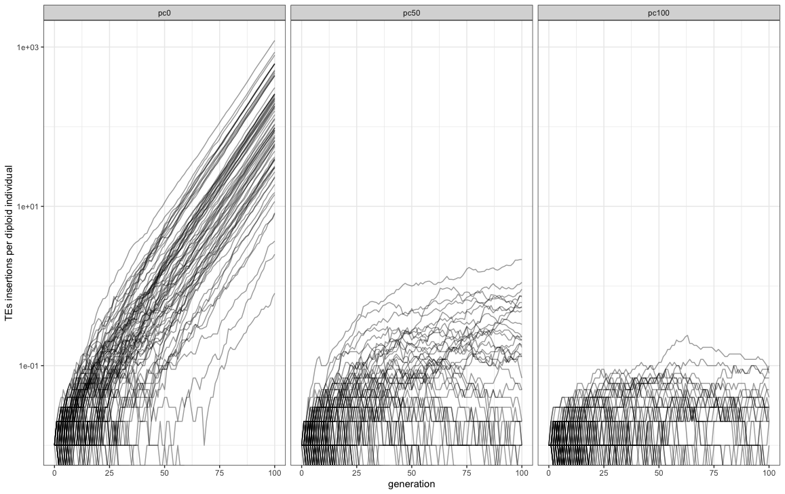

Validation piRNA clusters
================
Shashank Pritam

## Introduction

### Scenarios

-   pc0: no piRNA clusters

-   pc50: 50% of the genome is composed by piRNA clusters

-   pc100: 100% of the genome is composed by piRNA clusters

### Starting conditions equal for all the simulations

c<sub>0</sub> = 10

$\mu$  = 0.1

t = 100


A chromosome of size 1Mb and variable piRNA clusters sizes.

## Materials & Methods

version: invadego 0.1.3

-   seed pc0: 1681242126180873098

-   seed pc50: 1681242126180824031

-   seed pc100: 1681242126181272737

### Commands for the simulation:

``` bash
tool="./main"
folder="Simulation-Results/Insertion-Bias/validation_3"

$tool --N 1000 --gen 100 --genome mb:1 --cluster kb:0 --rr 4 --rep 100 --u 0.1 --basepop "10(0)" --steps 1 --sampleid pc0> $folder/validation_3_1 &
$tool --N 1000 --gen 100 --genome mb:1 --cluster kb:500 --rr 4 --rep 100 --u 0.1 --basepop "10(0)" --steps 1 --sampleid pc50> $folder/validation_3_2 & 
$tool --N 1000 --gen 100 --genome mb:1 --cluster kb:1000 --rr 4 --rep 100 --u 0.1 --basepop "10(0)" --steps 1 --sampleid pc100> $folder/validation_3_3

wait

cat "$folder/validation_3_1" "$folder/validation_3_2" "$folder/validation_3_3" | grep -v "^Invade" | grep -v "^#" > "$folder/$(date +%Y_%m_%d)_Validation_3_piRNA_clusters"


```

### Visualization in R

Setting the environment

``` r
library(ggplot2)
library(RColorBrewer)
library(plyr)
library(gridExtra)
theme_set(theme_bw())
```

Visualization: comparing the simulations with the prediction

``` r
validation<-read.table("2023_04_11_Validation_3_piRNA_clusters", fill = TRUE, sep = "\t")
names(validation)<-c("rep", "gen", "popstat", "spacer_1", "fwte", "avw", "minw","avtes", "avpopfreq", "fixed", "spacer_2", "phase", "fwcli","avcli","fixcli","spacer_3","avbias","3tot","3cluster","spacer_4","sampleids")

data_new <- validation
data_new$sampleid <- factor(data_new$sampleid,
                            levels = c("pc0", "pc50", "pc100"))

gl<-ggplot()+geom_line(data=data_new,aes(x=gen,group=rep,y=avtes*1000),alpha=0.4)+scale_y_log10()+theme(legend.position="none")+ylab("TE copies in population")+xlab("generation")+facet_grid(.~sampleid)
plot(gl)
```


``` r
g<-ggplot()+geom_line(data=data_new,aes(x=gen,group=rep,y=avtes),alpha=0.4)+
  scale_y_log10()+
  ylab("TEs insertions per diploid individual")+xlab("generation")+
  facet_grid(.~sampleid)+
  facet_wrap(~sampleid, ncol=3)

plot(g)
```



## Conclusions

The simulation matched the expectations.

The introduction of piRNA clusters stops the spreading of TEs in the
population.
