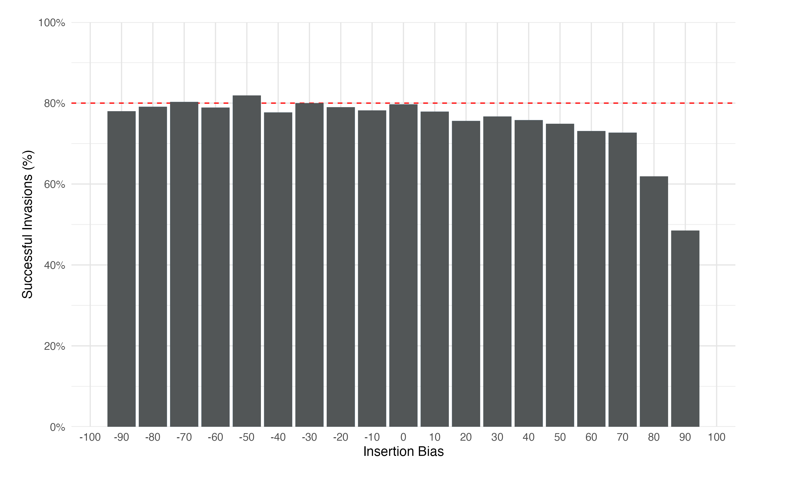
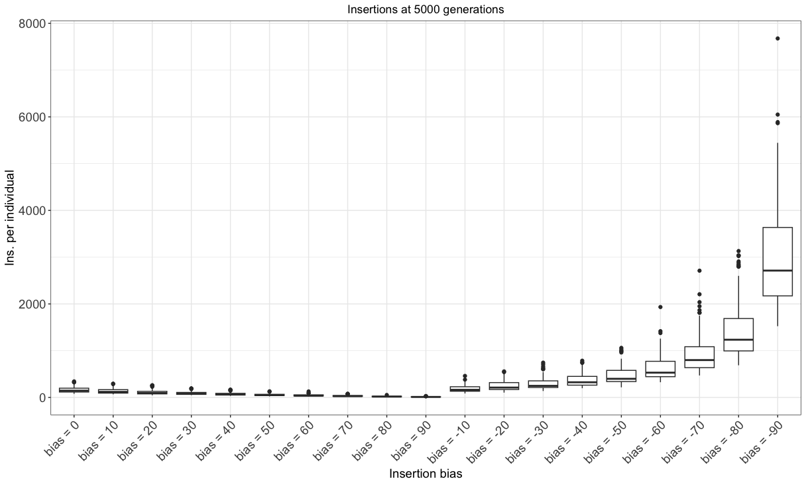

Validation of Insertion Bias
================
Shashank Pritam

18th April 2021


## Introduction

With this simulation we wanted to understand the impact of the insertion
bias on the transposable elements invasion dynamics.

### Initial conditions:

* A population of 1000, 5 chromosomes of size 10 Mb, 5 piRNA clusters of size 300 Kb and an initial number of TEs in the population equal to 10.
* We used 1000 replicates for the establishment probability simulation. (Part A)
* We used 100 replicates for the other simulations. (Part B)

## Part A

## Materials & Methods

version: invadego-insertionbias

- seed mb90: 1681416686772742525
- seed mb80: 1681416686774110472
- seed mb70: 1681416686775454804
- seed mb60: 1681416686777197238
- seed mb50: 1681416686800571008
- seed mb40: 1681416686781159100
- seed mb30: 1681416686799564808
- seed mb20: 1681416686789184445
- seed mb10: 1681416686852215098
- seed b0: 1681416686895551778
- seed b10: 1681416686901710885
- seed b20: 1681416686922069349
- seed b30: 1681416686945831086
- seed b40: 1681416686916556559
- seed b50: 1681416686923950537
- seed b60: 1681416686979799130
- seed b70: 1681416686963536390
- seed b80: 1681416687018751364
- seed b90: 1681416687027712625

version: invadego 0.1.3

### Commands for the simulation:

``` bash
tool="./main"
N=1000
gen=500
genome="mb:10,10,10,10,10"
cluster="kb:300,300,300,300,300"
rr="4,4,4,4,4"
rep=1000
u=0.1
steps=500
folder="Simulation-Results/Insertion-Bias/validation_5.1"

for i in {-9..9}; do
  i=$(($i * 10))

  if (( $i < 0 )); then
    sampleid="mb$(($i * -1))"
  else
    sampleid="b$(($i))"
  fi

  basepop="10($i)"
  output_file="$folder/$(date +%Y_%m_%d)_simulation_0_m100_500gen_basepop_$i"
  command="$tool --N $N --gen $gen --genome $genome --cluster $cluster --rr $rr --rep $rep --u $u --basepop \"$basepop\" --steps $steps --sampleid $sampleid > $output_file"
  echo "Running command: $command"
  eval "$command" &
done

# wait for all simulations to finish
wait

# concatenate output files with system date
for i in {-9..9}; do
  i=$(($i * 10))
  cat "$folder"/*_simulation_* | grep -v "^Invade" | grep -v "^#" > "$folder"/"$(date +%Y_%m_%d)"_Validation_5_bias
done

```

### Visualization in R

Setting the environment

``` r
library(tidyverse)
library(RColorBrewer)
library(ggpubr)
theme_set(theme_bw())
```

Visualization:

``` r
# Load libraries

# Read data and set column names
df0 <- read.table("2023_04_16_Validation_5_bias", fill = TRUE, sep = "\t") 
names(df0) <- c("rep", "gen", "popstat", "spacer_1", "fwte", "avw", "min_w", "avtes", "avpopfreq",
                "fixed", "spacer_2", "phase", "fwcli", "avcli", "fixcli", "spacer_3",
                "avbias", "3tot", "3cluster", "spacer_4", "sampleid")

# Filter and select columns
df00 <- subset(df0, gen != 0)
df00 <- select(df00, -c(22))

# Calculate statistics
df0_stat <- df00 %>%
  group_by(sampleid) %>%
  summarize(fail = sum(popstat == "fail-0"),
            success = sum(popstat == "ok"),
            total = success + fail,
            ok_rate = success/total)

# Modify sampleid values
df0_stat <- df0_stat %>%
  mutate(sampleid = str_replace_all(sampleid, c("mb90" = "-90", "mb80" = "-80", "mb70" = "-70", "mb60" = "-60",
                                                "mb50" = "-50", "mb40" = "-40", "mb30" = "-30", "mb20" = "-20",
                                                "mb10" = "-10", "b90" = "90", "b80" = "80", "b70" = "70",
                                                "b60" = "60", "b50" = "50", "b40" = "40", "b30" = "30",
                                                "b20" = "20", "b10" = "10", "b0" = "0")))

# Convert sampleid to integer and sort
df0_stat$sampleid <- as.integer(df0_stat$sampleid)
df0_stat <- df0_stat[order(df0_stat$sampleid),]


# Create and plot the graph with well-defined grid and margin
g0 <- ggplot(data = df0_stat, aes(x = as.factor(sampleid), y = ok_rate, fill = ok_rate)) +
  geom_col(show.legend = FALSE) +
  geom_hline(yintercept = 0.8, linetype = "dashed", color = "red") +
  scale_y_continuous(
    limits = c(0, 1), 
    expand = expansion(mult = c(0, 0)), 
    breaks = seq(0, 1, 0.2),
    labels = scales::percent
  ) +
  scale_x_discrete(
    limits = as.character(seq(-100, 100, by = 10)),
    labels = setNames(
      c("-90", "-80", "-70", "-60", "-50", "-40", "-30", "-20", "-10", "0",
        "10", "20", "30", "40", "50", "60", "70", "80", "90"),
      unique(df0_stat$sampleid)
    )
  ) +
  geom_col(fill = "#525657") +
  xlab("Insertion Bias") +
  ylab("Successful Invasions (%)") +
  theme_minimal(base_size = 12) +
  theme(
    plot.background = element_rect(fill = "white", color = "white"),
    panel.background = element_rect(fill = "white", color = "white"),
    plot.margin = margin(20, 60, 20, 20, "pt"),  # Adjusted margin
    panel.grid.major.x = element_line(color = "grey90", size = 0.5),  # Custom major x grid lines
    panel.grid.major.y = element_line(color = "grey90", size = 0.5)   # Custom major y grid lines
  )

# Save the plot with a solid background and added padding
ggsave("images/2023_04_17_Validation_5a_bias.png", plot = g0, bg = "white", width = 10, height = 6)

plot(g0)
```




## Part B

## Materials & Methods

version: invadego-insertionbias

- seed bm90:1681703746948243382
- seed bm80:1681703746967971953
- seed bm70:1681703746971553379
- seed bm60:1681703746982043927
- seed bm50:1681703746966638661
- seed bm40:1681703746968163967
- seed bm30:1681703746966865535
- seed bm20:1681703746967140988
- seed bm10:1681703746968185216
- seed b0:1681703746967266047
- seed b10:1681703746966943511
- seed b20:1681703746967467361
- seed b30:1681703746968281172
- seed b40:1681703746966595814
- seed b50:1681703746965872050
- seed b60:1681703746993945683
- seed b70:1681703746994770216
- seed b80:1681703747014417508
- seed b90:1681703747037138734


version: invadego 0.1.3

### Commands for the simulation:

``` bash
tool="./main"
N=1000
gen=5000
genome="mb:10,10,10,10,10"
cluster="kb:300,300,300,300,300"
rr="4,4,4,4,4"
rep=100
u=0.1
steps=20
folder="Simulation-Results/Insertion-Bias/validation_5.2"

for i in {-9..9}; do
  i=$(($i * 10))

  if (( $i < 0 )); then
    sampleid="bm$(($i * -1))"
  else
    sampleid="b$(($i))"
  fi

  basepop="10($i)"
  output_file="$folder/$(date +%Y_%m_%d)_simulation_0_${sampleid}"
  command="$tool --N $N --gen $gen --genome $genome --cluster $cluster --rr $rr --rep $rep --u $u --basepop \"$basepop\" --steps $steps --sampleid $sampleid > $output_file"
  echo "Running command: $command"
  eval "$command" &
done

# wait for all simulations to finish
wait

# concatenate output files with system date
cat $folder/$*simulation_0_* | grep -v "^Invade" | grep -v "^#" > $folder/$(date +%Y_%m_%d)_Simulation_0_exploration

```

### Visualization in R

Setting the environment

``` r
library(tidyverse)
library(RColorBrewer)
library(ggpubr)
theme_set(theme_bw())
```

Visualization:

``` r
library(tidyverse)
library(RColorBrewer)
library(ggpubr)
theme_set(theme_bw())

p <- c("#1a9850", "#ffd700", "#d73027")

df <- read.table("2023_04_18_simulation_5_2_bias", fill = TRUE, sep = "\t")
names(df) <- c("rep", "gen", "popstat", "spacer_1", "fwte", "avw", "min_w", "avtes", "avpopfreq",
               "fixed", "spacer_2", "phase", "fwcli", "avcli", "fixcli", "spacer_3",
               "avbias", "3tot", "3cluster", "spacer_4", "sampleid")

df$phase <- factor(df$phase, levels = c("rapi", "trig", "shot", "inac"))
df$sampleid <- factor(df$sampleid, levels = c("b0", "b10", "b20", "b30", "b40", "b50", "b60", "b70", "b80", "b90", "bm10", "bm20", "bm30", "bm40", "bm50", "bm60", "bm70", "bm80", "bm90"))

g <- ggplot() +
  geom_line(data = df, aes(x = gen, y = avtes, group = rep, color = phase), alpha = 1, linewidth = 0.7) +
  xlab("Generation") +
  ylab("TEs insertions per diploid individual") +
  theme(legend.position = "bottom",
        plot.title = element_text(hjust = 0.5),
        panel.grid.major = element_line(colour = "gray90"),
        panel.grid.minor = element_line(colour = "gray95"),
        strip.background = element_rect(fill = "lightgrey"),
        strip.text = element_text(face = "bold")) +
  ggtitle("Bias vs TE Insertions") +
  scale_colour_manual(values = p) +
  facet_wrap(~sampleid, labeller = labeller(sampleid =
                                              c("b0" = "bias = 0",
                                                "b10" = "bias = 10",
                                                "b20" = "bias = 20",
                                                "b30" = "bias = 30",
                                                "b40" = "bias = 40",
                                                "b50" = "bias = 50",
                                                "b60" = "bias = 60",
                                                "b70" = "bias = 70",
                                                "b80" = "bias = 80",
                                                "b90" = "bias = 90",
                                                "bm10" = "bias = -10",
                                                "bm20" = "bias = -20",
                                                "bm30" = "bias = -30",
                                                "bm40" = "bias = -40",
                                                "bm50" = "bias = -50",
                                                "bm60" = "bias = -60",
                                                "bm70" = "bias = -70",
                                                "bm80" = "bias = -80",
                                                "bm90" = "bias = -90")))

plot(g)
```


``` r
# Divide in shot and inact phases
df1 <- subset(df, phase %in% c("shot", "inac"))
df2 <- data.frame()

# New dataframe with only the first shotgun & the first inactive phase of each replicate
repcheck <- 1
x <- 1
y <- 1
while (x < nrow(df1)) {
  if (repcheck != df1[x, 1]) {
    y <- 1
  }
  if (y == 1) {
    if (df1[x, 12] == "shot") {
      df2 <- rbind(df2, df1[x,])
      y <- 2
      repcheck <- df1[x, 1]
    }
  }
  if (y == 2) {
    if (df1[x, 12] == "inac") {
      df2 <- rbind(df2, df1[x,])
      y <- 1
    }
  }
  x <- x + 1
}

# Summary statistics
df2 <- select(df2, -c(22))

df_count <- df2 %>%
  dplyr::count(sampleid, phase)

df_summary <- df2 %>%
  dplyr::group_by(sampleid, phase) %>%
  dplyr::summarize(av_fwcli = mean(fwcli), sd_fwcli = sd(fwcli),
                   av_cli = mean(avcli), sd_cli = sd(avcli), cv_cli_percent = sd(avcli) / mean(avcli),
                   av_tes = mean(avtes), sd_tes = sd(avtes), cv_tes_percent = sd(avtes) / mean(avtes),
                   length_previous_phase = mean(gen),
                   sd_gen_phases = sd(gen))
df_summary <- cbind(df_count$n, df_summary)

colnames(df_summary)[1] <- "n"

# CI 95%: z* sd/sqrt(population)
df_summary$ci_fwcli <- qt(0.975, df = df_summary$n - 1) * (df_summary$sd_fwcli / sqrt(df_summary$n))
df_summary$ci_cli <- qt(0.975, df = df_summary$n - 1) * (df_summary$sd_cli / sqrt(df_summary$n))
df_summary$ci_tes <- qt(0.975, df = df_summary$n - 1) * (df_summary$sd_tes / sqrt(df_summary$n))

# Average TE insertions per individual shot and inac phases
g_avtes <- ggplot(df_summary, aes(x = phase, y = av_tes, fill = phase)) +
  geom_bar(stat = "identity") +
  geom_errorbar(aes(x = phase, ymin = av_tes - sd_tes, ymax = av_tes + sd_tes), width = 0.2, colour = "black", alpha = 0.9, size = 0.8) +
  ylab("Insertions per individual") +
  xlab("Phase") +
  theme(legend.position = "bottom",
        plot.title = element_text(hjust = 0.5),
        panel.grid.major = element_line(colour = "gray90"),
        panel.grid.minor = element_line(colour = "gray95"),
        strip.background = element_rect(fill = "lightgrey"),
        strip.text = element_text(face = "bold")) +
  ggtitle("Bias vs TE Insertions") +
  scale_y_continuous(expand = expansion(mult = c(0, 0.01))) +
  scale_fill_manual(values = c("#ffd700", "#d73027")) +
  facet_wrap(~sampleid, labeller = labeller(sampleid =
                                              c("b0" = "bias = 0",
                                                "b10" = "bias = 10",
                                                "b20" = "bias = 20",
                                                "b30" = "bias = 30",
                                                "b40" = "bias = 40",
                                                "b50" = "bias = 50",
                                                "b60" = "bias = 60",
                                                "b70" = "bias = 70",
                                                "b80" = "bias = 80",
                                                "b90" = "bias = 90",
                                                "bm10" = "bias = -10",
                                                "bm20" = "bias = -20",
                                                "bm30" = "bias = -30",
                                                "bm40" = "bias = -40",
                                                "bm50" = "bias = -50",
                                                "bm60" = "bias = -60",
                                                "bm70" = "bias = -70",
                                                "bm80" = "bias = -80",
                                                "bm90" = "bias = -90")))

plot(g_avtes)
```


``` r
# Average cluster insertions per individual shot and inac phases
g_avcli <- ggplot(df_summary, aes(x = phase, y = av_cli, fill = phase)) +
  geom_bar(stat = "identity") +
  geom_errorbar(aes(x = phase, ymin = av_cli - sd_cli, ymax = av_cli + sd_cli), width = 0.2, colour = "black", alpha = 0.9, size = 0.8) +
  ylab("Cluster insertions per individual") +
  xlab("Phase") +
  theme(legend.position = "bottom",
        plot.title = element_text(hjust = 0.5),
        panel.grid.major = element_line(colour = "gray90"),
        panel.grid.minor = element_line(colour = "gray95"),
        strip.background = element_rect(fill = "lightgrey"),
        strip.text = element_text(face = "bold")) +
  ggtitle("Bias vs Cluster Insertions") +
  scale_y_continuous(expand = expansion(mult = c(0, 0.01))) +
  scale_fill_manual(values = c("#ffd700", "#d73027")) +
  facet_wrap(~sampleid, labeller = labeller(sampleid =
                                             c("b0" = "bias = 0",
                                               "b10" = "bias = 10",
                                               "b20" = "bias = 20",
                                               "b30" = "bias = 30",
                                               "b40" = "bias = 40",
                                               "b50" = "bias = 50",
                                               "b60" = "bias = 60",
                                               "b70" = "bias = 70",
                                               "b80" = "bias = 80",
                                               "b90" = "bias = 90",
                                               "bm10" = "bias = -10",
                                               "bm20" = "bias = -20",
                                               "bm30" = "bias = -30",
                                               "bm40" = "bias = -40",
                                               "bm50" = "bias = -50",
                                               "bm60" = "bias = -60",
                                               "bm70" = "bias = -70",
                                               "bm80" = "bias = -80",
                                               "bm90" = "bias = -90")))

plot(g_avcli)

```


``` r
g_bar_av_TEs <- ggplot(df2, aes(x = sampleid, y = avtes)) +
  geom_boxplot() +
  ggtitle("Insertions at 5000 generations") +
  ylab("Ins. per individual") +
  xlab("Insertion bias") +
  theme(legend.position = "none",
        axis.text.x = element_text(size = 14, angle = 45, hjust = 1),
        axis.text.y = element_text(size = 14),
        axis.title.x = element_text(size = 14),
        axis.title.y = element_text(size = 14),
        strip.text = element_text(size = 14),
        plot.title = element_text(hjust = 0.5)) +
  scale_x_discrete(labels = c("b0" = "bias = 0",
                              "b10" = "bias = 10",
                              "b20" = "bias = 20",
                              "b30" = "bias = 30",
                              "b40" = "bias = 40",
                              "b50" = "bias = 50",
                              "b60" = "bias = 60",
                              "b70" = "bias = 70",
                              "b80" = "bias = 80",
                              "b90" = "bias = 90",
                              "bm10" = "bias = -10",
                              "bm20" = "bias = -20",
                              "bm30" = "bias = -30",
                              "bm40" = "bias = -40",
                              "bm50" = "bias = -50",
                              "bm60" = "bias = -60",
                              "bm70" = "bias = -70",
                              "bm80" = "bias = -80",
                              "bm90" = "bias = -90"))

plot(g_bar_av_TEs)

```



``` r
g_bar_av_cli <- ggplot(df2, aes(x = sampleid, y = avcli)) +
  geom_boxplot() +
  ggtitle("Cluster insertions at 5000 generations") +
  ylab("Cluster ins. per individual") +
  xlab("Insertion bias") +
  theme(legend.position = "none",
        axis.text.x = element_text(size = 14, angle = 45, hjust = 1),
        axis.text.y = element_text(size = 14),
        axis.title.x = element_text(size = 14),
        axis.title.y = element_text(size = 14),
        strip.text = element_text(size = 14),
        plot.title = element_text(hjust = 0.5)) +
  scale_x_discrete(labels = c("b0" = "bias = 0",
                              "b10" = "bias = 10",
                              "b20" = "bias = 20",
                              "b30" = "bias = 30",
                              "b40" = "bias = 40",
                              "b50" = "bias = 50",
                              "b60" = "bias = 60",
                              "b70" = "bias = 70",
                              "b80" = "bias = 80",
                              "b90" = "bias = 90",
                              "bm10" = "bias = -10",
                              "bm20" = "bias = -20",
                              "bm30" = "bias = -30",
                              "bm40" = "bias = -40",
                              "bm50" = "bias = -50",
                              "bm60" = "bias = -60",
                              "bm70" = "bias = -70",
                              "bm80" = "bias = -80",
                              "bm90" = "bias = -90"))

plot(g_bar_av_cli)

```


## Conclusions

-   The insertion bias affects the probability of a successful invasion
    establishment.

-   The average number of insertions are affected by insertion bias.

-   The average number of cluster insertions is not affected by the
    insertion bias.

