Validation of selection
================
Shashank Pritam

## Introduction

In this validation we wanted to test if selection was correctly
implemented.

To do so we tested different scenarios:

### Selection on all TEs vs selection on non-cluster TEs

-   selection on all TEs, seed: 1684875660692792125

-   selection only on non-cluster TEs, seed: 1684875660692741311

### Different selection coefficients on the same population:

x is the selection coefficient.

-   x = 0, seed: 1684875660692523289

-   x = 0.1, seed: 1684875660692636798

-   x = 0.01, seed: 1684875660693066006

-   x = 0.001, seed: 1684875660693365389

-   x = 0.0001, seed: 1684875660693072854

## Materials & Methods

version: invadego 0.1.3

### Commands for the simulation:

``` bash

# Create Input Basepop File
echo "2500; 1(0) 400(-60); 50000(-70)
2500;;
5000; 2(0) 10000(60) 50000(70);" > input_sel

# Parameters
tool="./main"
folder="Simulation-Results/Insertion-Bias/validation_6_redone"
genome="mb:1"
rep=100

# All commands updated
$tool --N 1000 --gen 100 --genome $genome --cluster kb:100 --rr 4 --rep $rep --u 0.1 --basepop "100(0)" --steps 25 -x 0.1 --file-mhp $folder/validation_6_redone_1_mhp > $folder/validation_6_redone_1 &

$tool --N 1000 --gen 100 --genome $genome --cluster kb:100 --rr 4 --rep $rep --u 0.1 --basepop "100(0)" --steps 25 -x 0.1 -no-x-cluins --file-mhp $folder/validation_6_redone_2_mhp > $folder/validation_6_redone_2 &

$tool --N 10000 --u 0 --basepop file:input_sel --gen 1000 --genome $genome --steps 10 --rr 0 --rep $rep --sampleid psel3 > $folder/validation_6_redone_3 &

$tool --N 10000 --u 0 -x 0.1 --basepop file:input_sel --gen 1000 --genome $genome --steps 10 --rr 0 --rep $rep --sampleid psel4 > $folder/validation_6_redone_4 &

$tool --N 10000 --u 0 -x 0.01 --basepop file:input_sel --gen 1000 --genome $genome --steps 10 --rr 0 --rep $rep --sampleid psel5 > $folder/validation_6_redone_5 &

$tool --N 10000 --u 0 -x 0.001 --basepop file:input_sel --gen 1000 --genome $genome --steps 10 --rr 0 --rep $rep --sampleid psel6 > $folder/validation_6_redone_6 &

$tool --N 10000 --u 0 -x 0.0001 --basepop file:input_sel --gen 1000 --genome $genome --steps 10 --rr 0 --rep $rep --sampleid psel7 > $folder/validation_6_redone_7 &

# Wait for all simulations to finish
wait

# Concatenate output files
cat "$folder/validation_6_redone_3" "$folder/validation_6_redone_4" "$folder/validation_6_redone_5" "$folder/validation_6_redone_6" "$folder/validation_6_redone_7" | grep -v "^Invade" | grep -v "^#" > "$folder/2023_05_23_Validation_6_Redone_Selection"

```

### Visualization in R

Setting the environment

``` r
library(ggplot2)
library(RColorBrewer)
library(plyr)
library(patchwork)
library(ggpubr)
```

# Selection vs selection on non-cluster insertions

``` r
t_1<-read.table("validation_6_redone_1_mhp", fill = TRUE, sep = "\t")
names(t_1)<-c("rep","gen","chr","pos","locus","popfreq")
t_1$rep<-as.factor(t_1$rep)
t_1$gen<-as.factor(t_1$gen)
t_1<-subset(t_1,rep==10)
t_1<-subset(t_1,gen==0 | gen==25 | gen==50)
g_1<-ggplot(data=t_1,aes(x=pos, fill=locus))+geom_histogram(binwidth=10000)+facet_grid(gen~chr, scales="free_x", space = "free_x")+
  scale_x_continuous(breaks=c(0,500000,1000000,1500000),labels=c("0","0.5m","1m","1.5m"))+
  xlab("position")+ylab("counter per 10kb bin")
plot(g_1)
```

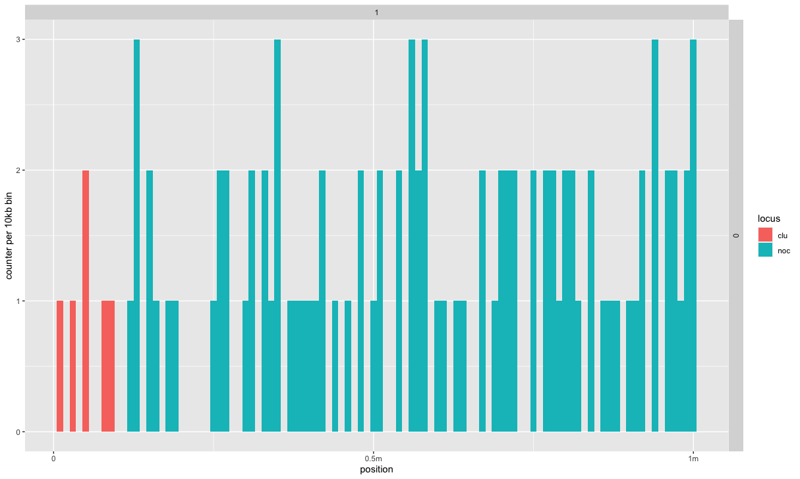

``` r
t_1_2<-read.table("validation_6_redone_1_mhp", fill = TRUE, sep = "\t")
names(t_1_2)<-c("rep","gen","chr","pos","locus","popfreq")
t_1_2$gen<-as.factor(t_1_2$gen)
t_1_2<-subset(t_1_2, gen==0)
g_1_2<-ggplot()+
  geom_bar(data=t_1_2,aes(x = locus, y = (..count..)/sum(..count..), fill = locus))+ 
  scale_y_continuous(labels = scales::percent_format(accuracy = 1))+
  ggtitle("Generation 0")+
  theme(legend.position="none", plot.title = element_text(size=14, face="bold.italic"))+
  ylab("relative frequencies")

t_1_3<-read.table("validation_6_redone_1_mhp", fill = TRUE, sep = "\t")
names(t_1_3)<-c("rep","gen","chr","pos","locus","popfreq")
t_1_3$gen<-as.factor(t_1_3$gen)
t_1_3<-subset(t_1_3, gen==50)
g_1_3<-ggplot()+
  geom_bar(data=t_1_3,aes(x = locus, y = (..count..)/sum(..count..), fill = locus))+ 
  scale_y_continuous(labels = scales::percent_format(accuracy = 1))+
  ggtitle("Generation 50")+
  theme(plot.title = element_text(size=14, face="bold.italic"))+
  ylab("relative frequencies")

g_1_2+g_1_3
```

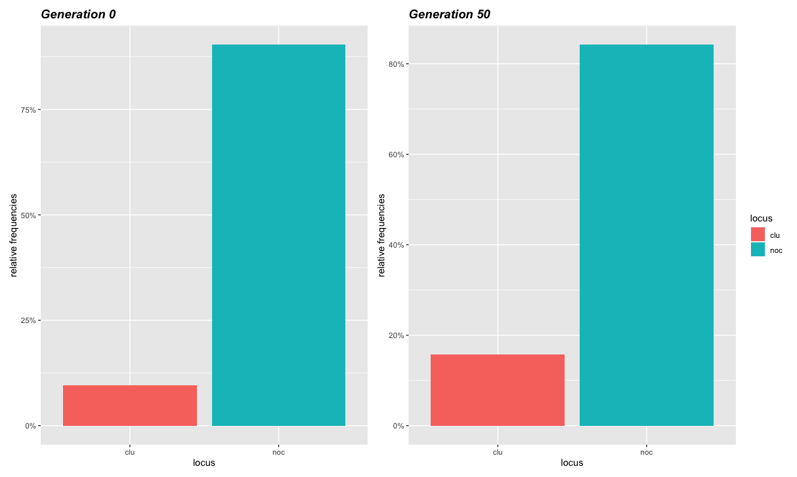

``` r
t_2<-read.table("validation_6_redone_2_mhp", fill = TRUE, sep = "\t")
names(t_2)<-c("rep","gen","chr","pos","locus","popfreq")
t_2$rep<-as.factor(t_2$rep)
t_2$gen<-as.factor(t_2$gen)
t_2<-subset(t_2,rep==1)
t_2<-subset(t_2,gen==0 | gen==25 | gen==50 | gen==75 | gen==100)
g_2<-ggplot(data=t_2,aes(x=pos, fill=locus))+geom_histogram(binwidth=10000)+facet_grid(gen~chr, scales="free_x", space = "free_x")+
  scale_x_continuous(breaks=c(0,500000,1000000,1500000),labels=c("0","0.5m","1m","1.5m"))+
  xlab("position")+ylab("counter per 10kb bin")
plot(g_2)
```

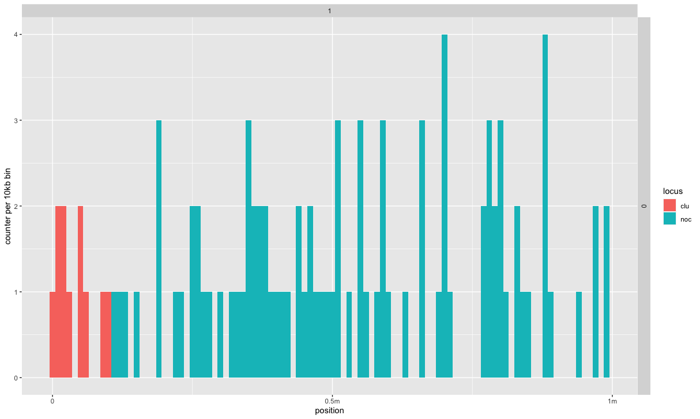

``` r
t_2_2<-read.table("validation_6_redone_2_mhp", fill = TRUE, sep = "\t")
names(t_2_2)<-c("rep","gen","chr","pos","locus","popfreq")
t_2_2$gen<-as.factor(t_2_2$gen)
t_2_2<-subset(t_2_2, gen==0)
g_2_2<-ggplot()+
  geom_bar(data=t_2_2,aes(x = locus, y = (..count..)/sum(..count..), fill = locus))+ 
  scale_y_continuous(labels = scales::percent_format(accuracy = 1))+
  ggtitle("Generation 0")+
  theme(legend.position="none", plot.title = element_text(size=14, face="bold.italic"))+
  ylab("relative frequencies")

t_2_3<-read.table("validation_6_redone_2_mhp", fill = TRUE, sep = "\t")
names(t_2_3)<-c("rep","gen","chr","pos","locus","popfreq")
t_2_3$gen<-as.factor(t_2_3$gen)
t_2_3<-subset(t_2_3, gen==100)
g_2_3<-ggplot()+
  geom_bar(data=t_2_3,aes(x = locus, y = (..count..)/sum(..count..), fill = locus))+ 
  scale_y_continuous(labels = scales::percent_format(accuracy = 1))+
  ggtitle("Generation 100")+
  theme(plot.title = element_text(size=14, face="bold.italic"))+
  ylab("relative frequencies")

g_2_2+g_2_3
```

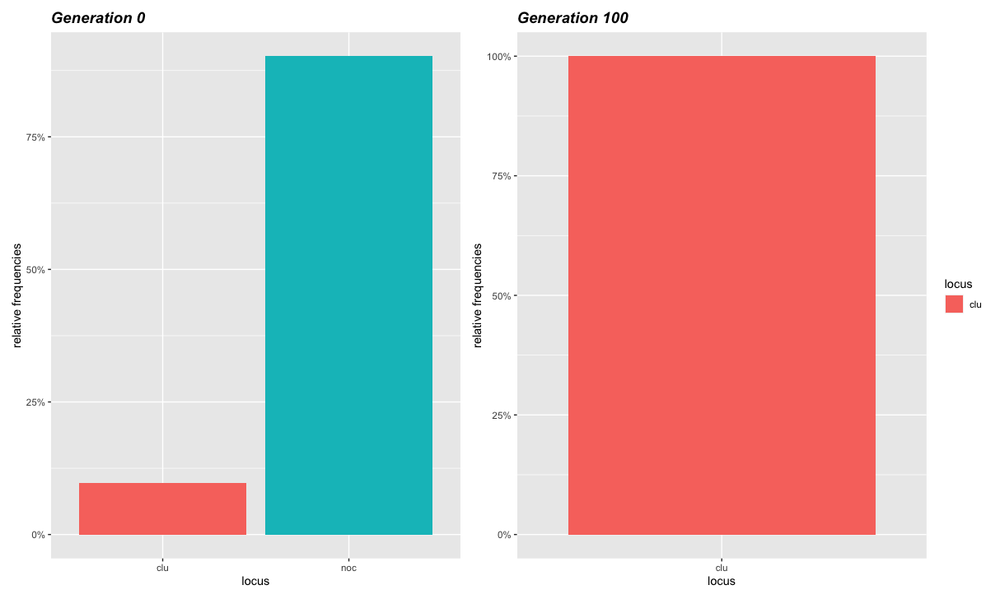

Selection can act on all TEs insertion, as in the first case or only in
non-cluster TEs insertions in the latter. The reason being is that
cluster insertions generate piRNAs. Therefore make sense to not consider
selection upon cluster insertion in some models. From the two pairs of
histograms is easy to see the difference: in the first case all TEs tend
to be lost, while in the second only non cluster TEs are lost, while
cluster insertions are maintained.

``` r
df_sel<-read.table("2023_05_25_Validation_6_Selection_redone", fill = TRUE, sep = "\t")
names(df_sel)<-c("rep", "gen", "popstat", "spacer_1", "fwte", "avw", "min_w", "avtes", "avpopfreq",
                 "fixed","spacer_2", "phase", "fwcli", "avcli", "fixcli", "spacer_3",
                 "avbias",	"3tot",	"3cluster",	"spacer 4", "sampleid")


g_sel<-ggplot(df_sel, aes(x=gen, y=avpopfreq , group=rep))+
  geom_line(alpha=1,size=0.7)+
  ylab("TE population frequency") + xlab("generation")+
  facet_wrap(~sampleid, ncol=3)+
  facet_wrap(~sampleid, labeller = labeller(sampleid =
                                              c("psel3" = "x = 0",
                                                "psel4" = "x = 0.1",
                                                "psel5" = "x = 0.01",
                                                "psel6" = "x = 0.001",
                                                "psel7" = "x = 0.0001")))
plot(g_sel)
```

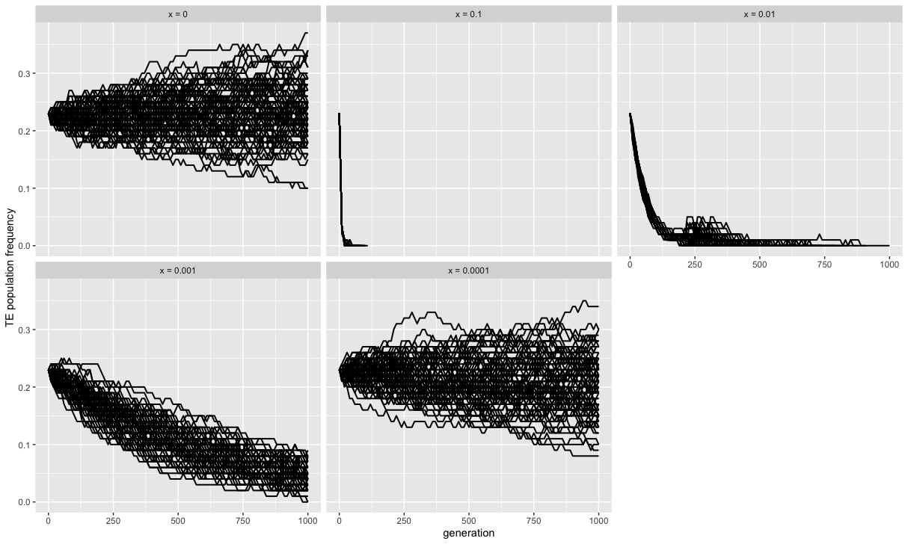


``` r
df3_s<-subset(df_sel, sampleid=="psel3")

p0=0.5
p<-p0
q<-1-p0
t=1000
traj<- matrix(NA, ncol=3, nrow=max(t)+1)
traj[1,1]<-p
traj[1,2]<-0
s=0
g=1
wAA=1-(2*s)
wAa=1-s
waa=1
while(g<=max(t)){
  w<- (p^2)*wAA + (2*p*q*wAa) + (q^2)*waa
  p<-( p*(p*wAA + q*wAa) ) / w
  q<-1-p
  traj[g+1,1]<-p
  traj[g+1,2]<-g
  g<-g+1
}
traj<- as.data.frame(traj)
traj[,3]<- "black"
colnames(traj)<- c("freq", "generations", "color")

g_s_3<-ggplot()+ 
  geom_line(df3_s, mapping=aes(x=gen, y=avpopfreq, group=rep), alpha =0.5)+
  geom_line(traj, mapping=aes(x=generations, y=(freq)), color="blue", size = 1)+
  ggtitle("x = 0")+
  labs(x="generation", y="frequency of TEs in the population")

plot(g_s_3)
```

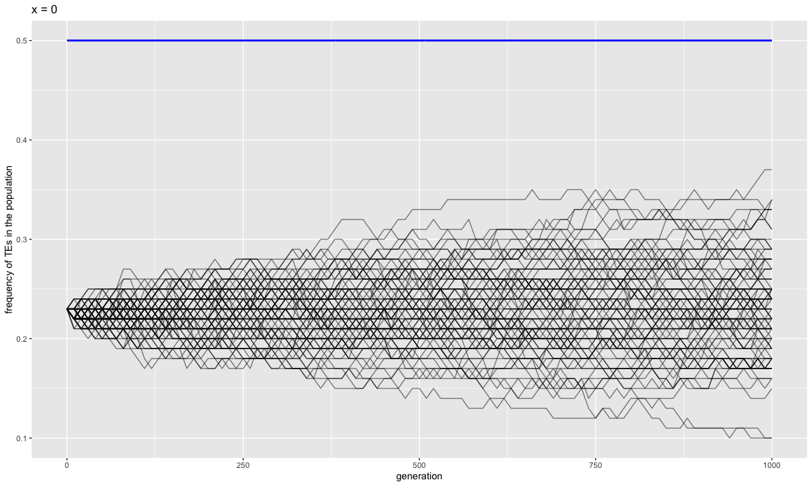

``` r
df4_s<-subset(df_sel, sampleid=="psel4")

p0=0.5
p<-p0
q<-1-p0
t=1000
traj<- matrix(NA, ncol=3, nrow=max(t)+1)
traj[1,1]<-p
traj[1,2]<-0
s=0.1
g=1
wAA=1-(2*s)
wAa=1-s
waa=1
while(g<=max(t)){
  w<- (p^2)*wAA + (2*p*q*wAa) + (q^2)*waa
  p<-( p*(p*wAA + q*wAa) ) / w
  q<-1-p
  traj[g+1,1]<-p
  traj[g+1,2]<-g
  g<-g+1
}
traj<- as.data.frame(traj)
traj[,3]<- "black"
colnames(traj)<- c("freq", "generations", "color")
g_s_4<-ggplot()+ 
  geom_line(df4_s, mapping=aes(x=gen, y=avpopfreq, group=rep),alpha =0.5)+
  geom_line(traj, mapping=aes(x=generations, y=(freq)), color="blue", size = 0.5)+
  ggtitle("x = 0.1")+
  labs(x="generation", y="frequency of TEs in the population")

plot(g_s_4)
```

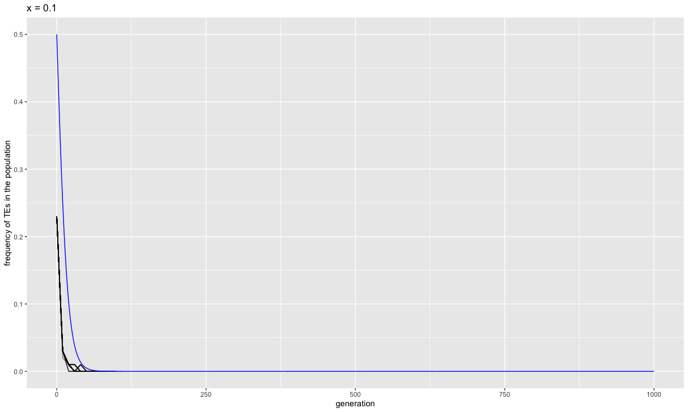

``` r
df5_s<-subset(df_sel, sampleid=="psel5")

p0=0.5
p<-p0
q<-1-p0
t=1000
traj<- matrix(NA, ncol=3, nrow=max(t)+1)
traj[1,1]<-p
traj[1,2]<-0
s=0.01
g=1
wAA=1-(2*s)
wAa=1-s
waa=1
while(g<=max(t)){
  w<- (p^2)*wAA + (2*p*q*wAa) + (q^2)*waa
  p<-( p*(p*wAA + q*wAa) ) / w
  q<-1-p
  traj[g+1,1]<-p
  traj[g+1,2]<-g
  g<-g+1
}
traj<- as.data.frame(traj)
traj[,3]<- "black"
colnames(traj)<- c("freq", "generations", "color")

g_s_5<-ggplot()+ 
  geom_line(df5_s, mapping=aes(x=gen, y=avpopfreq, group=rep), alpha =0.5)+
  geom_line(traj, mapping=aes(x=generations, y=(freq)), color="blue", size = 1)+
  ggtitle("x = 0.01")+
  labs(x="generation", y="frequency of TEs in the population")

plot(g_s_5)
```

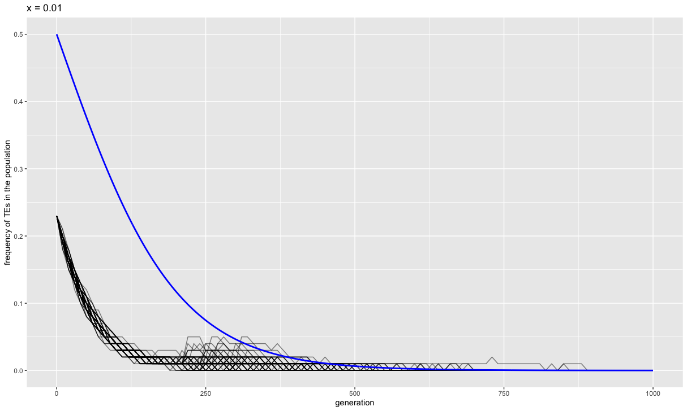

``` r
df6_s<-subset(df_sel, sampleid=="psel6")

p0=0.5
p<-p0
q<-1-p0
t=1000
traj<- matrix(NA, ncol=3, nrow=max(t)+1)
traj[1,1]<-p
traj[1,2]<-0
s=0.001
g=1
wAA=1-(2*s)
wAa=1-s
waa=1
while(g<=max(t)){
  w<- (p^2)*wAA + (2*p*q*wAa) + (q^2)*waa
  p<-( p*(p*wAA + q*wAa) ) / w
  q<-1-p
  traj[g+1,1]<-p
  traj[g+1,2]<-g
  g<-g+1
}
traj<- as.data.frame(traj)
traj[,3]<- "black"
colnames(traj)<- c("freq", "generations", "color")
g_s_6<-ggplot()+ 
  geom_line(df6_s, mapping=aes(x=gen, y=avpopfreq, group=rep), alpha =0.5)+
  geom_line(traj, mapping=aes(x=generations, y=(freq)), color="blue", size = 1)+
  ggtitle("x = 0.001")+
  labs(x="generation", y="frequency of TEs in the population")

plot(g_s_6)
```

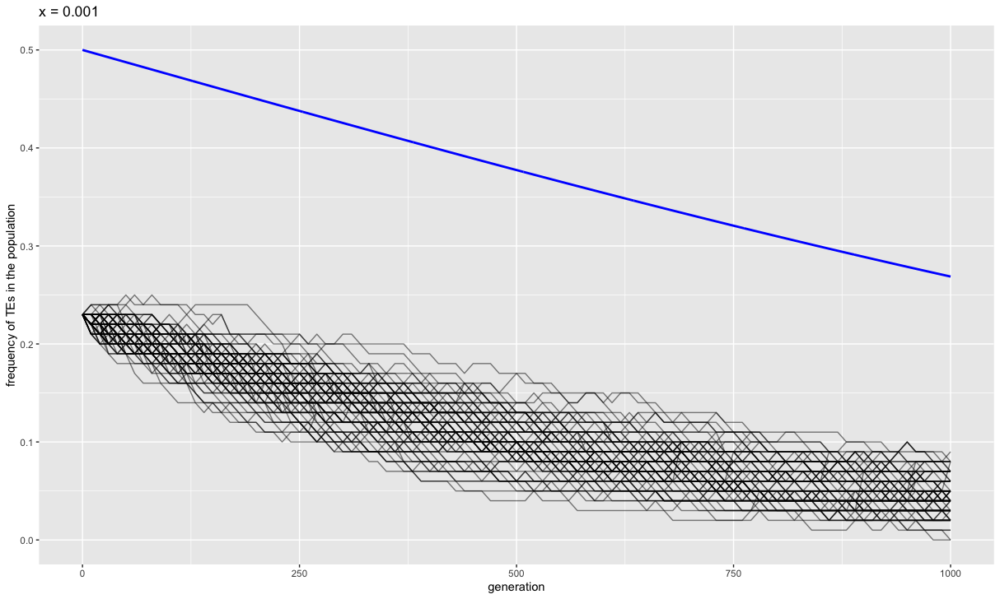

``` r
df7_s<-subset(df_sel, sampleid=="psel7")

p0=0.5
p<-p0
q<-1-p0
t=1000
traj<- matrix(NA, ncol=3, nrow=max(t)+1)
traj[1,1]<-p
traj[1,2]<-0
s=0.0001
g=1
wAA=1-(2*s)
wAa=1-s
waa=1
while(g<=max(t)){
  w<- (p^2)*wAA + (2*p*q*wAa) + (q^2)*waa
  p<-( p*(p*wAA + q*wAa) ) / w
  q<-1-p
  traj[g+1,1]<-p
  traj[g+1,2]<-g
  g<-g+1
}
traj<- as.data.frame(traj)
traj[,3]<- "black"
colnames(traj)<- c("freq", "generations", "color")
g_s_7<-ggplot()+ 
  geom_line(df7_s, mapping=aes(x=gen, y=avpopfreq, group=rep), alpha =0.5)+
  geom_line(traj, mapping=aes(x=generations, y=(freq)), color="blue", size = 1)+
  ggtitle("x = 0.0001")+
  labs(x="generation", y="frequency of TEs in the population")

plot(g_s_7)
```

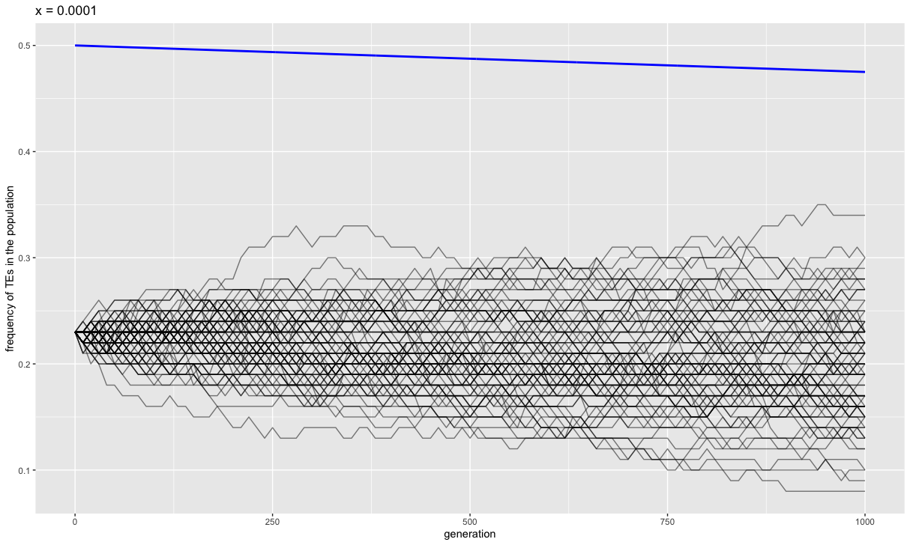

``` r
ggarrange(g_s_3, g_s_7, g_s_6, g_s_5, g_s_4,
          ncol = 3, nrow = 2, align = ("v"),
          labels = c("A", "B", "C", "D", "E"), heights = c(2,2), widths = c(2,2)
)
```

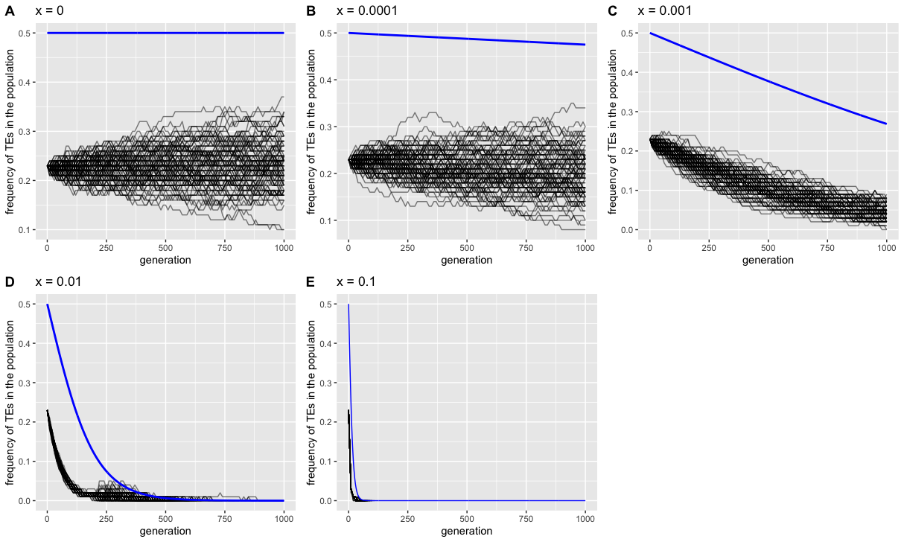

The simulations match the expected values (blue line).

As we expected in the first set of graphs we can see how an higher
selection coefficient decrease the number of generations needed to lose
all the TEs in the population. But if the selection coefficient is too
small (A and B) drift will prevail.

Selection is linked to population size and to be effective it has to
meet the requirements from the following equation:
> N*x > 1

Thus in small populations the predominant force is not selection but
drift.

## Conclusions

The simulation matched our expectations.
Selection in the simulations follows the theoretical expectations.
