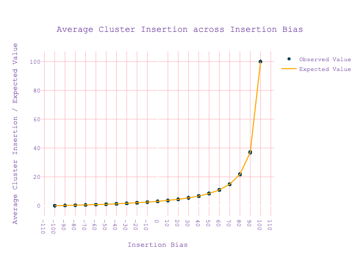
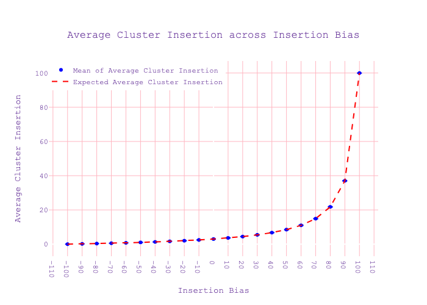

#### Shashank Pritam

# Introduction

In this validation we wanted to test if insertion was correctly implemented.

version: invadego 0.1.3

### Materials & Methods

| Bias  | SampleID | Seed              |
|-------|----------|-------------------|
| -100  | mb100 | 1687986419473565499 |
| -90  | mb90 | 1687986439519204740 |
| -80  | mb80 | 1687986459385010207 |
| -70  | mb70 | 1687986479004319218 |
| -60  | mb60 | 1687986498415164945 |
| -50  | mb50 | 1687986518191731481 |
| -40  | mb40 | 1687986537947039053 |
| -30  | mb30 | 1687986557979563694 |
| -20  | mb20 | 1687986577799895192 |
| -10  | mb10 | 1687986597553426300 |
| 0  | b0 | 1687986617358973799 |
| 10  | b10 | 1687986636894417837 |
| 20  | b20 | 1687986656418196570 |
| 30  | b30 | 1687986677115413538 |
| 40  | b40 | 1687986698520036068 |
| 50  | b50 | 1687986720075130951 |
| 60  | b60 | 1687986741333869430 |
| 70  | b70 | 1687986762991078587 |
| 80  | b80 | 1687986784961325051 |
| 90  | b90 | 1687986806594066852 |
| 100  | b100 | 1687986827704107589 |

```{bash}

tool="./main"
genome="mb:1,1,1,1,1"
cluster="kb:30,30,30,30,30"
rep=100
gen=1
steps=1
folder="Simulation-Results/Insertion-Bias/validation_7"
rr="0,0,0,0,0"

mkdir -p $folder

# Loop over values from -100 to 100 in steps of 10
for j in $(seq -100 10 100)
do
    # Set basepop directly to "1000;j"
    basepop="1000($j)"

    # Assign current counter value to sampleid with descriptive prefix
    if [ $j -ge 0 ]
    then
        sampleid="b${j}"
    else
        sampleid="mb${j#-}"  # Use parameter expansion to remove the negative sign
    fi

    # Run the command and write the output to a file named after the sampleid
    $tool --N 100000 --gen $gen --genome $genome --cluster $cluster --rr $rr --rep $rep --basepop "$basepop" --steps $steps --sampleid $sampleid > "$folder/result_${sampleid}.out"
done

cat result_*.out | grep -v "^Invade" | grep -v "^#" > combined_results.out
```

Load and Clean Data


```python
import pandas as pd
import seaborn as sns
import matplotlib.pyplot as plt
import numpy as np
import plotly.graph_objects as go


# Define column names
column_names = ["rep", "gen", "popstat", "spacer_1", "fwte", "avw", "min_w", "avtes", "avpopfreq",
                "fixed", "spacer_2", "phase", "fwcli", "avcli", "fixcli", "spacer_3",
                "avbias", "3tot", "3cluster", "spacer_4", "sampleid"]

# Load DataFrame with column names
df = pd.read_csv('combined_results.out', sep='\t', header=None, names=column_names, usecols=range(21))

# Define replacement dictionary
replace_dict = {"mb100": "-100","mb90": "-90", "mb80": "-80", "mb70": "-70", "mb60": "-60",
                "mb50": "-50", "mb40": "-40", "mb30": "-30", "mb20": "-20",
                "mb10": "-10", "b100": "100","b90": "90", "b80": "80", "b70": "70",
                "b60": "60", "b50": "50", "b40": "40", "b30": "30",
                "b20": "20", "b10": "10", "b0": "0"}

# Apply replacements to 'sampleid' column
df['sampleid'] = df['sampleid'].replace(replace_dict, regex=True)

# Define numeric columns
numeric_columns = ["rep", "gen", "fwte", "avw", "min_w", "avtes", "avpopfreq",
                   "fixed", "fwcli", "avcli", "fixcli",
                   "avbias", "sampleid"]

# Convert the columns to numeric
for col in numeric_columns:
    df[col] = pd.to_numeric(df[col], errors='coerce')
```

Plot Data


```python
# Define your function
def pc(bias, clufrac):
    genfrac = 1.0 - clufrac
    bias = bias / 100
    clufit = (bias + 1.0) / 2.0
    genfit = 1.0 - clufit
    totfit = clufrac * clufit + genfrac * genfit
    p = (clufrac * clufit) / totfit
    return p * 100

# Create a new dataframe where 'gen' == 0 and sort it by 'sampleid'
df2 = df[df['gen'] == 0][numeric_columns].sort_values('sampleid')

# Calculate the expected values (pc) for each 'sampleid'
df2['pc'] = df2['sampleid'].apply(lambda x: pc(x, 0.03))

# Create scatterplot
scatter = go.Scatter(x=df2['sampleid'], 
                     y=df2['avcli'], 
                     mode='markers',
                     name='Observed Value',
                     marker=dict(color="#003f5c"))

# Create line plot with computed 'pc' values
line = go.Scatter(x=df2['sampleid'], 
                  y=df2['pc'], 
                  mode='lines',
                  name='Expected Value',
                  line=dict(color="#ffa600"))

# Create layout
layout = go.Layout(
    title={
        'text': "Average Cluster Insertion across Insertion Bias",
        'y':0.9,
        'x':0.5,
        'xanchor': 'center',
        'yanchor': 'top'},
    xaxis=dict(
        title='Insertion Bias',
        tickmode = 'linear',
        tick0 = -100,
        dtick = 10,
        showgrid=True,
        gridwidth=1,
        gridcolor='LightPink'
    ),
    yaxis=dict(
        title='Average Cluster Insertion / Expected Value',
        showgrid=True,
        gridwidth=1,
        gridcolor='LightPink'
    ),
    plot_bgcolor='rgba(255,255,255,0)',
    font=dict(
        family="Courier New, monospace",
        size=12,  # change font size here
        color="RebeccaPurple"
    )
)

# Combine all elements and plot
fig = go.Figure(data=[scatter, line], layout=layout)

# Export as png
fig.write_image("../../images/2023_06_29_Validation_7a.png")
```




The distribution of average TE (Transposable Elements) insertions across different insertion bias levels for all replicates. The x-axis shows the different Insertion Bias levels ranging from -100 to 100. The y-axis represents the average TE insertions in the piRNA Cluster (Blue Dots for Observed Value and Orange line for Expected value) for each bias level. 


```python
import plotly.graph_objects as go
import pandas as pd

# Convert sampleid to numeric
df2['sampleid'] = pd.to_numeric(df2['sampleid'])

# Calculate mean_cli, sd_meancli, pc, and deviation_pc
df_summary = df2.groupby('sampleid')['avcli'].agg(['mean', 'std']).reset_index()
df_summary.columns = ['sampleid', 'mean_cli', 'sd_meancli']
df_summary['pc'] = pc(df_summary['sampleid'], 0.03)
df_summary['deviation_pc'] = df_summary['mean_cli'] - df_summary['pc']

# Create the scatter plot with error bars using Plotly
fig = go.Figure()

# Add the mean_cli and sd_meancli as error bars
fig.add_trace(go.Scatter(
    x=df_summary['sampleid'],
    y=df_summary['mean_cli'],
    error_y=dict(
        type='data',
        array=df_summary['sd_meancli'],
        visible=True
    ),
    mode='markers',
    marker=dict(
        size=6,
        color='blue',
        symbol='circle'
    ),
    name='Mean of Average Cluster Insertion'
))

# Add the expected line
fig.add_trace(go.Scatter(
    x=df_summary['sampleid'],
    y=df_summary['pc'],
    mode='lines',
    line=dict(
        color='red',
        dash='dash'
    ),
    name='Expected Average Cluster Insertion'
))

# Set plot title and labels
fig.update_layout(
    title={
        'text': "Average Cluster Insertion across Insertion Bias",
        'y':0.9,
        'x':0.5,
        'xanchor': 'center',
        'yanchor': 'top'},
    xaxis=dict(
        title='Insertion Bias',
        tickmode = 'linear',
        tick0 = -100,
        dtick = 10,
        showgrid=True,
        gridwidth=1,
        gridcolor='LightPink'
    ),
    yaxis=dict(
        title='Average Cluster Insertion',
        showgrid=True,
        gridwidth=1,
        gridcolor='LightPink'
    ),
    plot_bgcolor='rgba(255,255,255,0)',
    font=dict(
        family="Courier New, monospace",
        size=12,  # change font size here
        color="RebeccaPurple"
    )
)

# Move the legend to the left
fig.update_layout(legend=dict(x=0, y=1))


# Export as png
fig.write_image("../../images/2023_06_29_Validation_7b.png")

```




This plot is same as before except the Mean of all obeserved Average Cluster Insertion for all 100 replicate is plotted. 


```python
import plotly.graph_objects as go

# Convert sampleid to numeric
df2['sampleid'] = pd.to_numeric(df2['sampleid'])

# Filter for rep 1
df_rep1 = df2[df2['rep'] == 1]

# Create data frame with bias, theoretical values, and observed values
df_avtes = pd.DataFrame({'bias': df_rep1['sampleid'], 'avtes': df_rep1['avtes']})

# Create scatter plot using Plotly
scatter = go.Scatter(x=df_avtes['bias'], 
                     y=df_avtes['avtes'], 
                     mode='markers',
                     marker=dict(color="#003f5c"))

# Create layout
layout = go.Layout(
    title={
        'text': "Avtes",
        'y':0.9,
        'x':0.5,
        'xanchor': 'center',
        'yanchor': 'top'},
    xaxis=dict(
        title='Insertion Bias',
        tickmode = 'linear',
        tick0 = -100,
        dtick = 10,
        showgrid=True,
        gridwidth=1,
        gridcolor='LightPink'
    ),
    yaxis=dict(
        title='Average TE Insertions',
        showgrid=True,
        gridwidth=1,
        gridcolor='LightPink'
    ),
    plot_bgcolor='rgba(255,255,255,0)',
    font=dict(
        family="Courier New, monospace",
        size=12,
        color="RebeccaPurple"
    )
)

# Combine all elements and plot
fig = go.Figure(data=[scatter], layout=layout)

# Export as png
fig.write_image("../../images/2023_06_29_Validation_7c.png")

```


Average TE insertions (y-axis) and insertion bias (x-axis) for a single replicate [['rep'] == 1]. The x-axis represents the Insertion Bias varying from -100 to 100. The y-axis depicts the average TE insertions for each bias level. Each data point on the graph represents the average TE insertions for a specific bias level for replicate 1.

```python
import plotly.graph_objects as go

# Calculate mean and standard deviation of avtes
df_summary_2 = df2.groupby('sampleid')['avtes'].agg(['mean', 'std']).reset_index()
df_summary_2.columns = ['sampleid', 'mean_avtes', 'sd_avtes']

# Create the scatter plot with error bars using Plotly
scatter = go.Scatter(
    x=df_summary_2['sampleid'],
    y=df_summary_2['mean_avtes'],
    error_y=dict(
        type='data',
        array=df_summary_2['sd_avtes'],
        visible=True
    ),
    mode='markers',
    marker=dict(
        size=6,
        color='blue',
        symbol='circle'
    ),
    name='Mean of Average TE Insertions'
)

# Create layout
layout = go.Layout(
    title={
        'text': "Average TE Insertions across Insertion Bias",
        'y':0.9,
        'x':0.5,
        'xanchor': 'center',
        'yanchor': 'top'},
    xaxis=dict(
        title='Insertion Bias',
        tickmode = 'linear',
        tick0 = -100,
        dtick = 10,
        showgrid=True,
        gridwidth=1,
        gridcolor='LightPink'
    ),
    yaxis=dict(
        title='Average TE Insertions',
        showgrid=True,
        gridwidth=1,
        gridcolor='LightPink'
    ),
    plot_bgcolor='rgba(255,255,255,0)',
    font=dict(
        family="Courier New, monospace",
        size=12,
        color="RebeccaPurple"
    ),
    legend=dict(x=0, y=1)  # move the legend to the left
)

# Combine all elements and plot
fig = go.Figure(data=[scatter], layout=layout)

# Export as png
fig.write_image("../../images/2023_06_29_Validation_7d.png")
```


All replicates' mean average TE insertions (y-axis) against the insertion bias (x-axis). The plot includes error bars, which visually represent the variability in the data by displaying the standard deviation for the average TE insertions at each bias level. 
The x-axis represents the Insertion Bias, which ranges from -100 to 100. The y-axis depicts the mean of the average TE insertions for each bias level. Each data point on the graph represents the mean average TE insertions for a specific bias level across all replicates, with the error bars representing the standard deviation.

# Conclusion

The validation matches our expectations and the insertion is working as
expected.


