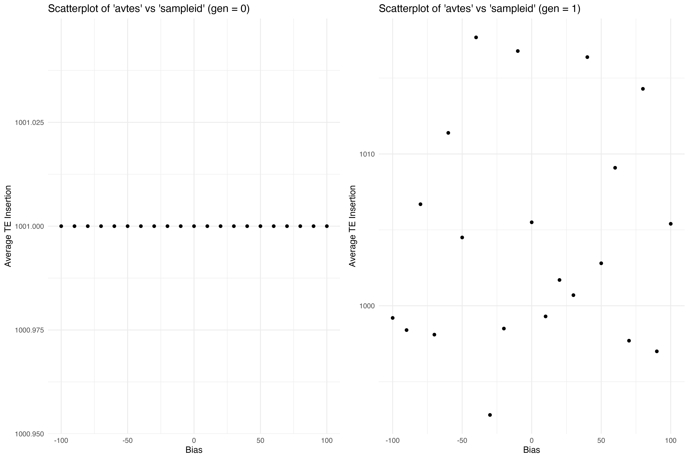
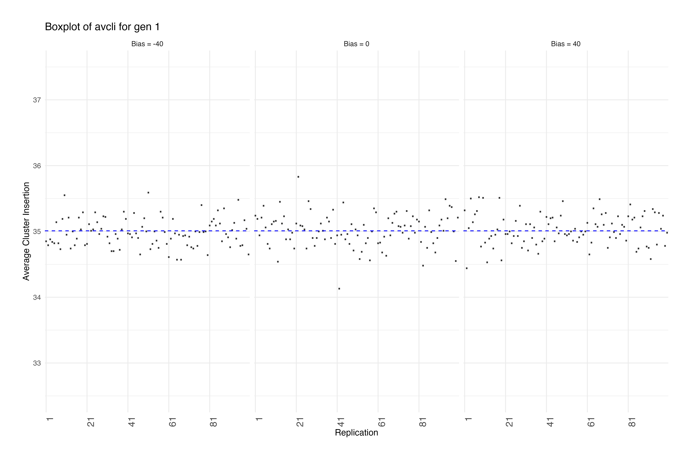

Validation of insertion
================

## Shashank Pritam

# Introduction

In this validation we wanted to test if insertion was correctly
implemented.

We introduced one TE at 0 with 0 bias in one chromosome and 1000 TEs
with 0 bias at random places in other chromosome, for all the 10000
population size; like this - basepop – 10000; 0(0); X<sub>1</sub>(-100)
… X<sub>1000</sub>(-100).

We define only one diploid chromosome with genome size =“mb:1” and with
3% cluster size =“kb:30”.

version: invadego 0.1.3

### Materials & Methods

| Bias | SampleID | Seed                |
|------|----------|---------------------|
| -100 | mb100    | 1686770879523998894 |
| -90  | mb90     | 1686771718574230166 |
| -80  | mb80     | 1686772555915943630 |
| -70  | mb70     | 1686773393544347167 |
| -60  | mb60     | 1686774231935093186 |
| -50  | mb50     | 1686775071484589895 |
| -40  | mb40     | 1686775911463785597 |
| -30  | mb30     | 1686776750162246315 |
| -20  | mb20     | 1686777590950853421 |
| -10  | mb10     | 1686778429311511212 |
| 0    | b0       | 1686779268523079622 |
| 10   | b10      | 1686780106772056421 |
| 20   | b20      | 1686780945785645464 |
| 30   | b30      | 1686781784522882135 |
| 40   | b40      | 1686782622204643493 |
| 50   | b50      | 1686783462555771126 |
| 60   | b60      | 1686784300400838990 |
| 70   | b70      | 1686785138223446093 |
| 80   | b80      | 1686785978272667371 |
| 90   | b90      | 1686786816510484323 |
| 100  | b100     | 1686787656366000793 |

The insertions within the piRNA Clusters -

| Index | Value |
|-------|-------|
| 1     | 10000 |
| 2     | 5598  |
| 3     | 5698  |
| 4     | 1469  |
| 5     | 22900 |
| 6     | 9478  |
| 7     | 29202 |
| 8     | 29000 |
| 9     | 2026  |
| 10    | 18615 |
| 11    | 24544 |
| 12    | 18197 |
| 13    | 17935 |
| 14    | 17257 |
| 15    | 29766 |
| 16    | 14626 |
| 17    | 8253  |
| 18    | 25481 |
| 19    | 29009 |
| 20    | 24390 |
| 21    | 24500 |
| 22    | 8637  |
| 23    | 24634 |
| 24    | 13613 |
| 25    | 27845 |
| 26    | 2193  |
| 27    | 341   |
| 28    | 19864 |
| 29    | 6987  |
| 30    | 27319 |
| 31    | 23332 |
| 32    | 4214  |
| 33    | 9471  |
| 34    | 10166 |
| 35    | 3249  |

Commands for the simulation:

``` bash
#!/bin/bash

# Base name for the output files
outfile_base="input_bias"

tool="./main"
genome="mb:1"
cluster="kb:30"
rep=100
gen=1
steps=1
folder="Simulation-Results_Files/Insertion-Bias/validation_7.1"
rr=0

# Make sure the output folder exists
mkdir -p $folder

# Initialize a counter
counter=1

# Function to generate a random number between 0 and 1 million
generate_random_number() {
    echo $(( $(od -An -N3 -i /dev/urandom) % 1000001 ))
}

# Generate 1000 random numbers and store them in an array
declare -a random_numbers
for i in {1..1000}
do
    random_numbers[i]=$(generate_random_number)
done

# Loop over values from -100 to 100 in steps of 10
for j in $(seq -100 10 100)
do
    # Formulate the outfile name for this iteration
    outfile="$folder/${outfile_base}${counter}"  # Added $folder to the path

    # Remove the outfile if it already exists
    if [ -e "$outfile" ]
    then
        rm "$outfile"
    fi

    # Start the line with "10000;" and the first random number
    line="10000; ${random_numbers[1]}(${j})"

    # Add 999 more random numbers and the bias value to the line
    for i in {2..1000}
    do
        line="$line, ${random_numbers[i]}(${j})"
    done

    # Finish the line with "; 0(0)" and write it to the file
    echo "$line; 0(0)" >> $outfile

    # Specify basepop with the current outfile
    basepop="file:$outfile"  # Now correctly pointing to the outfile in $folder

    # Assign current counter value to sampleid with descriptive prefix
    if [ $j -ge 0 ]
    then
        sampleid="b${j}"
    else
        sampleid="mb${j#-}"  # Use parameter expansion to remove the negative sign
    fi

    # Run the command
    $tool --N 10000 --gen $gen --genome $genome --cluster $cluster --rr $rr --rep $rep --u 0.1 --basepop $basepop --steps $steps --sampleid $sampleid >> "$folder/result_${counter}.out"

    # Increment the counter
    counter=$((counter+1))
done
```

# Data Processing in R

This part includes loading and cleaning the data. First, we specify the
column names for our data. Then, we define a function `process_file` to
read and process each file.

``` r
# Define column names
column_names <- c("rep", "gen", "popstat", "spacer_1", "fwte", "avw", "min_w", "avtes", "avpopfreq",
                  "fixed","spacer_2", "phase", "fwcli", "avcli", "fixcli", "spacer_3",
                  "avbias", "3tot", "3cluster", "spacer_4", "sampleid")

# Define numeric columns
numeric_columns <- c("rep", "gen", "fwte", "avw", "min_w", "avtes", "avpopfreq",
                     "fixed", "fwcli", "avcli", "fixcli",
                     "avbias")

# Define N as the total number of result files
N <- 21

# Create a function to process each file
process_file <- function(i) {
  # Construct filename
  filename <- paste0("./Simulation-Results_Files/validation_7.1/result_", i, ".out")
  
  # Read and process the result file
  result <- read_lines(filename) %>% 
    discard(~str_detect(., "^#|^Invade")) %>%  # Remove lines starting with '#' or 'Invade'
    str_split("\\s+", simplify = TRUE) %>%  # Split lines into columns by whitespace
    as_tibble()  # Convert matrix to tibble
  
  # Remove the last column ('sampleids')
  result <- result[,-ncol(result)]
  
  # Set column names
  colnames(result) <- column_names
  
  # Convert numeric columns to appropriate data types
  result <- mutate(result, across(all_of(numeric_columns), as.numeric), .keep = "all")
  
  return(result)
}

# Loop over result files and combine them into a single data frame
result_df <- map_df(seq_len(N), process_file)
result_df <- result_df %>%
  mutate(sampleid = str_replace_all(sampleid, c("mb100" = "-100","mb90" = "-90", "mb80" = "-80", "mb70" = "-70", "mb60" = "-60",
                                                "mb50" = "-50", "mb40" = "-40", "mb30" = "-30", "mb20" = "-20",
                                                "mb10" = "-10", "b100" = "100","b90" = "90", "b80" = "80", "b70" = "70",
                                                "b60" = "60", "b50" = "50", "b40" = "40", "b30" = "30",
                                                "b20" = "20", "b10" = "10", "b0" = "0")))
```

# Visualization in R

After the data is cleaned, we create a barplot of `avtes` for 21
`sampleid`s to visualize and evaluate potential bias in the data.

``` r
# Define a function to normalize values using min-max normalization
normalize_min_max <- function(x) {
  return((x - min(x)) / (max(x) - min(x)))
}

# Filter the results for generations 0 and 1 with repetition 10, and normalize 'avtes'
result_df_filtered <- result_df %>%
  filter(gen %in% c(0, 1), rep == 10) %>%
  mutate(avtes_normalized = normalize_min_max(avtes))

# Specify the order of sample IDs for the bars in the plot
sampleid_order <- c("-100", "-90", "-80", "-70", "-60", "-50", "-40", "-30", "-20", "-10", "0", "10", "20", "30", "40", "50", "60", "70", "80", "90", "100")

# Arrange the levels of the `sampleid` factor according to the specified order
result_df_filtered$sampleid <- factor(result_df_filtered$sampleid, levels = sampleid_order)

# Create a bar plot
a <- ggplot(result_df_filtered, aes(x = sampleid, y = avtes_normalized)) +
  geom_bar(stat = 'identity') +
  labs(title = "Barplot of Normalized 'avtes' for 21 SampleIDs", x = "Bias", y = "Normalized Average TE Insertion") +
  theme_minimal() +
  theme(axis.text.x = element_text(angle = 90, vjust = 0.5, hjust = 1))

# Save the plot as a PNG file
ggsave("images/Validation_7a_insertion.png", plot = a)
```

``` r
# Filter data for gen 0 and gen 1
data_gen0 <- result_df %>% filter(gen == 0)
data_gen1 <- result_df %>% filter(gen == 1)

# Plotting for gen 0
b <- ggplot(data_gen0, aes(x = as.factor(rep), y = avcli)) +
  geom_boxplot() +
  geom_hline(yintercept = mean(data_gen0$avcli), linetype="dashed", color = "blue") +
  facet_wrap(~sampleid, scales = "free_x") +
  labs(title = "Boxplot of avcli for gen 0",
       x = "Replication",
       y = "Average Cluster Insertion") +
  theme_minimal() +
  theme(axis.text.x = element_text(angle = 90, hjust = 1),
        legend.position = "none")
ggsave("images/Validation_7b_insertion.png", plot = b)

# Plotting for gen 1
c <- ggplot(data_gen1, aes(x = as.factor(rep), y = avcli)) +
  geom_boxplot() +
  geom_hline(yintercept = mean(data_gen1$avcli), linetype="dashed", color = "blue") +
  facet_wrap(~sampleid, scales = "free_x") +
  labs(title = "Boxplot of avcli for gen 1",
       x = "Replication",
       y = "Average Cluster Insertion") +
  theme_minimal() +
  theme(axis.text.x = element_text(angle = 90, hjust = 1),
        legend.position = "none")
ggsave("images/Validation_7c_insertion.png", plot = c)
```

# Results




<figure>

<figcaption aria-hidden="true">Here is a Plot for avcli vs bias for Gen
= 1</figcaption>
</figure>

# Conclusion

The validation matches our expectations and the insertion is working as
expected.

# Session Info

    ## R version 4.2.1 (2022-06-23)
    ## Platform: aarch64-apple-darwin20 (64-bit)
    ## Running under: macOS Ventura 13.4
    ## 
    ## Matrix products: default
    ## BLAS:   /Library/Frameworks/R.framework/Versions/4.2-arm64/Resources/lib/libRblas.0.dylib
    ## LAPACK: /Library/Frameworks/R.framework/Versions/4.2-arm64/Resources/lib/libRlapack.dylib
    ## 
    ## locale:
    ## [1] en_US.UTF-8/en_US.UTF-8/en_US.UTF-8/C/en_US.UTF-8/en_US.UTF-8
    ## 
    ## attached base packages:
    ## [1] stats     graphics  grDevices utils     datasets  methods   base     
    ## 
    ## other attached packages:
    ## [1] tidyr_1.3.0   purrr_1.0.1   stringr_1.5.0 dplyr_1.1.2   readr_2.1.4  
    ## [6] ggplot2_3.4.2
    ## 
    ## loaded via a namespace (and not attached):
    ##  [1] pillar_1.9.0      compiler_4.2.1    tools_4.2.1       bit_4.0.5        
    ##  [5] digest_0.6.31     evaluate_0.21     lifecycle_1.0.3   tibble_3.2.1     
    ##  [9] gtable_0.3.3      pkgconfig_2.0.3   rlang_1.1.1       cli_3.6.1        
    ## [13] rstudioapi_0.14   parallel_4.2.1    yaml_2.3.7        xfun_0.39        
    ## [17] fastmap_1.1.1     withr_2.5.0       knitr_1.43        systemfonts_1.0.4
    ## [21] generics_0.1.3    vctrs_0.6.2       hms_1.1.3         bit64_4.0.5      
    ## [25] grid_4.2.1        tidyselect_1.2.0  glue_1.6.2        R6_2.5.1         
    ## [29] textshaping_0.3.6 fansi_1.0.4       vroom_1.6.3       rmarkdown_2.22   
    ## [33] farver_2.1.1      tzdb_0.4.0        magrittr_2.0.3    scales_1.2.1     
    ## [37] htmltools_0.5.5   colorspace_2.1-0  labeling_0.4.2    ragg_1.2.5       
    ## [41] utf8_1.2.3        stringi_1.7.12    munsell_0.5.0     crayon_1.5.2
