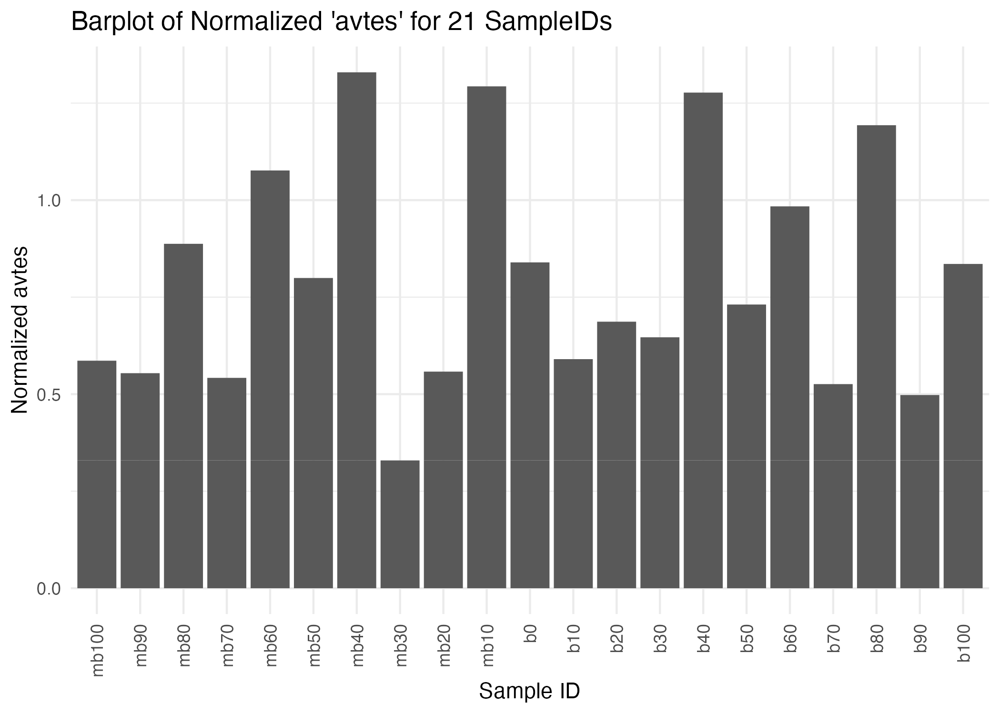

Bias Validation
================

# Introduction

This notebook illustrates the data processing and visualization steps.
We start by loading necessary libraries, defining some parameters, and
then we process the data files. The final part of the notebook presents
a bar plot of `avtes` for 21 `sampleid`s.

# Data Processing

This part includes loading and cleaning the data. First, we specify the
column names for our data. Then, we define a function `process_file` to
read and process each file.

``` r
# Define column names
column_names <- c("rep", "gen", "popstat", "spacer_1", "fwte", "avw", "min_w", "avtes", "avpopfreq",
                  "fixed","spacer_2", "phase", "fwcli", "avcli", "fixcli", "spacer_3",
                  "avbias", "3tot", "3cluster", "spacer_4", "sampleid")

# Define numeric columns
numeric_columns <- c("rep", "gen", "fwte", "avw", "min_w", "avtes", "avpopfreq",
                     "fixed", "fwcli", "avcli", "fixcli",
                     "avbias")

# Define N as the total number of result files
N <- 21

# Create a function to process each file
process_file <- function(i) {
  # Construct filename
  filename <- paste0("./Simulation-Results_Files/validation_7.1/result_", i, ".out")
  
  # Read and process the result file
  result <- read_lines(filename) %>% 
    discard(~str_detect(., "^#|^Invade")) %>%  # Remove lines starting with '#' or 'Invade'
    str_split("\\s+", simplify = TRUE) %>%  # Split lines into columns by whitespace
    as_tibble()  # Convert matrix to tibble
  
  # Remove the last column ('sampleids')
  result <- result[,-ncol(result)]
  
  # Set column names
  colnames(result) <- column_names
  
  # Convert numeric columns to appropriate data types
  result <- mutate(result, across(all_of(numeric_columns), as.numeric), .keep = "all")
  
  return(result)
}

# Loop over result files and combine them into a single data frame
result_df <- map_df(seq_len(N), process_file)
```

# Data Visualization

After the data is cleaned, we create a barplot of `avtes` for 21
`sampleid`s to visualize and evaluate potential bias in the data.

``` r
normalize_min_max <- function(x) {
  return((x - min(x)) / (max(x) - min(x)))
}

result_df_filtered <- result_df %>%
  filter(gen %in% c(0, 1), rep == 10) %>%
  mutate(avtes_normalized = normalize_min_max(avtes))

# Define the desired order of the bars
sampleid_order <- c("mb100", "mb90", "mb80", "mb70", "mb60", "mb50", "mb40", "mb30", "mb20", "mb10", "b0", "b10", "b20", "b30", "b40", "b50", "b60", "b70", "b80", "b90", "b100")

# Set the order of the `sampleid` factor levels
result_df_filtered$sampleid <- factor(result_df_filtered$sampleid, levels = sampleid_order)

p <- ggplot(result_df_filtered, aes(x = sampleid, y = avtes_normalized)) +
  geom_bar(stat = 'identity') +
  labs(title = "Barplot of Normalized 'avtes' for 21 SampleIDs", x = "Sample ID", y = "Normalized avtes") +
  theme_minimal() +
  theme(axis.text.x = element_text(angle = 90, vjust = 0.5, hjust = 1))

ggsave("images/validation7.1.png", plot = p)
```

\#

This bar plot gives us insights about …

# Conclusion

The notebook illustrated how we can efficiently process our data files
and generate insightful visualizations. The bar plot gives us an
understanding of …

    ## R version 4.2.1 (2022-06-23)
    ## Platform: aarch64-apple-darwin20 (64-bit)
    ## Running under: macOS Ventura 13.4
    ## 
    ## Matrix products: default
    ## BLAS:   /Library/Frameworks/R.framework/Versions/4.2-arm64/Resources/lib/libRblas.0.dylib
    ## LAPACK: /Library/Frameworks/R.framework/Versions/4.2-arm64/Resources/lib/libRlapack.dylib
    ## 
    ## locale:
    ## [1] en_US.UTF-8/en_US.UTF-8/en_US.UTF-8/C/en_US.UTF-8/en_US.UTF-8
    ## 
    ## attached base packages:
    ## [1] stats     graphics  grDevices utils     datasets  methods   base     
    ## 
    ## other attached packages:
    ## [1] tidyr_1.3.0   purrr_1.0.1   stringr_1.5.0 dplyr_1.1.2   readr_2.1.4  
    ## [6] ggplot2_3.4.2
    ## 
    ## loaded via a namespace (and not attached):
    ##  [1] pillar_1.9.0      compiler_4.2.1    tools_4.2.1       bit_4.0.5        
    ##  [5] digest_0.6.31     evaluate_0.21     lifecycle_1.0.3   tibble_3.2.1     
    ##  [9] gtable_0.3.3      pkgconfig_2.0.3   rlang_1.1.1       cli_3.6.1        
    ## [13] rstudioapi_0.14   parallel_4.2.1    yaml_2.3.7        xfun_0.39        
    ## [17] fastmap_1.1.1     withr_2.5.0       knitr_1.43        systemfonts_1.0.4
    ## [21] generics_0.1.3    vctrs_0.6.2       hms_1.1.3         bit64_4.0.5      
    ## [25] grid_4.2.1        tidyselect_1.2.0  glue_1.6.2        R6_2.5.1         
    ## [29] textshaping_0.3.6 fansi_1.0.4       vroom_1.6.3       rmarkdown_2.22   
    ## [33] farver_2.1.1      tzdb_0.4.0        magrittr_2.0.3    scales_1.2.1     
    ## [37] htmltools_0.5.5   colorspace_2.1-0  labeling_0.4.2    ragg_1.2.5       
    ## [41] utf8_1.2.3        stringi_1.7.12    munsell_0.5.0     crayon_1.5.2
