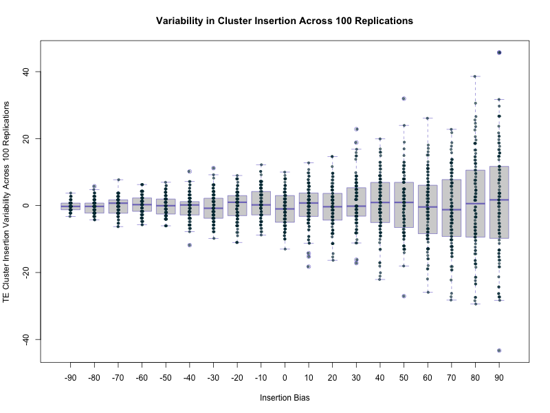

Validation of insertion
================

## Shashank Pritam

# Introduction

In this validation we wanted to test if insertion was correctly
implemented.

version: invadego 0.1.3

### Materials & Methods

| Bias | SampleID | Seed                |
|------|----------|---------------------|
| -100 | mb100    | 1687986419473565499 |
| -90  | mb90     | 1687986439519204740 |
| -80  | mb80     | 1687986459385010207 |
| -70  | mb70     | 1687986479004319218 |
| -60  | mb60     | 1687986498415164945 |
| -50  | mb50     | 1687986518191731481 |
| -40  | mb40     | 1687986537947039053 |
| -30  | mb30     | 1687986557979563694 |
| -20  | mb20     | 1687986577799895192 |
| -10  | mb10     | 1687986597553426300 |
| 0    | b0       | 1687986617358973799 |
| 10   | b10      | 1687986636894417837 |
| 20   | b20      | 1687986656418196570 |
| 30   | b30      | 1687986677115413538 |
| 40   | b40      | 1687986698520036068 |
| 50   | b50      | 1687986720075130951 |
| 60   | b60      | 1687986741333869430 |
| 70   | b70      | 1687986762991078587 |
| 80   | b80      | 1687986784961325051 |
| 90   | b90      | 1687986806594066852 |
| 100  | b100     | 1687986827704107589 |

## Bash Command for Simulation

``` bash

tool="./main"
genome="mb:1,1,1,1,1"
cluster="kb:30,30,30,30,30"
rep=100
gen=1
steps=1
folder="Simulation-Results/Insertion-Bias/validation_7"
rr="0,0,0,0,0"

mkdir -p $folder

# Loop over values from -100 to 100 in steps of 10
for j in $(seq -100 10 100)
do
    # Set basepop directly to "1000;j"
    basepop="1000($j)"

    # Assign current counter value to sampleid with descriptive prefix
    if [ $j -ge 0 ]
    then
        sampleid="b${j}"
    else
        sampleid="mb${j#-}"  # Use parameter expansion to remove the negative sign
    fi

    # Run the command and write the output to a file named after the sampleid
    $tool --N 100000 --gen $gen --genome $genome --cluster $cluster --rr $rr --rep $rep --basepop "$basepop" --steps $steps --sampleid $sampleid > "$folder/result_${sampleid}.out"
done

cat result_*.out | grep -v "^Invade" | grep -v "^#" > combined_results.out
```

## Load and Clean Data

``` r
# Load necessary libraries
library(readr)
library(dplyr)
library(ggplot2)

# Define column names
column_names <- c("rep", "gen", "popstat", "spacer_1", "fwte", "avw", "min_w", "avtes", "avpopfreq",
                "fixed", "spacer_2", "phase", "fwcli", "avcli", "fixcli", "spacer_3",
                "avbias", "3tot", "3cluster", "spacer_4", "sampleid")

# Load DataFrame with column names
df <- read_delim('Simulation-Results_Files/validation_7/combined_results.out', delim='\t', col_names = column_names)


# Define replacement dictionary
replace_dict <- c("mb100" = "-100","mb90" = "-90", "mb80" = "-80", "mb70" = "-70", "mb60" = "-60",
                "mb50" = "-50", "mb40" = "-40", "mb30" = "-30", "mb20" = "-20",
                "mb10" = "-10", "b100" = "100","b90" = "90", "b80" = "80", "b70" = "70",
                "b60" = "60", "b50" = "50", "b40" = "40", "b30" = "30",
                "b20" = "20", "b10" = "10", "b0" = "0")

# Apply replacements to 'sampleid' column
df$sampleid <- as.character(df$sampleid) %>% str_replace_all(replace_dict)

# Convert the columns to numeric
numeric_columns <- c("rep", "gen", "fwte", "avw", "min_w", "avtes", "avpopfreq",
                   "fixed", "fwcli", "avcli", "fixcli",
                   "avbias", "sampleid")

df[numeric_columns] <- lapply(df[numeric_columns], function(x) as.numeric(as.character(x)))

# Define your function
pc <- function(bias, clufrac) {
    genfrac = 1.0 - clufrac
    bias = bias / 100
    clufit = (bias + 1.0) / 2.0
    genfit = 1.0 - clufit
    totfit = clufrac * clufit + genfrac * genfit
    p = (clufrac * clufit) / totfit
    return(p * 100)
}

# Filter dataframe where 'gen' == 0 and sort it by 'sampleid'
df2 <- df[df$gen == 0, numeric_columns] %>% arrange(sampleid)

# Calculate the expected values (pc) for each 'sampleid'
df2$pc <- sapply(df2$sampleid, function(x) pc(x, 0.03))
```

## Plot Data

#### Figure 1 A

``` r
a <- ggplot(df2, aes(x = sampleid)) +
  geom_point(aes(y = avcli), color = "#003f5c") +
  geom_line(aes(y = pc), color = "#ffa600") +
  labs(title = "Average Cluster Insertion across Insertion Bias: All Data Points",
       x = "Insertion Bias",
       y = "Average Cluster Insertion Observed (Dots) and Expected Value (Lines)") +
  theme_minimal() +
  theme(plot.title = element_text(hjust = 0.5))

ggsave(
  filename = "images/Validation_7_1A.jpg",
  plot = a,
  width = 10,
  height = 10,
  units = "in"
)
ggsave(
  filename = "images/Validation_7_1A.pdf",
  plot = a,
  width = 10,
  height = 10,
  units = "in"
)
```


The distribution of average TE (Transposable Elements) insertions across
different insertion bias levels for all replicates. The x-axis shows the
different Insertion Bias levels ranging from -100 to 100. The y-axis
represents the average TE insertions in the piRNA Cluster (Blue Dots for
Observed Value and Orange line for Expected value) for each bias level.

#### Figure 1 B

``` r
# Filter out the group with sampleid = 100 and -100
df_filtered <- df2 %>%
  filter(!(sampleid %in% c(-100, 100)))

# Subtract 'pc' from 'avcli' and force as numeric
df_filtered$TE_insertions <- as.numeric(as.character(df_filtered$avcli)) - as.numeric(as.character(df_filtered$pc))
df_filtered$TE_insertions <- 100 * df_filtered$TE_insertions

# Convert 'sampleid' to factor
df_filtered$insertion_bias <- as.factor(df_filtered$sampleid)

# Create a new plot file with larger dimensions
png(filename = "images/Validation_7_1B.jpg", width = 800, height = 600)

# Boxplot
boxplot(df_filtered$TE_insertions ~ df_filtered$insertion_bias,
  border = rgb(0.1, 0.1, 0.7, 0.5),
  main = "Variability in Cluster Insertion Across 100 Replications",
  xlab = "Insertion Bias",
  ylab = "TE Cluster Insertion Variability Across 100 Replications")


# Add data points
mylevels <- levels(df_filtered$insertion_bias)
levelProportions <- summary(df_filtered$insertion_bias)/nrow(df_filtered)
for(i in 1:length(mylevels)){
  thislevel <- mylevels[i]
  thisvalues <- df_filtered[df_filtered$insertion_bias==thislevel, "TE_insertions"]
   
  # Ensure thisvalues is a numeric vector
  thisvalues <- unlist(thisvalues)
  
  # Take the x-axis indices and add a jitter, proportional to the N in each level
  myjitter <- jitter(rep(i, length(thisvalues)), amount=levelProportions[i]/2)
  
  # Use smaller points
  points(myjitter, thisvalues, pch=20, cex=0.9, col=rgb(0,0.2,0.25,0.6)) 
}


# Close the plot file
invisible(dev.off())
```



The plot displays the variability in Transposable Elements (TE)
insertions across different levels of Insertion Bias, using data from
100 replications. To calculate the ‘TE_insertions’ values plotted on the
y-axis, the ‘avcli’ column was subtracted from the ‘pc’ column in the
original dataset. This difference was then multiplied by 100 to express
the relative difference as a percentage:

$$TE_{insertions} = 100 * (avcli- pc)$$

The ‘Insertion Bias’ variable, represented on the x-axis, corresponds to
the ‘sampleid’ column. It was converted to a factor variable to
accommodate the categorical nature of this variable. The boxplot
summarizes the distribution of ‘TE_insertions’ for each level of
‘Insertion Bias’. Each boxplot indicates the median, interquartile
range, and potential outliers. The individual data points overlaid on
the boxplots represent the variability in TE insertions.

#### Figure 2 A

``` r
# Calculate mean_cli, sd_meancli, pc, and deviation_pc
df_summary <- df2 %>% 
    group_by(sampleid) %>% 
    summarise(mean_cli = mean(avcli, na.rm = TRUE), 
              sd_meancli = sd(avcli, na.rm = TRUE)) %>% 
    mutate(pc = sapply(sampleid, function(x) pc(x, 0.03)),
           deviation_pc = mean_cli - pc)

# Create scatter plot with error bars
c <- ggplot(df_summary, aes(x = sampleid)) +
  geom_point(aes(y = mean_cli), color = "#003f5c") +
  geom_errorbar(aes(ymin = mean_cli - sd_meancli, ymax = mean_cli + sd_meancli), width = .2, color = "003f5c") +
  geom_line(aes(y = pc), color = "#ffa600") +
  labs(title = "Observed and Expected Average Cluster Insertion across Insertion Bias",
       x = "Insertion Bias",
       y = "Mean of Average Cluster Insertion Observed (Dots)") +
  theme_minimal() +
  theme(plot.title = element_text(hjust = 0.5))
ggsave(filename = "images/Validation_7_1C.jpg", plot = c, width = 10, height = 10, units = "in")
ggsave(filename = "images/Validation_7_1C.pdf", plot = c, width = 10, height = 10, units = "in", device = "pdf")
print(c)
```

<!-- -->

This plot visualizes the mean of Average Cluster Insertion across
various Insertion Bias levels, with error bars indicating standard
deviation. Unlike previous plot’s individual data points, this
representation provides a concise summary of the data (mean), making it
easier to discern overall trends and reducing the impact of outliers.
The expected values are depicted by a dashed red line.

#### Figure 2 B

``` r
# Transform the 'mean_cli' and 'sd_meancli' by taking log10 to visualize better.
# We add a small constant to avoid log(0) and handle negative values.
# Apply a logarithmic transformation to 'mean_cli', 'sd_meancli', and 'pc'
df_summary$log_mean_cli <- log10(df_summary$mean_cli + 0.0001)
df_summary$log_sd_meancli <- log10(df_summary$sd_meancli + 0.0001)
df_summary$log_pc <- log10(df_summary$pc + 0.0001)

# Create scatter plot with error bars
d <- ggplot(df_summary, aes(x = sampleid)) +
    geom_point(aes(y = log_mean_cli), color = "blue") +
    geom_errorbar(aes(ymin = log_mean_cli - log_sd_meancli, ymax = log_mean_cli + log_sd_meancli), width = .2, color = "#008080") +
    geom_line(aes(y = log_pc), color = "orange") +
    labs(title = "Observed and Expected Average Cluster Insertion across Insertion Bias",
         x = "Insertion Bias",
         y = "Log-transformed Mean of Average Cluster Insertion") +
    theme_minimal() +
    theme(plot.title = element_text(hjust = 0.5))

# Print the plot

ggsave(filename = "images/Validation_7_1D.jpg", plot = d, width = 10, height = 10, units = "in")
ggsave(filename = "images/Validation_7_1D.pdf", plot = d, width = 10, height = 10, units = "in")
print(d)
```

<!-- -->

Figure 3 presents the same data as Figure 2, but with a logarithmic
transformation applied to the y-values. The transformation is performed
to better visualize the standard deviation, which is relatively small
compared to the mean values. By using the log scale, we can more easily
see the variability in the data (shown by the error bars) and the
deviation of the observed values (blue points) from the expected values
(red line). This plot provides a more detailed understanding of the
distribution of the data and the nature of the discrepancies between the
observed and expected values.

#### Figure 3

``` r
# Filter for rep 1
df_rep1 <- df2[df2$rep == 1, ]

# Create scatter plot
e <- ggplot(df_rep1, aes(x = sampleid, y = avtes)) +
  geom_point(color = "#003f5c") +
  labs(title = "Average Transposable Element Insertions",
       x = "Insertion Bias",
       y = "Average TE Insertions") +
  theme_minimal() +
  theme(plot.title = element_text(hjust = 0.5))

ggsave(filename = "images/Validation_7_1E.jpg", plot = e, width = 10, height = 10, units = "in")
ggsave(filename = "images/Validation_7_1E.pdf", plot = e, width = 10, height = 10, units = "in")
print(e)
```

<!-- -->

Average TE insertions (y-axis) and insertion bias (x-axis) for a single
replicate . The x-axis represents the Insertion Bias varying from -100
to 100. The y-axis depicts the average TE insertions for each bias
level. Each data point on the graph represents the average TE insertions
for a specific bias level for replicate 1.

#### Figure 4

``` r
# Calculate mean and standard deviation of avtes
df_summary_2 <- df2 %>% 
    group_by(sampleid) %>% 
    summarise(mean_avtes = mean(avtes, na.rm = TRUE), 
              sd_avtes = sd(avtes, na.rm = TRUE))

# Create scatter plot with error bars
f <- ggplot(df_summary_2, aes(x = sampleid)) +
    geom_point(aes(y = mean_avtes), color = "blue") +
    geom_errorbar(aes(ymin = mean_avtes - sd_avtes, ymax = mean_avtes + sd_avtes), width = .2, color = "#008080") +
    labs(title = "Average TE Insertions across Insertion Bias",
         x = "Insertion Bias",
         y = "Average TE Insertions") +
    theme_minimal() +
    theme(plot.title = element_text(hjust = 0.5))

ggsave(filename = "images/Validation_7_1F.jpg", plot = f, width = 10, height = 10, units = "in")
ggsave(filename = "images/Validation_7_1F.pdf", plot = f, width = 10, height = 10, units = "in")
print(f)
```

<!-- -->

All replicates’ mean average TE insertions (y-axis) against the
insertion bias (x-axis). The plot includes error bars, which visually
represent the variability in the data by displaying the standard
deviation for the average TE insertions at each bias level. The x-axis
represents the Insertion Bias, which ranges from -100 to 100. The y-axis
depicts the mean of the average TE insertions for each bias level. Each
data point on the graph represents the mean average TE insertions for a
specific bias level across all replicates, with the error bars
representing the standard deviation.

# Summary of Average Cluster Insertion Statistics

Across the 21 insertion bias values (sampleid 0 to 20), the mean of cli
is calculated for all 100 replications. The standard deviation is also
calculated. We have another column named pc which is the theoretical
value of average cluster insertion for a given insertion bias with a 3%
cluster size. It was calculated as follows:

``` r
# Define your function  
pc <- function(bias, clufrac) {  
    genfrac <- 1.0 - clufrac  
    bias <- bias / 100  
    clufit <- (bias + 1.0) / 2.0  
    genfit <- 1.0 - clufit  
    totfit <- clufrac * clufit + genfrac * genfit  
    p <- (clufrac * clufit) / totfit  
    return(p * 100)  
}
```

We create a new dataframe where ‘gen’ equals 0 and sort it by
‘sampleid’. Then we calculate the expected values (pc) for each
‘sampleid’.

``` r
# Filter dataframe where 'gen' equals 0 and sort it by 'sampleid'
df2 <- df[df$gen == 0, numeric_columns] %>% arrange(sampleid)

# Calculate the expected values (pc) for each 'sampleid'
df2$pc <- sapply(df2$sampleid, function(x) pc(x, 0.03))
```

The last column, deviation_pc, is calculated as the deviation of
mean_cli from pc as follows:

``` r
# Calculate mean_cli, sd_meancli, pc, and deviation_pc
df_summary <- df2 %>% 
    group_by(sampleid) %>% 
    summarise(mean_cli = mean(avcli, na.rm = TRUE), 
              sd_meancli = sd(avcli, na.rm = TRUE)) %>% 
    mutate(pc = sapply(sampleid, function(x) pc(x, 0.03)),
           deviation_pc = mean_cli - pc)

print(tibble(df_summary), n=21)
```

    ## # A tibble: 21 × 5
    ##    sampleid mean_cli sd_meancli      pc deviation_pc
    ##       <dbl>    <dbl>      <dbl>   <dbl>        <dbl>
    ##  1     -100    0        0         0         0       
    ##  2      -90    0.162    0.0130    0.163    -0.000814
    ##  3      -80    0.341    0.0204    0.342    -0.00157 
    ##  4      -70    0.542    0.0248    0.543    -0.000423
    ##  5      -60    0.769    0.0297    0.767     0.00154 
    ##  6      -50    1.02     0.0307    1.02     -0.00111 
    ##  7      -40    1.30     0.0360    1.31     -0.00454 
    ##  8      -30    1.63     0.0417    1.64     -0.00397 
    ##  9      -20    2.02     0.0448    2.02     -0.00160 
    ## 10      -10    2.48     0.0459    2.47      0.00719 
    ## 11        0    2.99     0.0514    3        -0.00930 
    ## 12       10    3.64     0.0571    3.64      0.000316
    ## 13       20    4.43     0.0622    4.43     -0.00360 
    ## 14       30    5.44     0.0707    5.43      0.00955 
    ## 15       40    6.73     0.0861    6.73      0.00333 
    ## 16       50    8.50     0.0932    8.49      0.00513 
    ## 17       60   11.0      0.0994   11.0      -0.00867 
    ## 18       70   14.9      0.112    14.9      -0.0104  
    ## 19       80   21.8      0.144    21.8       0.00271 
    ## 20       90   37.0      0.164    37.0       0.0114  
    ## 21      100  100.       0.00485 100        -0.0174

# Conclusion

The validation matches our expectations and the insertion is working as
expected and the the simulation successfully incorporates the
user-defined TE insertions as specified.
