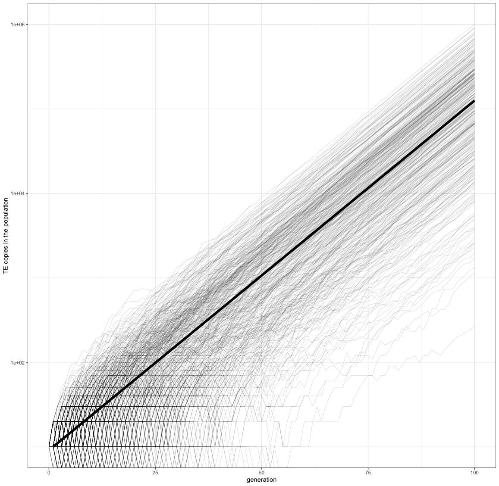
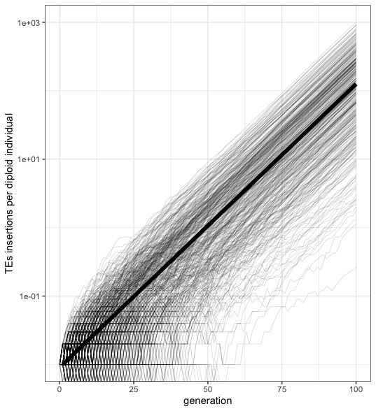

Validation of invasion
================
Almorò Scarpa

## Introduction

With this validation we wanted to prove that the simulator will generate
on average the number of insertions predicted by the equation:

c<sub>t</sub> = c<sub>0</sub>(1+ $\mu$ )<sup>t</sup>


c<sub>t</sub> = TE copies at generation t

c<sub>0</sub> = TE copies at generation 0

$\mu$  = Transposition rate

t = Generation

Initial conditions:
c<sub>0</sub> = 10

$\mu$  = 0.1

t = 100


A chromosome of size 1Mb and no piRNA clusters. We used 500 replicates

## Materials & Methods

version: invadego0.1.3 seed:1677013420283152972

### Commands for the simulation:

``` bash
folder="Simulation-Results/Insertion-Bias/validation_1"
tool="./main"

$tool --N 1000 --gen 100 --genome mb:1 --cluster kb:0 --rr 4 --rep 500 --u 0.1 --basepop "10(0)" --silent --steps 1 > $folder/2023_02_21_Validation_1_invasion
```


### Visualization in R (A)


      library(ggplot2)
      library(RColorBrewer)
      library(plyr)
      library(gridExtra)
      theme_set(theme_bw())
    
      cn<-seq(0,99,1)
      res<-10*1.1^cn
      theo<-data.frame(x=1:100,y=res)
      validation<-read.table("2023_02_05_Validation_1_invasion", fill = TRUE, sep = "\t")
      names(validation)<-c("rep", "gen", "popstat", "spacer_1", "fwte", "avw", "minw","avtes", "avpopfreq", "fixed", "spacer_2", "phase", "fwcli","avcli","fixcli","spacer_4","avbias","3tot", "3cluster")
    
      gl<-ggplot()+geom_line(data=validation,aes(x=gen,group=rep,y=avtes*1000),alpha=0.15,size=0.3)+scale_y_log10()+geom_line(data=theo,aes(x=x,y=y),size=2)+theme(legend.position="none")+ylab("TE copies in the population")+xlab("generation")
      plot(gl)


<p align="center">
A.  B. 
</p>

A. (Left) In this scenario estimated the expected TE copies in the population.

B. (Right) Similar to the previous case but in this scenario estimated the expected TE copies per diploid individual.

### Visualization in R (B)

    library(ggplot2)
    library(RColorBrewer)
    library(plyr)
    library(gridExtra)
    theme_set(theme_bw())
    
    cn<-seq(0,99,1)
    res<-10*1.1^cn    
    theo<-data.frame(x=1:100,y=res/1000)
    validation<-read.table("2023_02_05_Validation_1_invasion", fill = TRUE, sep = "\t")
    names(validation)<-c("rep", "gen", "popstat", "spacer_1", "fwte", "avw", "minw","avtes", "avpopfreq", "fixed", "spacer_2", "phase", "fwcli","avcli","fixcli","spacer_4","avbias","3tot", "3cluster")
    
    gl<-ggplot()+geom_line(data=validation,aes(x=gen,group=rep,y=avtes),alpha=0.15,size=0.3)+scale_y_log10()+geom_line(data=theo,aes(x=x,y=y),size=2)+theme(legend.position="none")+ylab("TEs insertions per diploid individual")+xlab("generation")
    plot(gl)


## Conclusions

The simulation matched the expectations. Invadego accurately reproduces
the expected exponential increase of TE copy numbers in a population
with no piRNA clusters.