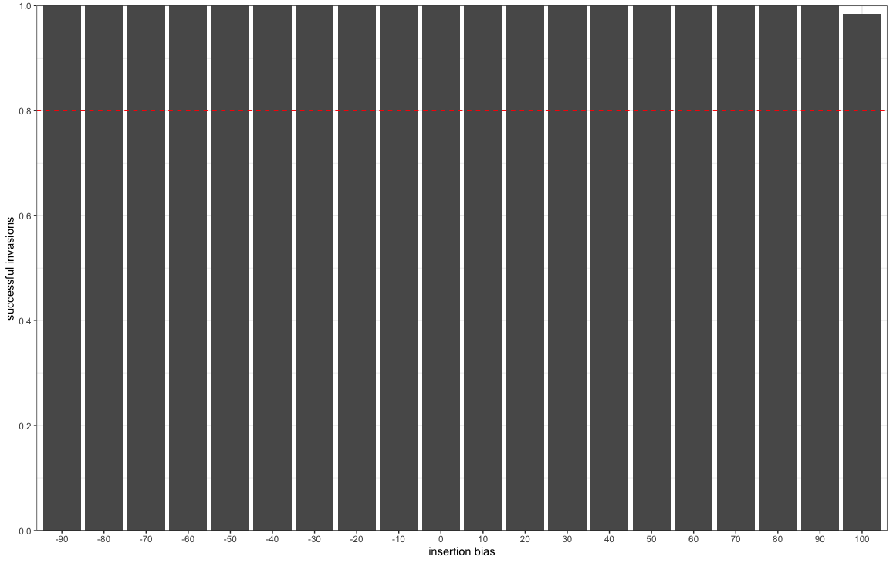
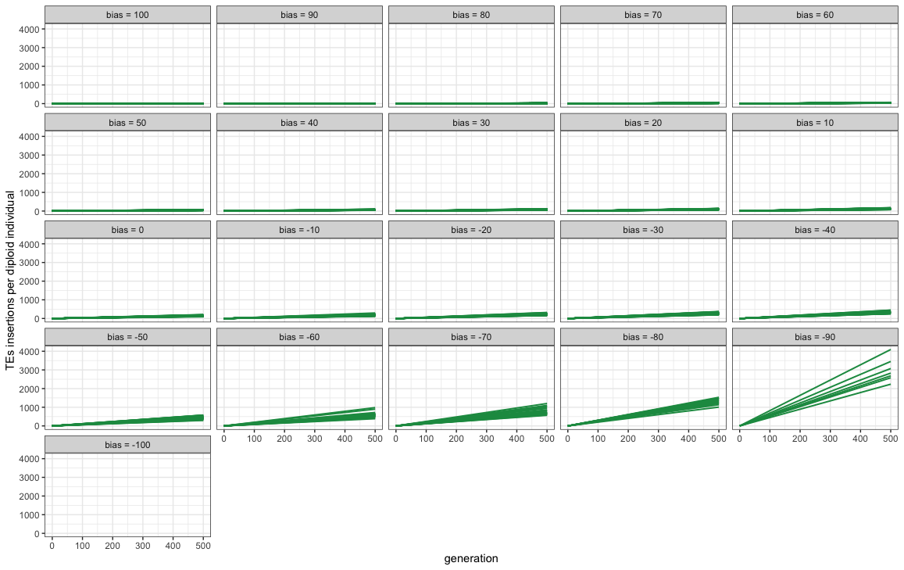
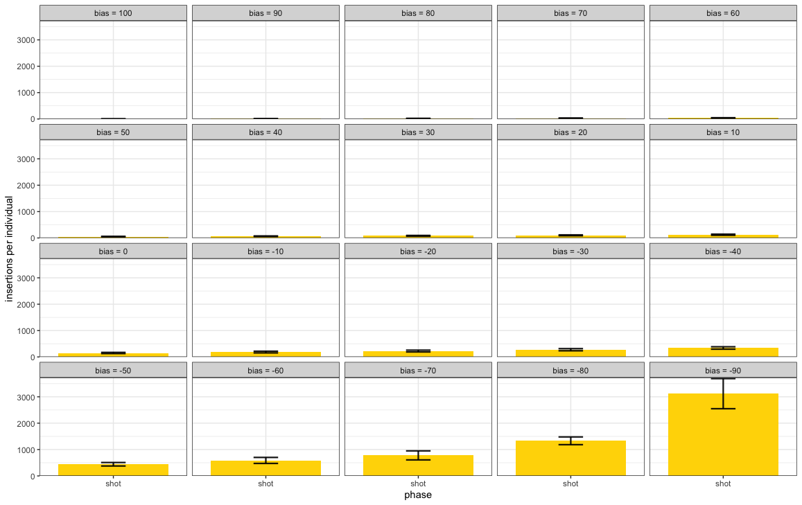
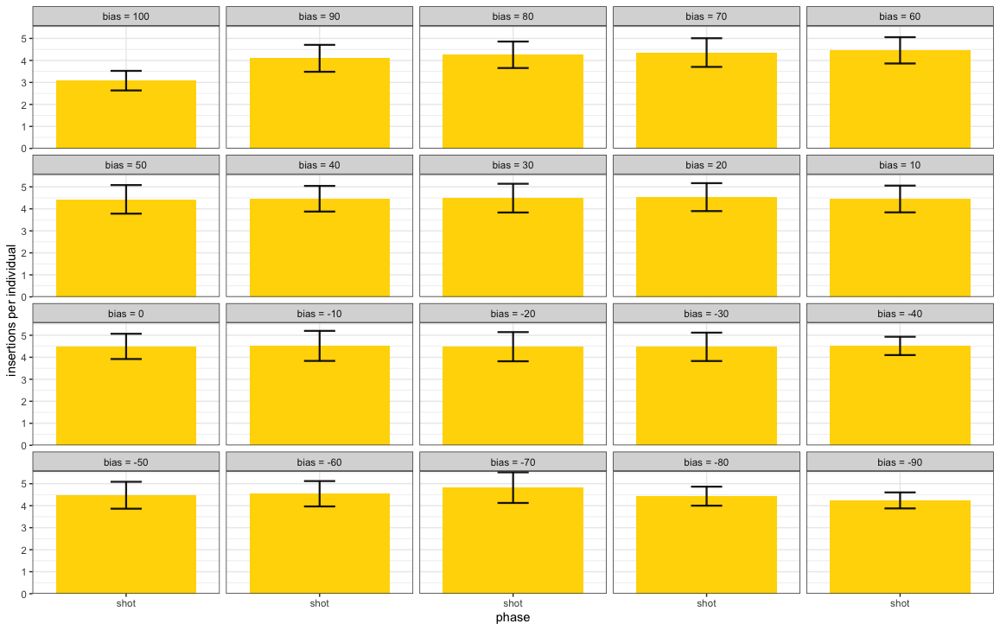
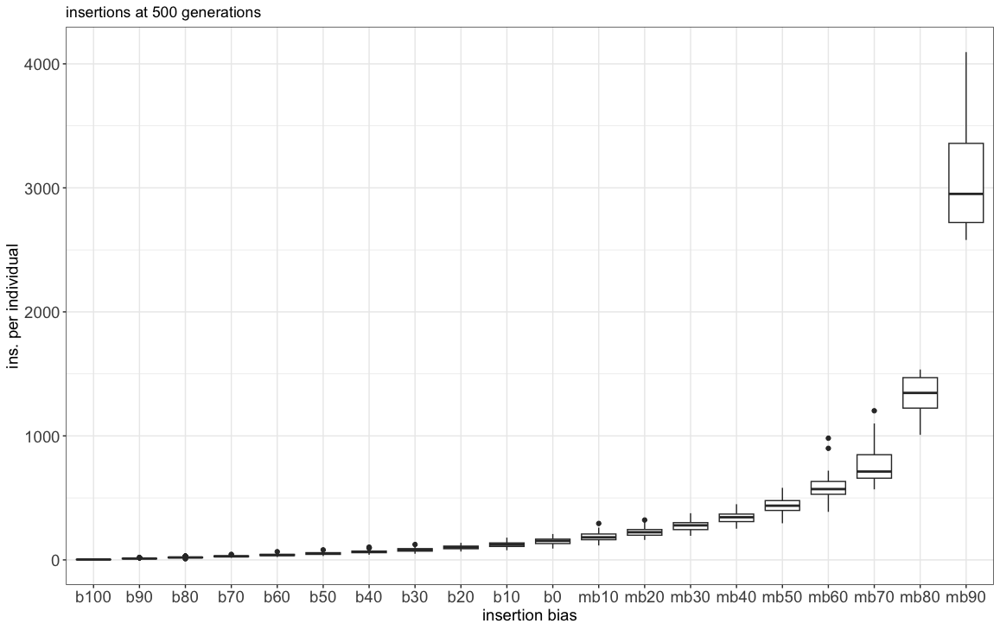
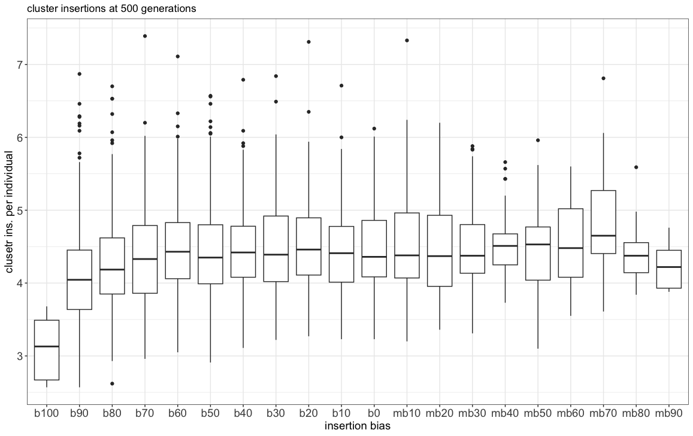

2023-03-21-Simulation-Bias-Exploration
================
Shashank
2023-03-21

## Introduction

With this simulation we wanted to understand the impact of the insertion
bias on the transposable elements invasion dynamics.

### Initial conditions:

A population of 1000, 5 chromosomes of size 10 Mb, 5 piRNA clusters of
size 300 Kb and an initial number of TEs in the population equal to 1000.

We used 1000 replicates for the establishment probability simulation.


## Materials & Methods

version: invadego-insertionbias

-   seed bm100:

-   seed bm90:

-   seed bm80:

-   seed bm70:

-   seed bm60:

-   seed bm50:

-   seed bm40:

-   seed bm30:

-   seed bm20:

-   seed bm10:

-   seed b0:

-   seed b10:

-   seed b20:

-   seed b30:

-   seed b40:

-   seed b50:

-   seed b60:

-   seed b70:

-   seed b80:

-   seed b90:

-   seed b100:

### Commands for the simulation:

``` bash
tool="./main"
folder="Simulation-Results/Insertion-Bias/Simulation_IB"


$tool --N 1000 --gen 500 --genome mb:10,10,10,10,10 --cluster kb:300,300,300,300,300 --rr 4,4,4,4,4 --rep 1000 --u 0.1 --basepop "1000(-100)" --steps 500 --sampleid mb100 > $folder/2023_03_21_simulation_0_m100_500gen &
$tool --N 1000 --gen 500 --genome mb:10,10,10,10,10 --cluster kb:300,300,300,300,300 --rr 4,4,4,4,4 --rep 1000 --u 0.1 --basepop "1000(-90)" --steps 500 --sampleid mb90 > $folder/2023_03_21_simulation_0_m90_500gen &
$tool --N 1000 --gen 500 --genome mb:10,10,10,10,10 --cluster kb:300,300,300,300,300 --rr 4,4,4,4,4 --rep 1000 --u 0.1 --basepop "1000(-80)" --steps 500 --sampleid mb80 > $folder/2023_03_21_simulation_0_m80_500gen &
$tool --N 1000 --gen 500 --genome mb:10,10,10,10,10 --cluster kb:300,300,300,300,300 --rr 4,4,4,4,4 --rep 1000 --u 0.1 --basepop "1000(-70)" --steps 500 --sampleid mb70 > $folder/2023_03_21_simulation_0_m70_500gen &
$tool --N 1000 --gen 500 --genome mb:10,10,10,10,10 --cluster kb:300,300,300,300,300 --rr 4,4,4,4,4 --rep 1000 --u 0.1 --basepop "1000(-60)" --steps 500 --sampleid mb60 > $folder/2023_03_21_simulation_0_m60_500gen &
$tool --N 1000 --gen 500 --genome mb:10,10,10,10,10 --cluster kb:300,300,300,300,300 --rr 4,4,4,4,4 --rep 1000 --u 0.1 --basepop "1000(-50)" --steps 500 --sampleid mb50 > $folder/2023_03_21_simulation_0_m50_500gen &
$tool --N 1000 --gen 500 --genome mb:10,10,10,10,10 --cluster kb:300,300,300,300,300 --rr 4,4,4,4,4 --rep 1000 --u 0.1 --basepop "1000(-40)" --steps 500 --sampleid mb40 > $folder/2023_03_21_simulation_0_m40_500gen &
$tool --N 1000 --gen 500 --genome mb:10,10,10,10,10 --cluster kb:300,300,300,300,300 --rr 4,4,4,4,4 --rep 1000 --u 0.1 --basepop "1000(-30)" --steps 500 --sampleid mb30 > $folder/2023_03_21_simulation_0_m30_500gen &
$tool --N 1000 --gen 500 --genome mb:10,10,10,10,10 --cluster kb:300,300,300,300,300 --rr 4,4,4,4,4 --rep 1000 --u 0.1 --basepop "1000(-20)" --steps 500 --sampleid mb20 > $folder/2023_03_21_simulation_0_m20_500gen &
$tool --N 1000 --gen 500 --genome mb:10,10,10,10,10 --cluster kb:300,300,300,300,300 --rr 4,4,4,4,4 --rep 1000 --u 0.1 --basepop "1000(-10)" --steps 500 --sampleid mb10 > $folder/2023_03_21_simulation_0_m10_500gen &
$tool --N 1000 --gen 500 --genome mb:10,10,10,10,10 --cluster kb:300,300,300,300,300 --rr 4,4,4,4,4 --rep 1000 --u 0.1 --basepop "1000(0)" --steps 500 --sampleid b0 > $folder/2023_03_21_simulation_0_0_500gen &
$tool --N 1000 --gen 500 --genome mb:10,10,10,10,10 --cluster kb:300,300,300,300,300 --rr 4,4,4,4,4 --rep 1000 --u 0.1 --basepop "1000(10)" --steps 500 --sampleid b10 > $folder/2023_03_21_simulation_0_10_500gen &
$tool --N 1000 --gen 500 --genome mb:10,10,10,10,10 --cluster kb:300,300,300,300,300 --rr 4,4,4,4,4 --rep 1000 --u 0.1 --basepop "1000(20)" --steps 500 --sampleid b20 > $folder/2023_03_21_simulation_0_20_500gen &
$tool --N 1000 --gen 500 --genome mb:10,10,10,10,10 --cluster kb:300,300,300,300,300 --rr 4,4,4,4,4 --rep 1000 --u 0.1 --basepop "1000(30)" --steps 500 --sampleid b30 > $folder/2023_03_21_simulation_0_30_500gen &
$tool --N 1000 --gen 500 --genome mb:10,10,10,10,10 --cluster kb:300,300,300,300,300 --rr 4,4,4,4,4 --rep 1000 --u 0.1 --basepop "1000(40)" --steps 500 --sampleid b40 > $folder/2023_03_21_simulation_0_40_500gen &
$tool --N 1000 --gen 500 --genome mb:10,10,10,10,10 --cluster kb:300,300,300,300,300 --rr 4,4,4,4,4 --rep 1000 --u 0.1 --basepop "1000(50)" --steps 500 --sampleid b50 > $folder/2023_03_21_simulation_0_50_500gen &
$tool --N 1000 --gen 500 --genome mb:10,10,10,10,10 --cluster kb:300,300,300,300,300 --rr 4,4,4,4,4 --rep 1000 --u 0.1 --basepop "1000(60)" --steps 500 --sampleid b60 > $folder/2023_03_21_simulation_0_60_500gen &
$tool --N 1000 --gen 500 --genome mb:10,10,10,10,10 --cluster kb:300,300,300,300,300 --rr 4,4,4,4,4 --rep 1000 --u 0.1 --basepop "1000(70)" --steps 500 --sampleid b70 > $folder/2023_03_21_simulation_0_70_500gen &
$tool --N 1000 --gen 500 --genome mb:10,10,10,10,10 --cluster kb:300,300,300,300,300 --rr 4,4,4,4,4 --rep 1000 --u 0.1 --basepop "1000(80)" --steps 500 --sampleid b80 > $folder/2023_03_21_simulation_0_80_500gen &
$tool --N 1000 --gen 500 --genome mb:10,10,10,10,10 --cluster kb:300,300,300,300,300 --rr 4,4,4,4,4 --rep 1000 --u 0.1 --basepop "1000(90)" --steps 500 --sampleid b90 > $folder/2023_03_21_simulation_0_90_500gen &
$tool --N 1000 --gen 500 --genome mb:10,10,10,10,10 --cluster kb:300,300,300,300,300 --rr 4,4,4,4,4 --rep 1000 --u 0.1 --basepop "1000(100)" --steps 500 --sampleid b100 > $folder/2023_03_21_simulation_0_100_500gen

```

### Visualization in R

Setting the environment

``` r
library(tidyverse)
library(RColorBrewer)
library(ggpubr)
theme_set(theme_bw())
```

Visualization:

``` r
p<-c("#1a9850","#ffd700","#d73027")


df0 <- read.table("2023_03_21_Simulation_0_500_gen_exploration", fill = TRUE, sep = "\t") 
names(df0)<-c("rep", "gen", "popstat", "spacer_1", "fwte", "avw", "min_w", "avtes", "avpopfreq",
              "fixed","spacer_2", "phase", "fwcli", "avcli", "fixcli", "spacer_3",
              "avbias","3tot", "3cluster","spacer_4", "sampleid")

df00 <- subset(df0, gen != 0)
df00 <- select (df00,-c(22))

df0_stat <- df00 %>%
  group_by(sampleid) %>%
  summarize(fail = sum(popstat == "fail-0"),
            success = sum(popstat == "ok"),
            total = success + fail,
            ok_rate = success/total)


df0_stat <- df0_stat %>%
  mutate(sampleid = str_replace(sampleid,"mb100", "-100")) %>%
  mutate(sampleid = str_replace(sampleid,"mb90", "-90")) %>%
  mutate(sampleid = str_replace(sampleid,"mb80", "-80")) %>%
  mutate(sampleid = str_replace(sampleid,"mb70", "-70")) %>%
  mutate(sampleid = str_replace(sampleid,"mb60", "-60")) %>%
  mutate(sampleid = str_replace(sampleid,"mb50", "-50")) %>%
  mutate(sampleid = str_replace(sampleid,"mb40", "-40")) %>%
  mutate(sampleid = str_replace(sampleid,"mb30", "-30")) %>%
  mutate(sampleid = str_replace(sampleid,"mb20", "-20")) %>%
  mutate(sampleid = str_replace(sampleid,"mb10", "-10")) %>%
  mutate(sampleid = str_replace(sampleid,"b0", "0")) %>%
  mutate(sampleid = str_replace(sampleid,"b10", "10")) %>%
  mutate(sampleid = str_replace(sampleid,"b20", "20")) %>%
  mutate(sampleid = str_replace(sampleid,"b30", "30")) %>%
  mutate(sampleid = str_replace(sampleid,"b40", "40")) %>%
  mutate(sampleid = str_replace(sampleid,"b50", "50")) %>%
  mutate(sampleid = str_replace(sampleid,"b60", "60")) %>%
  mutate(sampleid = str_replace(sampleid,"b70", "70")) %>%
  mutate(sampleid = str_replace(sampleid,"b80", "80")) %>%
  mutate(sampleid = str_replace(sampleid,"b90", "90")) %>%
  mutate(sampleid = str_replace(sampleid,"b100", "100"))


df0_stat$sampleid<-as.integer(df0_stat$sampleid)
df0_stat <- df0_stat[order(df0_stat$sampleid),]

g0 <- ggplot(data=df0_stat,aes(x=as.factor(sampleid),y=ok_rate)) +
  geom_col() +
  geom_hline(yintercept = 0.8, linetype = "dashed", color = "red") +
  scale_y_continuous(limits = c(0,1), expand = expansion(mult = c(0, 0)), breaks = seq(0, 1, 0.2)) +
  xlab("insertion bias") +
  ylab("successful invasions")

plot(g0)
```



### Visualization in R


``` r

df0_stat$sampleid<-as.integer(df0_stat$sampleid)
df0_stat <- df0_stat[order(df0_stat$sampleid),]



df<-read.table("2023_03_21_Simulation_0_500_gen_exploration", fill = TRUE, sep = "\t")
names(df)<-c("rep", "gen", "popstat", "spacer_1", "fwte", "avw", "min_w", "avtes", "avpopfreq",
             "fixed","spacer_2", "phase", "fwcli", "avcli", "fixcli", "spacer_3",
             "avbias","3tot", "3cluster","spacer_4", "sampleid")

df$phase <- factor(df$phase, levels=c("rapi", "trig", "shot", "inac"))
df$sampleid <- factor(df$sampleid, levels=c("b100", "b90", "b80", "b70","b60", "b50","b40", "b30", "b20", "b10", "b0",
                                            "mb10", "mb20","mb30", "mb40","mb50", "mb60","mb70", "mb80","mb90", "mb100"))


g<-ggplot()+
  geom_line(data=df,aes(x=gen,y=avtes,group=rep,color=phase), alpha = 1, linewidth = 0.7)+
  xlab("generation")+
  ylab("TEs insertions per diploid individual")+
  theme(legend.position="none")+
  scale_colour_manual(values=p)+
  facet_wrap(~sampleid, labeller = labeller(sampleid = 
                                              c("b100" = "bias = 100",
                                                "b90" = "bias = 90",
                                                "b80" = "bias = 80",
                                                "b70" = "bias = 70",
                                                "b60" = "bias = 60",
                                                "b50" = "bias = 50",
                                                "b40" = "bias = 40",
                                                "b30" = "bias = 30",
                                                "b20" = "bias = 20",
                                                "b10" = "bias = 10",
                                                "b0" = "bias = 0",
                                                "mb10" = "bias = -10",
                                                "mb20" = "bias = -20",
                                                "mb30" = "bias = -30",
                                                "mb40" = "bias = -40",
                                                "mb50" = "bias = -50",
                                                "mb60" = "bias = -60",
                                                "mb70" = "bias = -70",
                                                "mb80" = "bias = -80",
                                                "mb90" = "bias = -90",
                                                "mb100" = "bias = -100")))
plot(g)
```



``` r
# Divide in shot and inact pahses
df1 <- subset(df, df$phase %in% c("shot", "inac"))
df2 <- data.frame()

# New dataframe with only the first shotgun & the first inactive phase of each replicate
repcheck <- 1
x <- 1
y <- 1
while (x < nrow(df1)) {
  if (repcheck != df1[x, 1]) {
    y <- 1
  }
  if (y == 1) {
    if (df1[x, 12] == "shot") {
      df2 <- rbind(df2, df1[x, ])
      y <- 2
      repcheck <- df1[x, 1]
    }
  }
  if (y == 2) {
    if (df1[x, 12] == "inac") {
      df2 <- rbind(df2, df1[x, ])
      y <- 1
    }
  }
  x <- x + 1
}

#Summary statistics
df2<-select(df2,-c(22))

df_count <- df2 %>%
  dplyr::count(sampleid, phase)

df_summary <- df2 %>% 
  dplyr::group_by(sampleid, phase) %>%
  dplyr::summarize(av_fwcli = mean(fwcli), sd_fwcli = sd(fwcli),
                   av_cli = mean(avcli), sd_cli = sd(avcli), cv_cli_percent = sd(avcli)/mean(avcli),
                   av_tes = mean(avtes), sd_tes = sd(avtes), cv_tes_percent = sd(avtes)/mean(avtes),
                   length_previous_phase = mean(gen),
                   sd_gen_phases = sd(gen))
                   ```

    ## `summarise()` has grouped output by 'sampleid'. You can override using the
    ## `.groups` argument.

``` r
df_summary <- cbind(df_count$n, df_summary)

colnames(df_summary)[1] ="n"

#CI 95%: z* sd/sqrt(population)
df_summary$ci_fwcli <- qt(0.975,df=df_summary$n-1)*(df_summary$sd_fwcli/sqrt(df_summary$n))
df_summary$ci_cli <- qt(0.975,df=df_summary$n-1)*(df_summary$sd_cli/sqrt(df_summary$n))
df_summary$ci_tes <- qt(0.975,df=df_summary$n-1)*(df_summary$sd_tes/sqrt(df_summary$n))

#Average TE insertions per individual shot and inac phases
g_avtes <- ggplot(df_summary, aes(x=phase, y=av_tes, fill = phase)) + 
  geom_bar(stat = "identity") +
  geom_errorbar( aes(x=phase, ymin=av_tes-sd_tes, ymax=av_tes+sd_tes), width=0.2, colour="black", alpha=0.9, size=0.8)+
  ylab("insertions per individual")+
  xlab("phase")+
  theme(legend.position = "none")+
  scale_y_continuous(expand = expansion(mult = c(0, 0.01)))+
  scale_fill_manual(values = c("#ffd700", "#d73027"))+
  facet_wrap(~sampleid, labeller = labeller(sampleid = 
                                              c("b100" = "bias = 100",
                                                "b90" = "bias = 90",
                                                "b80" = "bias = 80",
                                                "b70" = "bias = 70",
                                                "b60" = "bias = 60",
                                                "b50" = "bias = 50",
                                                "b40" = "bias = 40",
                                                "b30" = "bias = 30",
                                                "b20" = "bias = 20",
                                                "b10" = "bias = 10",
                                                "b0" = "bias = 0",
                                                "mb10" = "bias = -10",
                                                "mb20" = "bias = -20",
                                                "mb30" = "bias = -30",
                                                "mb40" = "bias = -40",
                                                "mb50" = "bias = -50",
                                                "mb60" = "bias = -60",
                                                "mb70" = "bias = -70",
                                                "mb80" = "bias = -80",
                                                "mb90" = "bias = -90",
                                                "mb100" = "bias = -100")))


plot(g_avtes)
```



``` r
# Average cluster insertions per individual shot and inac phases
g_avcli <- ggplot(df_summary, aes(x=phase, y=av_cli, fill = phase)) + 
  geom_bar(stat = "identity") +
  geom_errorbar( aes(x=phase, ymin=av_cli-sd_cli, ymax=av_cli+sd_cli), width=0.2, colour="black", alpha=0.9, size=0.8)+
  ylab("cluster insertions per individual")+
  xlab("phase")+
  theme(legend.position = "none")+
  scale_y_continuous(expand = expansion(mult = c(0, 0.01)))+
  scale_fill_manual(values = c("#ffd700", "#d73027"))+
  facet_wrap(~sampleid, labeller = labeller(sampleid = 
                                              c("b0" = "bias = 0",
                                                "b25" = "bias = 25",
                                                "b50" = "bias = 50",
                                                "bm25" = "bias = -25",
                                                "bm50" = "bias = -50")))

plot(g_avcli)
```



``` r
# Average cluster insertions per individual shot and inac phases
g_avcli <- ggplot(df_summary, aes(x=phase, y=av_cli, fill = phase)) + 
  geom_bar(stat = "identity") +
  geom_errorbar( aes(x=phase, ymin=av_cli-sd_cli, ymax=av_cli+sd_cli), width=0.2, colour="black", alpha=0.9, size=0.8)+
  ylab("insertions per individual")+
  xlab("phase")+
  theme(legend.position = "none")+
  scale_y_continuous(expand = expansion(mult = c(0, 0.01)))+
  scale_fill_manual(values = c("#ffd700", "#d73027"))+
  facet_wrap(~sampleid, labeller = labeller(sampleid = 
                                              c("b100" = "bias = 100",
                                                "b90" = "bias = 90",
                                                "b80" = "bias = 80",
                                                "b70" = "bias = 70",
                                                "b60" = "bias = 60",
                                                "b50" = "bias = 50",
                                                "b40" = "bias = 40",
                                                "b30" = "bias = 30",
                                                "b20" = "bias = 20",
                                                "b10" = "bias = 10",
                                                "b0" = "bias = 0",
                                                "mb10" = "bias = -10",
                                                "mb20" = "bias = -20",
                                                "mb30" = "bias = -30",
                                                "mb40" = "bias = -40",
                                                "mb50" = "bias = -50",
                                                "mb60" = "bias = -60",
                                                "mb70" = "bias = -70",
                                                "mb80" = "bias = -80",
                                                "mb90" = "bias = -90",
                                                "mb100" = "bias = -100")))
plot(g_avcli)
```



``` r
g_bar_av_cli <- ggplot(df2, aes(x=sampleid, y=avcli)) + 
  geom_boxplot() +
  ggtitle("cluster insertions at 500 generations") +
  ylab("cluster ins. per individual") +
  xlab("insertion bias") +
  theme(legend.position="none",
        axis.text.x = element_text(size=14),
        axis.text.y = element_text(size=14),
        axis.title.x = element_text(size=14),
        axis.title.y = element_text(size=14),
        strip.text = element_text(size = 14))

plot(g_bar_av_cli)
```



## Conclusions

<del>-   The insertion bias affects the probability of a successful invasion
    establishment.

<del>-   The average number of insertions are affected by insertion bias.

<del>-   The average number of cluster insertions is not affected by the
    insertion bias.